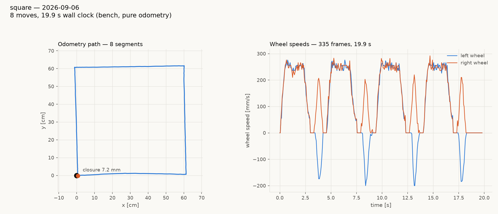

# tovez retune on the floor-relative arrival credit — 2026-09-06

Firmware **1.20260906.7**: the floor-relative arrival credit (`42bd5be`,
design S6.3) with a fresh bake, `lag_s 0.04` and `rotational_slip 1.018`
(radio-robot-lib `config/robots/tovez.json`, `_provenance_20260906`).
Playfield, `arducam-ov9782-usb-camera`, tag 52 registered, zilch serial
daemon.

## Result — the square, on the field

| | closure | net rotation |
|---|---|---|
| odometry (`04-square-field.json`) | **7.2 mm** | +360.72 deg |
| camera (`04-square-field-camera-score.json`) | **16.4 mm** | +6.07 deg |

Pivots in odometry **+89.97 / +89.85 / +89.84 / +89.65** (mean +89.83,
1.24–1.48 s each); legs 603 / 603 / 601 / 603 mm; `lexc`/`wrng`/
`cycovr` 0. The camera start heading carries ~3 deg of at-rest scatter
(the staging fix read −0.30, the pre-flight fix two seconds later
−3.44), so the +6 deg net physical rotation is ±3 deg from the start
fix alone; the 16 mm physical closure is the number to quote.

For scale, the same tour on the same robot earlier today: 387 mm on
the bench on the merged firmware; 105 mm by camera / 244 mm by odometry
on the field after the merge revert alone. Reference on the pre-029
engine: gopiv 5.0 mm, bench, 2026-09-01.

## Why a retune was needed

`rotational_slip 0.962` (2026-09-05) had been fitted WITH the 029 arrival
credit ending every pivot ~8 deg early, so it over-drove the wheels to
hide that. With the credit fixed there was nothing left to hide: the
morning dance on `.6` FAILED on +180 (+94.2 / +192.3 / +94.3 against
+90 / +180 / +90), an accuracy failure tripping the convention gate.

## The sweeps (`calibrate.py turns --no-tlm`, ±90/±180 ×4, cruise 188)

| run | live slip | mean abs err | fit gain | fit offset | suggested slip |
|---|---|---|---|---|---|
| `01-turns-slip0962` | 0.962 (bake) | 6.66 deg | 1.0712 | ~0 | 1.0305 |
| `02-turns-slip10305` | 1.0305 | 2.61 deg | 0.9873 | −0.85 | 1.0179 |
| `03-turns-slip10179` | 1.0179 | **1.21 deg** | 1.0043 | −1.54 | 1.0224 |

Baked **1.018**; the residual 0.4 % gain is inside the 1.2 deg scatter.
`stop_distance` stays 0.0 (fit offset ≈ 0 at the original slip). All
three ran at `lag 0.04` on the board — left there by a bench tour's
`SET`, not by intent, but it is the value the bench sweep on the fixed
credit selects (+0.12 deg at 0.04 vs −2.38 at 0.13,
`../square-hw-vs-sim-20260906/bench-demo/lag-sweep-bench-FLOORCREDIT.json`),
and it is what vevov already runs, so it is baked alongside the slip.
Each run directory has `REPORT.md`, `turns.csv`, `camera.csv`,
`summary.json` and the rendered `turn-error.png` / `fit.png` /
`wheel-speeds.png`.

Dance on `.7` after the flash: **PASSED** — +91.5 / +180.6 / +90.1 deg,
drives 20.1 / 40.3 / 20.3 cm, home 2.4 cm.

## Process failure, recorded

The square was launched from a shell chain `stage && preflight | tail
&& run_tour`. The pre-flight REFUSED (projected leg 1 reached y = −34.0
against the −32.65 working margin, from a start fix that read −3.4 deg)
— and the tour ran anyway, because the pipeline's exit status was
`tail`'s. The robot came home clean and the refusal was on the 12 cm
margin, not the 44.65 cm rail, but that is luck. A gate must never sit
on the left of a pipe without `set -o pipefail`, and a hardware run
must never be chained behind one. `preflight.json` was not written
(the refusal raised first); the camera score above uses the pre-flight's
own printed start pose.
