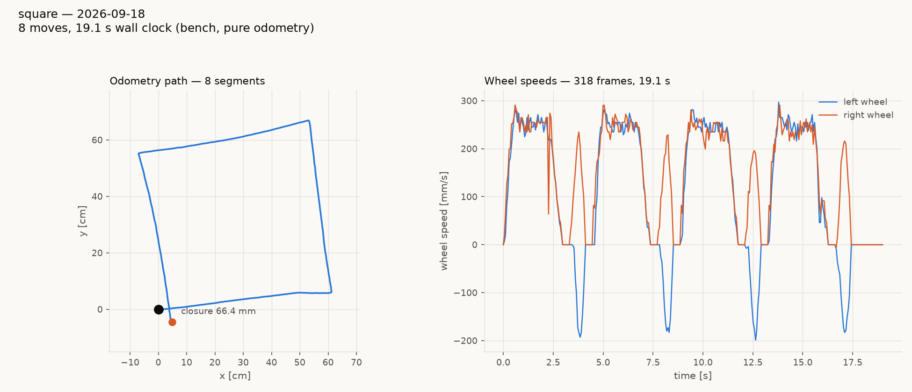

# tovez square tour, 2026-09-18 — closure 66.4 mm believed, ~12 cm real

**Board:** tovez, on the main playfield, driven over nada's serial
daemon (192.168.4.53:37481).
**Firmware:** `1.20260914.1`, `ID` profile `calibration`.
**Artifacts:** `reports/tovez-square-20260918/square.png`,
`square.json`; probe logs in `captures/tovez-square-20260918/`.



## The headline

| | believed (odometry) | physical (camera) |
|---|---|---|
| closure | **66.4 mm** | **~12 cm** |
| net rotation over 4 pivots | −0.1° | *not usable — see note* |

Reference points for the same tour: tovez **11.0 mm** on 2026-09-06
(`reports/square-hw-vs-sim-20260906/`), gopiv **5.0 mm** on 2026-09-01.
This run is 6x worse than tovez's own baseline in odometry alone, and
the camera says the physical error is roughly double the believed one.

## Where the error is: the pivots, and the robot cannot see most of it

Legs are perfect and the wheels are matched through them. Believed leg
geometry from `square.json` (bearings in the tour's own start frame):

| leg | believed length | corner turn that follows |
|---|---|---|
| leg1 | 60.0 cm | +91.8° |
| leg2 | 59.9 cm | +93.6° |
| leg3 | 60.0 cm | +90.0° |
| leg4 | 60.0 cm | +84.5° |

Four commanded 90° pivots land, by the robot's own encoders, between
**84.5° and 93.6° — a 9.1° spread**. That spread alone is the 66.4 mm
of believed closure; travel contributes nothing (60.0 cm on every leg).

The physical net-rotation figure this report first carried (+17.9°) is
WITHDRAWN: its start and end headings came from two different pose
frames (one registered read, one raw), so it measured my own
double-add, not the robot. The clean measurement of the turns is
`reports/tovez-turn-cal-20260918/` — 16 camera-scored pivots from rest,
which give `camera = 0.972 x commanded + 5.41 deg`.

The wheel-speed panel shows the mechanism: on the straights both wheels
track together at ~281–297 mm/s, but every pivot is **asymmetric** —
right wheel peaks 216–235 mm/s against the left's 183–199, for a
commanded 188 mm/s at the wheel. Pivot 3 shows a double hump on the
right wheel, i.e. it stalls and re-breaks-away mid-turn.

## Two configuration findings that would explain the regression

`GET` on the board reads, among others:

```
get rotational_slip 0.998        <- tovez's measured value is 0.962
get lag 0.000000                 <- square.tour's 11.0 mm run was at lag 0.13
get pid_kp 0.000000
get straight_trim 0.000000
```

tovez's tuned constants are **not on this board**. `rotational_slip
0.962` was baked into `radio-robot-lib/config/robots/tovez.json` on
2026-09-05 and cuts pivot error about 3x; `lag 0.13` is the pivot knob
the 2026-09-06 11.0 mm run used. Both are back at their defaults here,
and pivot error is exactly what got worse. The `ID` profile field reads
`calibration`, not `tovez`, which is consistent with a hex built from a
generic profile rather than tovez's own.

**This is the first thing to check** before chasing anything in the
motion engine. It is UNVERIFIED that reflashing with tovez's profile
restores the 11.0 mm closure; that is one flash and one tour to settle.

## WITHDRAWN: the "90 degree tag mount" claim

An earlier version of this report claimed tovez's tag plate was mounted
90 deg off the fleet convention and that
`tools/field_calibration.json`'s `mount_yaw_residual_deg: 0.0` was
wrong. **That was my bug, not the hardware's.** The plate is mounted
correctly and the calibration file is right.

I called `camlink.Cam.register('tovez')` early in the session. From that
point the daemon's reported `yaw_rad` IS the robot's heading, and my
scripts then ran it through `field.robot_heading_from_tag_yaw()`,
adding the +90 deg convention a second time.
`.claude/rules/tag-yaw-is-the-front-edge-not-the-hat.md` documents this
exact failure ("registered vs raw: who adds the 90") with this exact
signature -- absolute bearings off by +90 while pivots still pass -- and
`field.pose_from_registered_samples()`'s docstring records the same bug
hitting `field_dance.py` on this same robot on 2026-09-04. I re-derived
a known bug and blamed the tag for it.

Corrected reading, MEASURED 2026-09-18,
`captures/tovez-turns-20260918/center.log`: registered read, yaw used
unchanged -- nose +36.2 deg, a commanded 12 cm `MOVE_X` travelled
11.95 cm at bearing +37.9 deg, **1.7 deg off the nose**, 99.6% of
commanded. Frame correct, mount correct.

The rail collision was caused by this double-add, not by the tag.

## Caveats

- Start heading was −4.2°, not 0, so the figure is tilted by that much;
  it does not affect closure or the turn analysis.
- The camera's physical closure uses `mount_x_cm −4.1` from the
  calibration file, whose magnitude that file already flags UNVERIFIED —
  and whose *direction* is now suspect too, given the plate is rotated.
  Tag-to-tag displacement is 12.7 cm, centre-to-centre 11.6 cm; the
  rotation finding (+17.9°) does not depend on the mount offset at all.
- One tour only. Per `stop-after-the-first-bad-hardware-run`, the next
  move is a flash with tovez's profile, or in-place pivots, not another
  lap.
