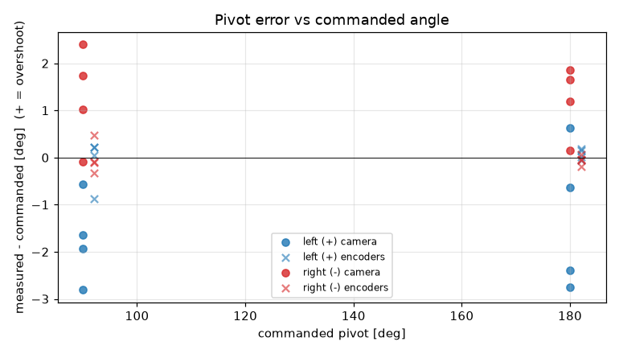
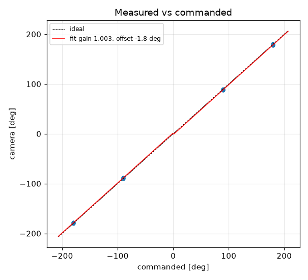
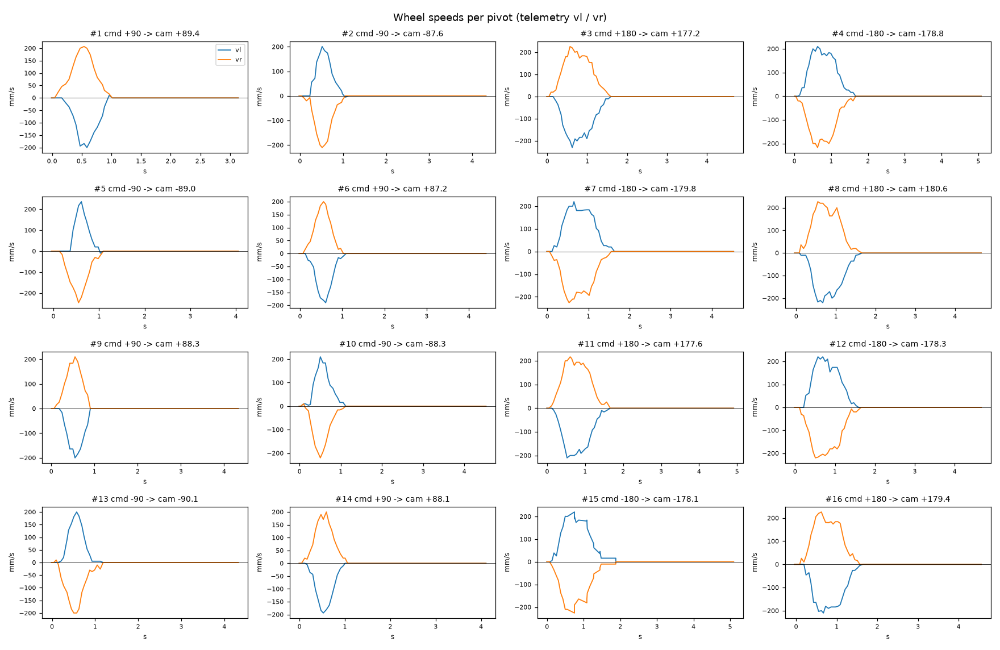

# Turn calibration -- tovez -- tovez-turn-cal-20260918-flashed

16 camera-scored pivots at cruise 188 mm/s, rotational_slip 0.998, pivot_overrun 0.0 mm (b_eff 114.43 mm).

| commanded | n | mean error [deg] | min | max |
|---|---|---|---|---|
| +90 | 4 | -1.74 | -2.8 | -0.6 |
| +180 | 4 | -1.29 | -2.8 | +0.6 |
| -90 | 4 | +1.26 | -0.1 | +2.4 |
| -180 | 4 | +1.22 | +0.1 | +1.9 |

Fit: camera = **1.0028** x commanded **-1.75** deg; mean |error| 1.47 deg; left mean -1.52, right mean 1.24; mean centre drift 2.13 cm.

Suggested: `SET rotational_slip 1.0007`, `SET stop_distance 0.0` (camera = gain*cmd + offset; slip_new = slip*gain; stop_distance_new = stop_distance + offset_rad*b_eff/2). 029 firmware: measure and SET lag first (S10.2); this stop_distance is only valid at the cruise it was fitted at

| # | cmd | camera | err | encoder err | drift cm | peak vl | peak vr | dur s | reason |
|---|---|---|---|---|---|---|---|---|---|
| 1 | +90 | +89.4 | -0.6 | +0.1 | 1.8 | 200 | 207 | 0.8 | stop |
| 2 | -90 | -87.6 | +2.4 | +0.5 | 1.8 | 201 | 210 | 0.9 | stop |
| 3 | +180 | +177.2 | -2.8 | +0.2 | 2.2 | 230 | 226 | 1.4 | stop |
| 4 | -180 | -178.8 | +1.2 | -0.2 | 2.4 | 210 | 217 | 1.5 | stop |
| 5 | -90 | -89.0 | +1.0 | -0.1 | 2.9 | 236 | 246 | 0.8 | stop |
| 6 | +90 | +87.2 | -2.8 | +0.2 | 1.8 | 190 | 200 | 0.9 | stop |
| 7 | -180 | -179.8 | +0.1 | -0.1 | 2.7 | 220 | 226 | 1.4 | stop |
| 8 | +180 | +180.6 | +0.6 | +0.0 | 2.1 | 220 | 227 | 1.4 | stop |
| 9 | +90 | +88.3 | -1.6 | -0.9 | 1.5 | 200 | 210 | 0.7 | stop |
| 10 | -90 | -88.3 | +1.7 | -0.1 | 1.8 | 210 | 220 | 1.0 | stop |
| 11 | +180 | +177.6 | -2.4 | +0.1 | 2.2 | 210 | 217 | 1.4 | stop |
| 12 | -180 | -178.3 | +1.7 | -0.0 | 2.5 | 220 | 220 | 1.4 | stop |
| 13 | -90 | -90.1 | -0.1 | -0.3 | 2.2 | 200 | 200 | 1.0 | stop |
| 14 | +90 | +88.1 | -1.9 | +0.2 | 1.8 | 194 | 200 | 0.9 | stop |
| 15 | -180 | -178.1 | +1.9 | +0.1 | 2.4 | 220 | 226 | 1.7 | stop |
| 16 | +180 | +179.4 | -0.6 | -0.1 | 2.0 | 210 | 226 | 1.4 | stop |
