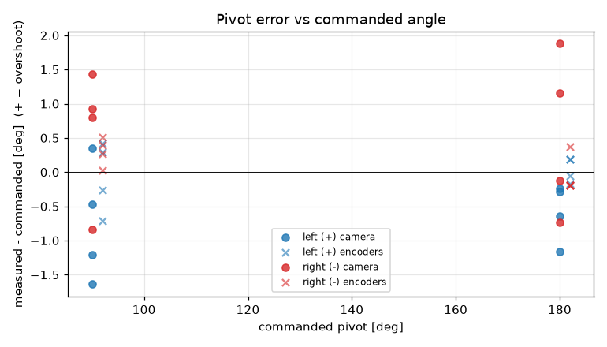
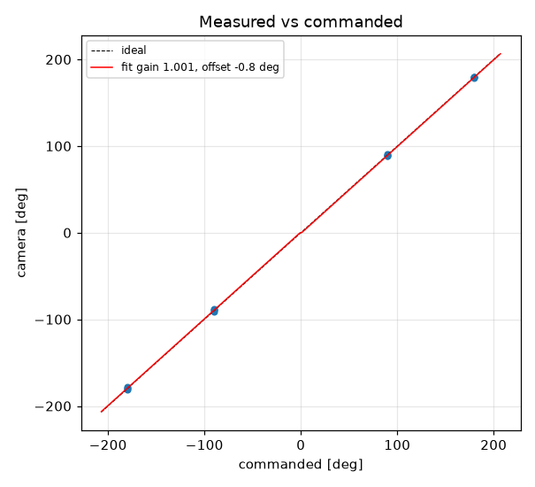
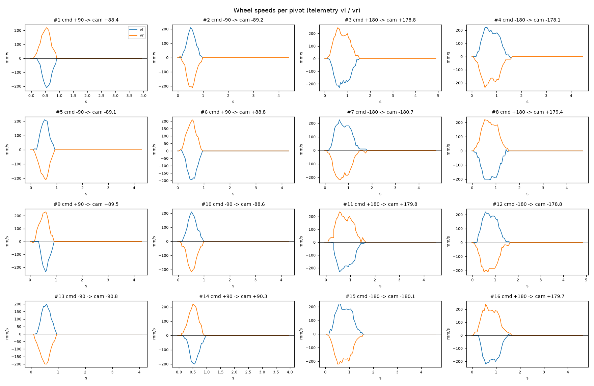

# Turn calibration -- tovez -- tovez-turn-cal-20260918-lag030

16 camera-scored pivots at cruise 188 mm/s, rotational_slip 0.998, pivot_overrun 0.0 mm (b_eff 114.43 mm).

| commanded | n | mean error [deg] | min | max |
|---|---|---|---|---|
| +90 | 4 | -0.74 | -1.6 | +0.3 |
| +180 | 4 | -0.58 | -1.2 | -0.2 |
| -90 | 4 | +0.58 | -0.8 | +1.4 |
| -180 | 4 | +0.54 | -0.7 | +1.9 |

Fit: camera = **1.0011** x commanded **-0.76** deg; mean |error| 0.87 deg; left mean -0.66, right mean 0.56; mean centre drift 2.09 cm.

Suggested: `SET rotational_slip 0.9991`, `SET stop_distance 0.0` (camera = gain*cmd + offset; slip_new = slip*gain; stop_distance_new = stop_distance + offset_rad*b_eff/2). 029 firmware: measure and SET lag first (S10.2); this stop_distance is only valid at the cruise it was fitted at

| # | cmd | camera | err | encoder err | drift cm | peak vl | peak vr | dur s | reason |
|---|---|---|---|---|---|---|---|---|---|
| 1 | +90 | +88.4 | -1.6 | -0.7 | 1.6 | 210 | 220 | 0.7 | stop |
| 2 | -90 | -89.2 | +0.8 | +0.0 | 1.7 | 210 | 210 | 0.8 | stop |
| 3 | +180 | +178.8 | -1.2 | -0.1 | 2.2 | 230 | 247 | 1.3 | stop |
| 4 | -180 | -178.1 | +1.9 | -0.2 | 2.5 | 220 | 236 | 1.4 | stop |
| 5 | -90 | -89.1 | +0.9 | +0.5 | 2.0 | 210 | 210 | 0.7 | stop |
| 6 | +90 | +88.8 | -1.2 | -0.3 | 1.7 | 194 | 210 | 0.8 | stop |
| 7 | -180 | -180.7 | -0.7 | -0.2 | 2.5 | 226 | 217 | 1.6 | stop |
| 8 | +180 | +179.4 | -0.6 | +0.2 | 2.3 | 204 | 220 | 1.4 | stop |
| 9 | +90 | +89.5 | -0.5 | +0.3 | 2.0 | 236 | 230 | 0.7 | stop |
| 10 | -90 | -88.6 | +1.4 | +0.3 | 1.8 | 210 | 217 | 0.8 | stop |
| 11 | +180 | +179.8 | -0.2 | -0.2 | 2.2 | 230 | 236 | 1.4 | stop |
| 12 | -180 | -178.8 | +1.2 | -0.2 | 2.3 | 220 | 210 | 1.5 | stop |
| 13 | -90 | -90.8 | -0.8 | +0.4 | 2.0 | 200 | 200 | 0.7 | stop |
| 14 | +90 | +90.3 | +0.3 | +0.4 | 1.9 | 200 | 220 | 0.8 | stop |
| 15 | -180 | -180.1 | -0.1 | +0.4 | 2.5 | 220 | 220 | 1.4 | stop |
| 16 | +180 | +179.7 | -0.3 | +0.2 | 2.1 | 220 | 240 | 1.5 | stop |
