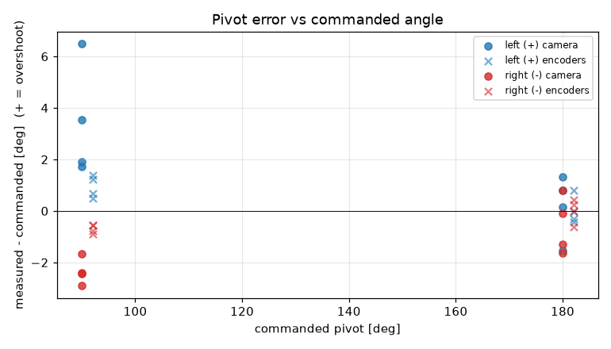
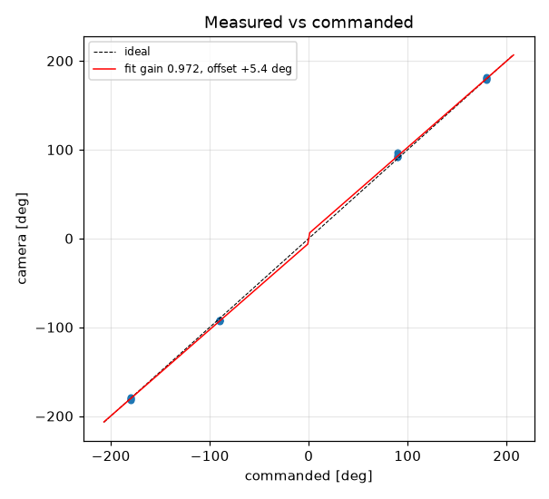
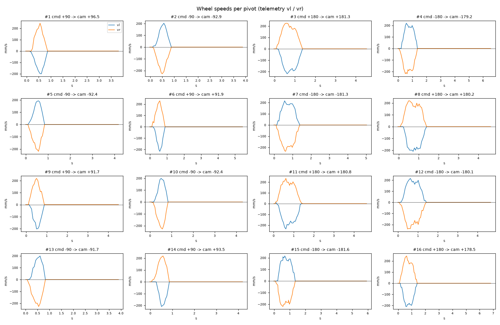

# Turn calibration -- tovez -- tovez-turn-cal-20260918

16 camera-scored pivots at cruise 188 mm/s, rotational_slip 0.998, pivot_overrun 0.0 mm (b_eff 114.43 mm).

| commanded | n | mean error [deg] | min | max |
|---|---|---|---|---|
| +90 | 4 | +3.41 | +1.7 | +6.5 |
| +180 | 4 | +0.18 | -1.5 | +1.3 |
| -90 | 4 | -2.36 | -2.9 | -1.7 |
| -180 | 4 | -0.55 | -1.6 | +0.8 |

Fit: camera = **0.972** x commanded **+5.41** deg; mean |error| 1.92 deg; left mean 1.8, right mean -1.46; mean centre drift 1.22 cm.

Suggested: `SET rotational_slip 0.9701`, `SET stop_distance 5.4` (camera = gain*cmd + offset; slip_new = slip*gain; stop_distance_new = stop_distance + offset_rad*b_eff/2). 029 firmware: measure and SET lag first (S10.2); this stop_distance is only valid at the cruise it was fitted at

| # | cmd | camera | err | encoder err | drift cm | peak vl | peak vr | dur s | reason |
|---|---|---|---|---|---|---|---|---|---|
| 1 | +90 | +96.5 | +6.5 | +1.4 | 1.1 | 200 | 245 | 0.5 | stop |
| 2 | -90 | -92.9 | -2.9 | -0.9 | 1.4 | 203 | 227 | 0.6 | stop |
| 3 | +180 | +181.3 | +1.3 | +0.8 | 0.7 | 219 | 225 | 1.1 | stop |
| 4 | -180 | -179.2 | +0.8 | -0.6 | 1.8 | 219 | 219 | 1.2 | stop |
| 5 | -90 | -92.4 | -2.4 | -0.6 | 1.4 | 193 | 219 | 0.6 | stop |
| 6 | +90 | +91.9 | +1.9 | +0.7 | 0.9 | 216 | 229 | 0.6 | stop |
| 7 | -180 | -181.3 | -1.3 | +0.2 | 1.7 | 216 | 235 | 1.2 | stop |
| 8 | +180 | +180.2 | +0.1 | -0.0 | 0.5 | 209 | 219 | 1.2 | stop |
| 9 | +90 | +91.7 | +1.7 | +0.5 | 1.0 | 202 | 219 | 0.6 | stop |
| 10 | -90 | -92.4 | -2.4 | -0.8 | 1.5 | 199 | 227 | 0.6 | stop |
| 11 | +180 | +180.8 | +0.8 | -0.4 | 0.7 | 235 | 235 | 1.3 | stop |
| 12 | -180 | -180.1 | -0.1 | +0.4 | 1.8 | 216 | 239 | 1.3 | stop |
| 13 | -90 | -91.7 | -1.7 | -0.6 | 1.6 | 199 | 227 | 0.6 | stop |
| 14 | +90 | +93.5 | +3.5 | +1.2 | 0.9 | 209 | 219 | 0.7 | stop |
| 15 | -180 | -181.6 | -1.6 | -0.0 | 1.8 | 216 | 219 | 1.1 | stop |
| 16 | +180 | +178.5 | -1.5 | -0.3 | 0.6 | 209 | 245 | 1.2 | stop |
