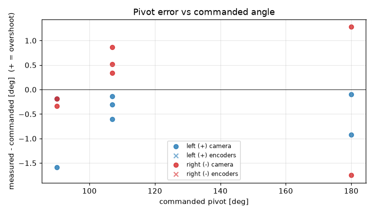
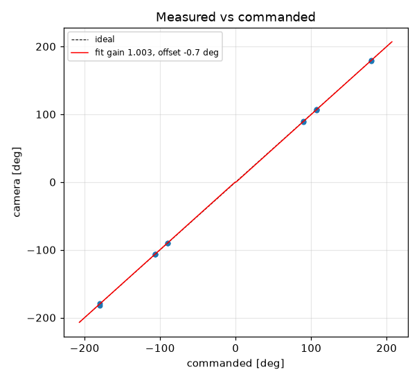

# Turn calibration -- tigez -- tigez-12-stats-lag0.10

14 camera-scored pivots at cruise 0 mm/s, rotational_slip 0.952, pivot_overrun 0.0 mm (b_eff 119.96 mm).

| commanded | n | mean error [deg] | min | max |
|---|---|---|---|---|
| +90 | 2 | -0.89 | -1.6 | -0.2 |
| +107 | 3 | -0.35 | -0.6 | -0.1 |
| +180 | 2 | -0.51 | -0.9 | -0.1 |
| -90 | 2 | -0.27 | -0.3 | -0.2 |
| -107 | 3 | +0.58 | +0.3 | +0.9 |
| -180 | 2 | -0.23 | -1.8 | +1.3 |

Fit: camera = **1.0029** x commanded **-0.68** deg; mean |error| 0.65 deg; left mean -0.55, right mean 0.1; mean centre drift 0.33 cm.

Suggested: `SET rotational_slip 0.9547`, `SET pivot_overrun 0.0` (camera = gain*cmd + offset; slip_new = slip*gain; pivot_overrun_new = pivot_overrun + offset_rad*b_eff/2).

| # | cmd | camera | err | encoder err | drift cm | peak vl | peak vr | dur s | reason |
|---|---|---|---|---|---|---|---|---|---|
| 9 | -107 | -106.1 | +0.9 |  | 0.2 |  |  | 0.0 | stop |
| 10 | +107 | +106.4 | -0.6 |  | 0.3 |  |  | 0.0 | stop |
| 11 | -180 | -181.8 | -1.8 |  | 0.2 |  |  | 0.0 | stop |
| 12 | +180 | +179.1 | -0.9 |  | 0.8 |  |  | 0.0 | stop |
| 13 | +90 | +89.8 | -0.2 |  | 0.3 |  |  | 0.0 | stop |
| 14 | -90 | -90.2 | -0.2 |  | 0.4 |  |  | 0.0 | stop |
| 15 | +107 | +106.9 | -0.1 |  | 0.2 |  |  | 0.0 | stop |
| 16 | -107 | -106.7 | +0.3 |  | 0.3 |  |  | 0.0 | stop |
| 17 | +180 | +179.9 | -0.1 |  | 0.3 |  |  | 0.0 | stop |
| 18 | -180 | -178.7 | +1.3 |  | 0.7 |  |  | 0.0 | stop |
| 19 | -90 | -90.3 | -0.3 |  | 0.2 |  |  | 0.0 | stop |
| 20 | +90 | +88.4 | -1.6 |  | 0.2 |  |  | 0.0 | stop |
| 21 | -107 | -106.5 | +0.5 |  | 0.2 |  |  | 0.0 | stop |
| 22 | +107 | +106.7 | -0.3 |  | 0.3 |  |  | 0.0 | stop |
