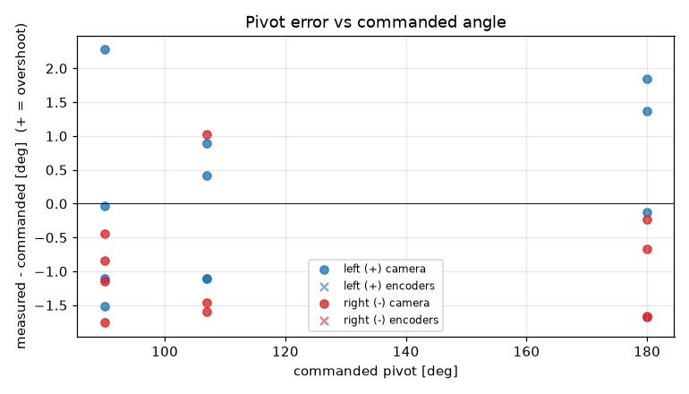
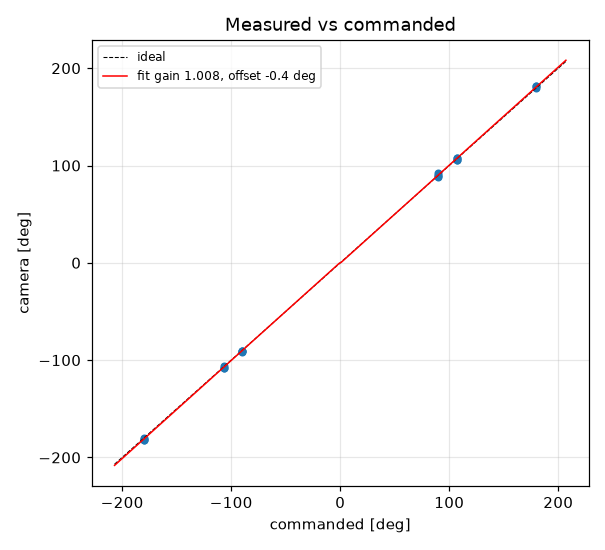

# Turn calibration -- tigez -- tigez-13-stats-lag0.05

22 camera-scored pivots at cruise 0 mm/s, rotational_slip 0.962, pivot_overrun 0.0 mm (b_eff 118.71 mm).

| commanded | n | mean error [deg] | min | max |
|---|---|---|---|---|
| +90 | 4 | -0.10 | -1.5 | +2.3 |
| +107 | 4 | -0.23 | -1.1 | +0.9 |
| +180 | 3 | +1.03 | -0.1 | +1.9 |
| -90 | 4 | -1.05 | -1.8 | -0.5 |
| -107 | 3 | -0.68 | -1.6 | +1.0 |
| -180 | 4 | -1.06 | -1.7 | -0.2 |

Fit: camera = **1.0078** x commanded **-0.42** deg; mean |error| 1.1 deg; left mean 0.16, right mean -0.95; mean centre drift 0.41 cm.

Suggested: `SET rotational_slip 0.9695`, `SET stop_distance 0.0` (camera = gain*cmd + offset; slip_new = slip*gain; stop_distance_new = stop_distance + offset_rad*b_eff/2). 029 firmware: measure and SET lag first (S10.2); this stop_distance is only valid at the cruise it was fitted at

| # | cmd | camera | err | encoder err | drift cm | peak vl | peak vr | dur s | reason |
|---|---|---|---|---|---|---|---|---|---|
| 1 | +90 | +90.0 | -0.0 |  | 0.2 |  |  | 0.0 | stop |
| 2 | -90 | -91.1 | -1.1 |  | 0.2 |  |  | 0.0 | stop |
| 3 | +107 | +107.9 | +0.9 |  | 0.3 |  |  | 0.0 | stop |
| 4 | -107 | -108.6 | -1.6 |  | 0.2 |  |  | 0.0 | stop |
| 6 | -180 | -181.7 | -1.7 |  | 0.1 |  |  | 0.0 | stop |
| 7 | -90 | -90.8 | -0.8 |  | 0.5 |  |  | 0.0 | stop |
| 8 | +90 | +88.9 | -1.1 |  | 0.7 |  |  | 0.0 | stop |
| 10 | +107 | +105.9 | -1.1 |  | 0.7 |  |  | 0.0 | stop |
| 11 | -180 | -180.2 | -0.2 |  | 0.5 |  |  | 0.0 | stop |
| 12 | +180 | +179.9 | -0.1 |  | 0.2 |  |  | 0.0 | stop |
| 13 | +90 | +92.3 | +2.3 |  | 0.4 |  |  | 0.0 | stop |
| 14 | -90 | -91.8 | -1.8 |  | 0.5 |  |  | 0.0 | stop |
| 15 | +107 | +107.4 | +0.4 |  | 0.5 |  |  | 0.0 | stop |
| 16 | -107 | -108.5 | -1.5 |  | 0.3 |  |  | 0.0 | stop |
| 17 | +180 | +181.4 | +1.4 |  | 0.3 |  |  | 0.0 | stop |
| 18 | -180 | -181.7 | -1.7 |  | 0.2 |  |  | 0.0 | stop |
| 19 | -90 | -90.5 | -0.5 |  | 0.5 |  |  | 0.0 | stop |
| 20 | +90 | +88.5 | -1.5 |  | 0.7 |  |  | 0.0 | stop |
| 21 | -107 | -106.0 | +1.0 |  | 0.5 |  |  | 0.0 | stop |
| 22 | +107 | +105.9 | -1.1 |  | 0.6 |  |  | 0.0 | stop |
| 23 | -180 | -180.7 | -0.7 |  | 0.9 |  |  | 0.0 | stop |
| 24 | +180 | +181.8 | +1.9 |  | 0.1 |  |  | 0.0 | stop |
