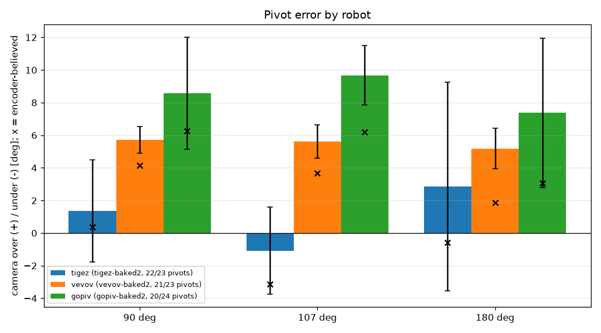
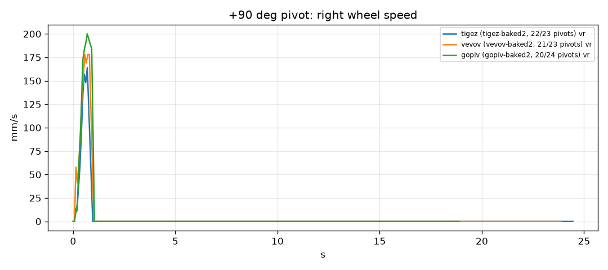

# Pivot comparison

| robot / run | 90 deg mean (sd, n) / encoder | 107 deg mean (sd, n) / encoder | 180 deg mean (sd, n) / encoder |
|---|---|---|---|
| tigez (tigez-baked2, 22/23 pivots) | +1.4 (3.1, 7) / +0.4 | -1.1 (2.7, 7) / -3.1 | +2.9 (6.4, 8) / -0.6 |
| vevov (vevov-baked2, 21/23 pivots) | +5.7 (0.8, 7) / +4.1 | +5.6 (1.0, 8) / +3.7 | +5.2 (1.2, 6) / +1.9 |
| gopiv (gopiv-baked2, 20/24 pivots) | +8.6 (3.4, 7) / +6.3 | +9.7 (1.8, 8) / +6.2 | +7.4 (4.6, 5) / +3.1 |

