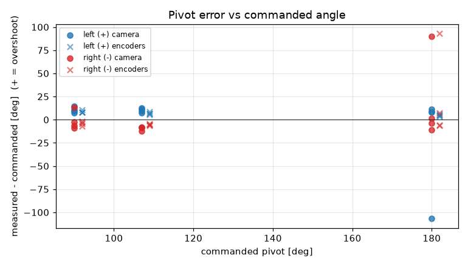
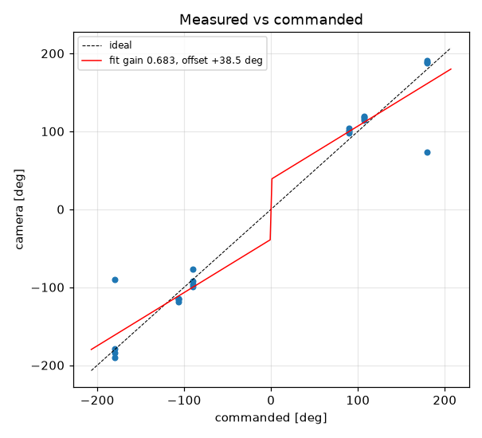
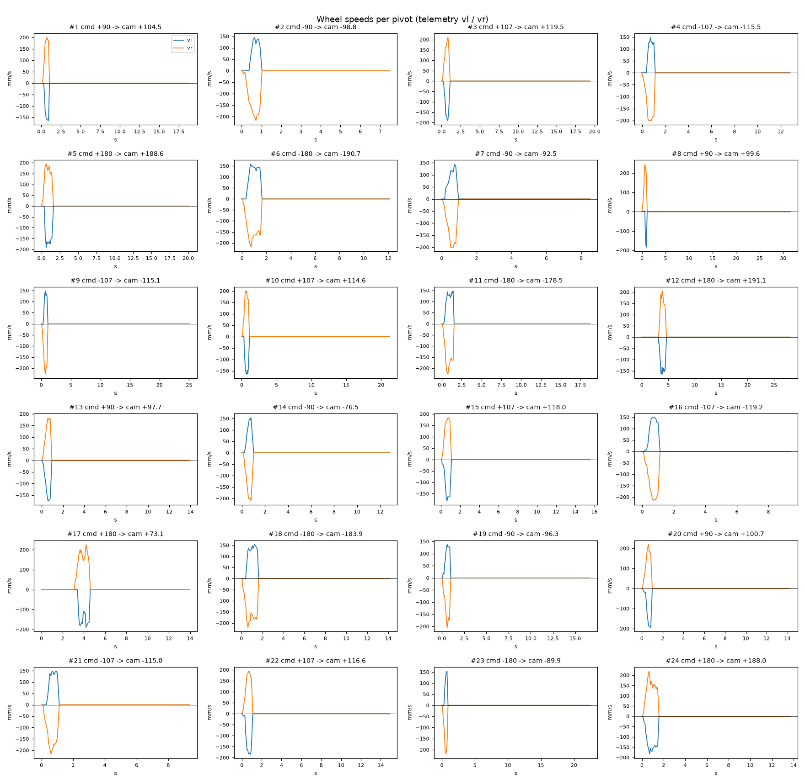

# Turn calibration -- gopiv -- gopiv-baked2

24 camera-scored pivots at cruise 0 mm/s, rotational_slip 0.952, pivot_overrun 0.0 mm (b_eff 119.96 mm).

| commanded | n | mean error [deg] | min | max |
|---|---|---|---|---|
| +90.0 | 4 | +10.61 | +7.7 | +14.5 |
| +107.0 | 4 | +10.16 | +7.6 | +12.5 |
| +180.0 | 4 | -19.81 | -106.9 | +11.1 |
| -90.0 | 4 | -1.02 | -8.8 | +13.5 |
| -107.0 | 4 | -9.19 | -12.2 | -8.0 |
| -180.0 | 4 | +19.25 | -10.7 | +90.1 |

Fit: camera = **0.6831** x commanded **+38.48** deg; mean |error| 16.32 deg; left mean 0.32, right mean 3.01; mean centre drift 3.21 cm.

Suggested: `SET rotational_slip 0.6503`, `SET pivot_overrun 40.29` (camera = gain*cmd + offset; slip_new = slip*gain; overrun_new = overrun + offset_rad*b_eff/2).

| # | cmd | camera | err | encoder err | drift cm | peak vl | peak vr | dur s | reason |
|---|---|---|---|---|---|---|---|---|---|
| 1 | +90 | +104.5 | +14.5 | +10.5 | 1.1 | 164 | 200 | 0.7 | stop |
| 2 | -90 | -98.8 | -8.8 | -4.5 | 2.9 | 145 | 217 | 0.8 | stop |
| 3 | +107 | +119.5 | +12.5 | +8.9 | 0.8 | 190 | 210 | 0.8 | stop |
| 4 | -107 | -115.5 | -8.5 | -5.6 | 2.7 | 148 | 200 | 0.9 | stop |
| 5 | +180 | +188.6 | +8.6 | +4.9 | 0.3 | 190 | 193 | 1.3 | stop |
| 6 | -180 | -190.7 | -10.7 | -6.3 | 3.0 | 158 | 220 | 1.4 | stop |
| 7 | -90 | -92.5 | -2.5 | -1.5 | 1.8 | 144 | 200 | 0.6 | stop |
| 8 | +90 | +99.6 | +9.6 | +7.9 | 3.4 | 184 | 246 | 0.7 | stop |
| 9 | -107 | -115.1 | -8.1 | -4.9 | 2.5 | 148 | 226 | 0.8 | stop |
| 10 | +107 | +114.6 | +7.6 | +5.5 | 0.9 | 164 | 200 | 0.8 | stop |
| 11 | -180 | -178.5 | +1.5 | +7.1 | 2.7 | 148 | 226 | 1.3 | stop |
| 12 | +180 | +191.1 | +11.1 | +6.2 | 0.5 | 164 | 205 | 1.2 | stop |
| 13 | +90 | +97.7 | +7.7 | +7.7 | 0.4 | 174 | 184 | 0.7 | stop |
| 14 | -90 | -76.5 | +13.5 | -7.3 | 2.8 | 154 | 210 | 0.7 | stop |
| 15 | +107 | +118.0 | +11.0 | +6.7 | 0.7 | 181 | 184 | 0.8 | stop |
| 16 | -107 | -119.2 | -12.2 | -6.4 | 2.1 | 148 | 216 | 0.8 | stop |
| 17 (disturbed, excluded) | +180 | +73.1 | -106.9 | +3.6 | 9.2 | 190 | 227 | 1.3 | stop |
| 18 (disturbed, excluded) | -180 | -183.9 | -3.9 | -5.7 | 27.2 | 154 | 220 | 1.4 | stop |
| 19 | -90 | -96.3 | -6.3 | -3.4 | 5.9 | 138 | 204 | 0.7 | stop |
| 20 | +90 | +100.7 | +10.7 | +8.2 | 0.9 | 194 | 220 | 0.7 | stop |
| 21 | -107 | -115.0 | -8.0 | -4.6 | 2.6 | 148 | 217 | 0.8 | stop |
| 22 | +107 | +116.6 | +9.6 | +6.9 | 0.3 | 184 | 194 | 0.8 | stop |
| 23 | -180 | -89.9 | +90.1 | +93.0 | 2.1 | 154 | 220 | 0.7 | stop |
| 24 | +180 | +188.0 | +8.0 | +5.0 | 0.3 | 184 | 220 | 1.4 | stop |
