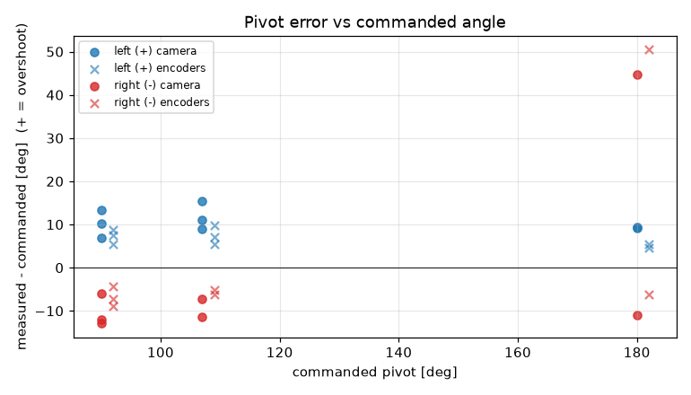
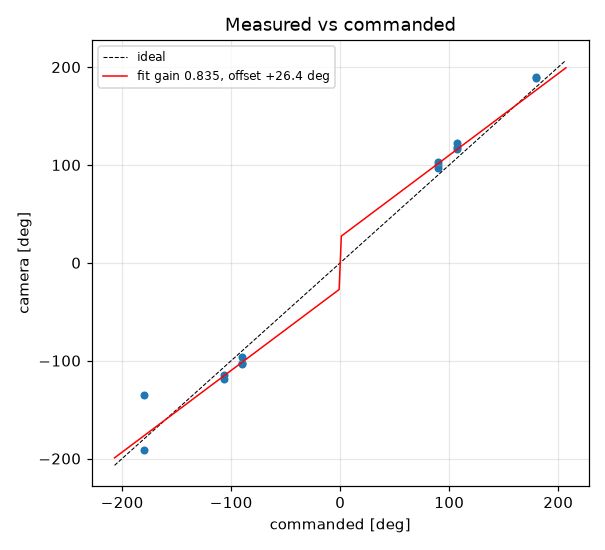
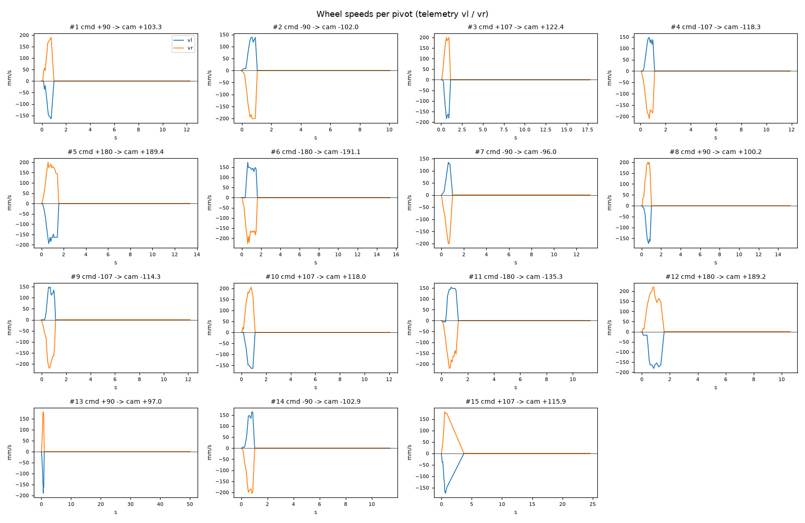

# Turn calibration -- gopiv -- gopiv-baked3

15 camera-scored pivots at cruise 0 mm/s, rotational_slip 0.952, pivot_overrun 0.0 mm (b_eff 119.96 mm).

| commanded | n | mean error [deg] | min | max |
|---|---|---|---|---|
| +90 | 3 | +10.15 | +7.0 | +13.3 |
| +107 | 3 | +11.75 | +8.9 | +15.4 |
| +180 | 2 | +9.33 | +9.2 | +9.4 |
| -90 | 3 | -10.32 | -12.9 | -6.0 |
| -107 | 2 | -9.32 | -11.3 | -7.3 |
| -180 | 2 | +16.83 | -11.1 | +44.7 |

Fit: camera = **0.8349** x commanded **+26.45** deg; mean |error| 12.65 deg; left mean 10.54, right mean -2.28; mean centre drift 1.34 cm.

Suggested: `SET rotational_slip 0.7948`, `SET pivot_overrun 27.69` (camera = gain*cmd + offset; slip_new = slip*gain; overrun_new = overrun + offset_rad*b_eff/2).

| # | cmd | camera | err | encoder err | drift cm | peak vl | peak vr | dur s | reason |
|---|---|---|---|---|---|---|---|---|---|
| 1 | +90 | +103.3 | +13.3 | +8.7 | 0.8 | 164 | 190 | 0.6 | stop |
| 2 | -90 | -102.0 | -12.0 | -7.2 | 2.1 | 138 | 201 | 0.8 | stop |
| 3 | +107 | +122.4 | +15.4 | +9.8 | 0.7 | 184 | 200 | 0.7 | stop |
| 4 | -107 | -118.3 | -11.3 | -6.2 | 1.9 | 148 | 210 | 0.8 | stop |
| 5 | +180 | +189.4 | +9.4 | +4.6 | 0.1 | 194 | 200 | 1.3 | stop |
| 6 | -180 | -191.1 | -11.1 | -6.3 | 2.8 | 174 | 226 | 1.4 | stop |
| 7 | -90 | -96.0 | -6.0 | -4.3 | 2.0 | 135 | 200 | 0.6 | stop |
| 8 | +90 | +100.2 | +10.2 | +7.5 | 0.8 | 174 | 200 | 0.7 | stop |
| 9 | -107 | -114.3 | -7.3 | -5.1 | 2.1 | 148 | 220 | 0.9 | stop |
| 10 | +107 | +118.0 | +10.9 | +7.1 | 0.3 | 164 | 206 | 0.8 | stop |
| 11 (disturbed, excluded) | -180 | -135.3 | +44.7 | +50.5 | 2.0 | 154 | 220 | 0.9 | stop |
| 12 | +180 | +189.2 | +9.2 | +5.5 | 1.1 | 181 | 220 | 1.3 | stop |
| 13 | +90 | +97.0 | +7.0 | +5.4 | 0.6 | 190 | 181 | 0.7 | stop |
| 14 | -90 | -102.9 | -12.9 | -8.9 | 1.9 | 164 | 204 | 0.8 | stop |
| 15 | +107 | +115.9 | +8.9 | +5.5 | 0.8 | 174 | 181 | 0.8 |  |
