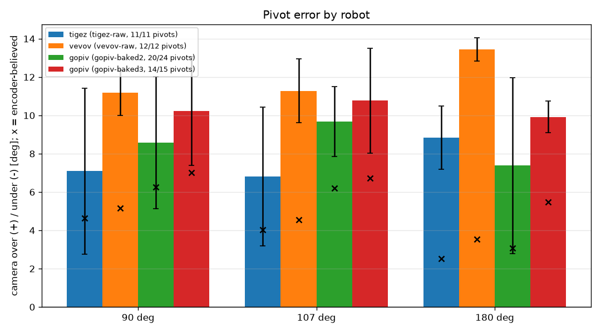
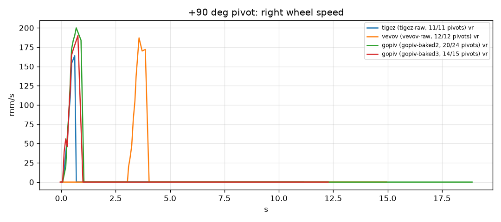

# Pivot comparison

| robot / run | 90 deg mean (sd, n) / encoder | 107 deg mean (sd, n) / encoder | 180 deg mean (sd, n) / encoder |
|---|---|---|---|
| tigez (tigez-raw, 11/11 pivots) | +7.1 (4.3, 3) / +4.6 | +6.8 (3.6, 4) / +4.0 | +8.8 (1.6, 4) / +2.5 |
| vevov (vevov-raw, 12/12 pivots) | +11.2 (1.2, 4) / +5.2 | +11.3 (1.7, 4) / +4.6 | +13.4 (0.6, 4) / +3.5 |
| gopiv (gopiv-baked2, 20/24 pivots) | +8.6 (3.4, 7) / +6.3 | +9.7 (1.8, 8) / +6.2 | +7.4 (4.6, 5) / +3.1 |
| gopiv (gopiv-baked3, 14/15 pivots) | +10.2 (2.8, 6) / +7.0 | +10.8 (2.7, 5) / +6.7 | +9.9 (0.8, 3) / +5.5 |

