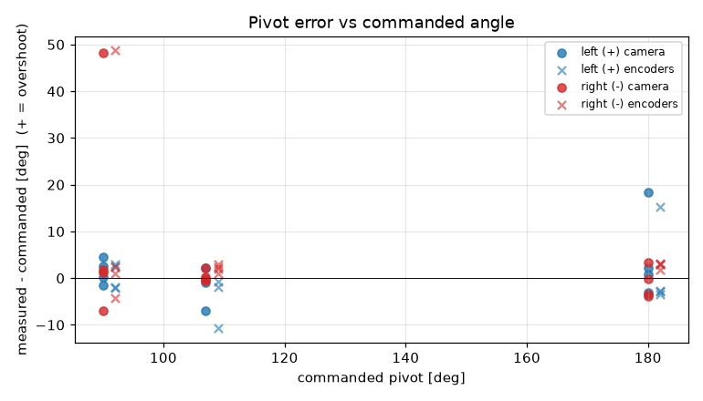
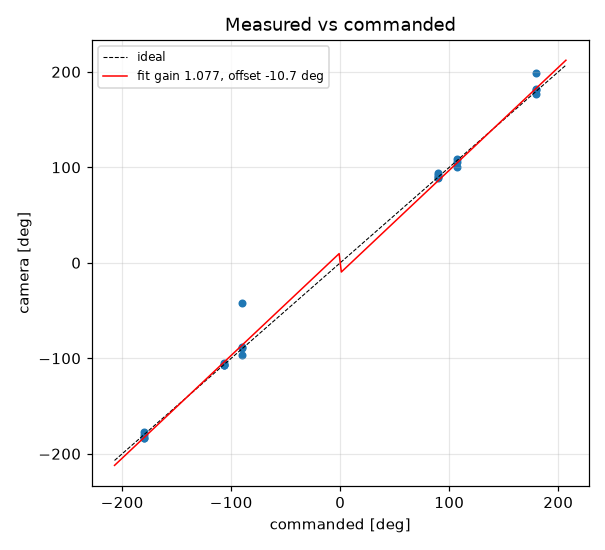
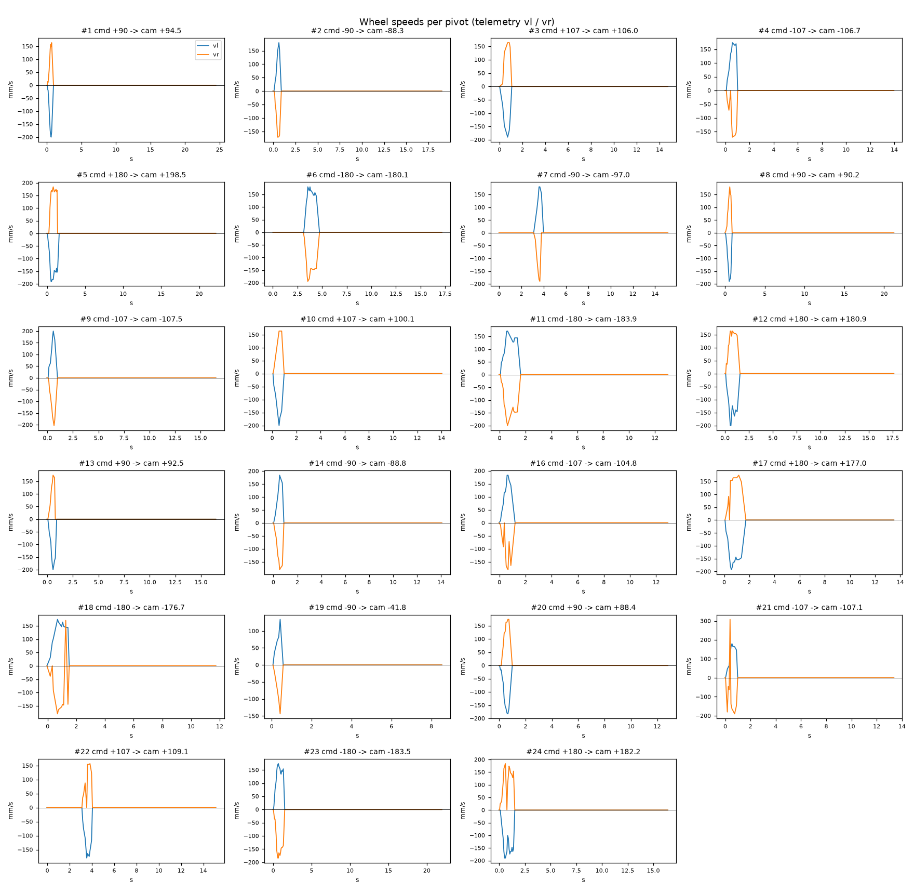

# Turn calibration -- tigez -- tigez-baked2

23 camera-scored pivots at cruise 0 mm/s, rotational_slip 0.962, pivot_overrun 5.5 mm (b_eff 118.71 mm).

| commanded | n | mean error [deg] | min | max |
|---|---|---|---|---|
| +90 | 4 | +1.39 | -1.6 | +4.5 |
| +107 | 3 | -1.92 | -6.9 | +2.1 |
| +180 | 4 | +4.64 | -3.0 | +18.5 |
| -90 | 4 | +11.04 | -7.0 | +48.2 |
| -107 | 4 | +0.45 | -0.5 | +2.1 |
| -180 | 4 | -1.06 | -3.9 | +3.3 |

Fit: camera = **1.0767** x commanded **-10.71** deg; mean |error| 5.01 deg; left mean 1.67, right mean 3.48; mean centre drift 0.47 cm.

Suggested: `SET rotational_slip 1.0357`, `SET pivot_overrun 0.0` (camera = gain*cmd + offset; slip_new = slip*gain; overrun_new = overrun + offset_rad*b_eff/2).

| # | cmd | camera | err | encoder err | drift cm | peak vl | peak vr | dur s | reason |
|---|---|---|---|---|---|---|---|---|---|
| 1 | +90 | +94.5 | +4.5 | +3.0 | 1.1 | 200 | 164 | 0.6 | stop |
| 2 | -90 | -88.3 | +1.7 | +2.3 | 0.1 | 180 | 171 | 0.6 | stop |
| 3 | +107 | +106.0 | -0.9 | -0.8 | 1.1 | 190 | 164 | 0.7 | stop |
| 4 | -107 | -106.7 | +0.3 | +1.0 | 0.0 | 174 | 3168 | 0.8 | stop |
| 5 | +180 | +198.5 | +18.5 | +15.2 | 1.6 | 190 | 6393 | 1.1 | stop |
| 6 | -180 | -180.1 | -0.1 | +3.2 | 0.1 | 180 | 194 | 1.3 | stop |
| 7 | -90 | -97.0 | -7.0 | -4.3 | 0.4 | 180 | 3440 | 0.6 | stop |
| 8 | +90 | +90.2 | +0.2 | -1.9 | 0.8 | 190 | 180 | 0.7 | stop |
| 9 | -107 | -107.5 | -0.5 | +2.4 | 0.4 | 200 | 203 | 0.6 | stop |
| 10 | +107 | +100.1 | -6.9 | -10.8 | 0.4 | 200 | 164 | 0.7 | stop |
| 11 | -180 | -183.9 | -3.9 | +1.7 | 0.2 | 171 | 200 | 1.2 | stop |
| 12 | +180 | +180.9 | +0.9 | -2.7 | 0.3 | 200 | 164 | 1.1 | stop |
| 13 | +90 | +92.5 | +2.5 | +2.6 | 0.5 | 200 | 1792 | 0.6 | stop |
| 14 | -90 | -88.8 | +1.2 | +1.0 | 0.2 | 184 | 180 | 0.6 | stop |
| 16 | -107 | -104.8 | +2.1 | +2.1 | 0.2 | 183 | 2457 | 0.8 | stop |
| 17 | +180 | +177.0 | -3.0 | -3.5 | 1.0 | 193 | 616 | 1.2 | stop |
| 18 | -180 | -176.7 | +3.3 | +2.9 | 0.2 | 174 | 5567 | 1.2 | stop |
| 19 (disturbed, excluded) | -90 | -41.8 | +48.2 | +48.8 | 0.2 | 134 | 144 | 0.3 | stop |
| 20 | +90 | +88.4 | -1.6 | -2.1 | 0.4 | 183 | 174 | 0.6 | stop |
| 21 | -107 | -107.1 | -0.1 | +3.0 | 0.3 | 180 | 308 | 0.7 | stop |
| 22 | +107 | +109.1 | +2.1 | -1.8 | 0.5 | 180 | 2827 | 0.8 | stop |
| 23 | -180 | -183.5 | -3.5 | +3.0 | 0.4 | 174 | 184 | 1.2 | stop |
| 24 | +180 | +182.2 | +2.2 | -2.9 | 0.3 | 190 | 4576 | 1.3 | stop |
