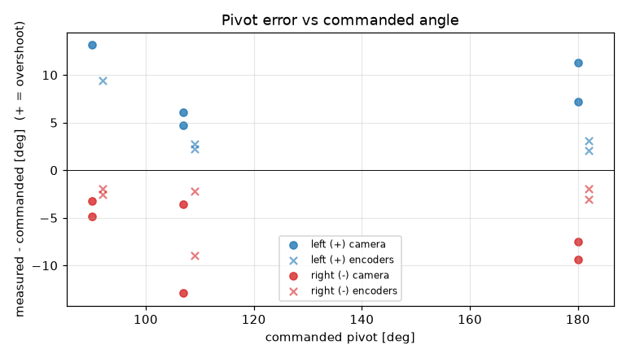
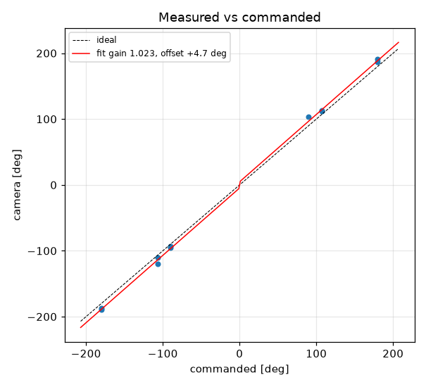
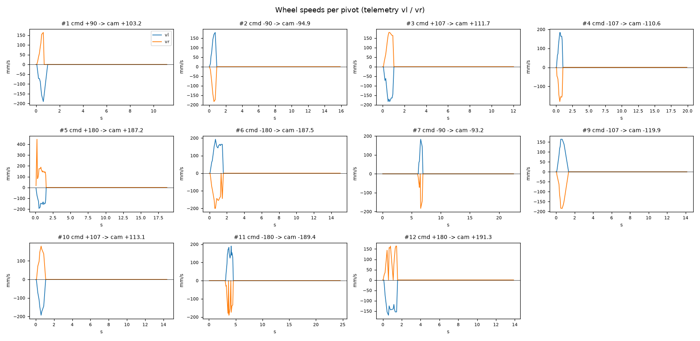

# Turn calibration -- tigez -- tigez-raw

11 camera-scored pivots at cruise 0 mm/s, rotational_slip 0.952, pivot_overrun 0.0 mm (b_eff 119.96 mm).

| commanded | n | mean error [deg] | min | max |
|---|---|---|---|---|
| +90 | 1 | +13.15 | +13.2 | +13.2 |
| +107 | 2 | +5.39 | +4.7 | +6.1 |
| +180 | 2 | +9.26 | +7.2 | +11.3 |
| -90 | 2 | -4.05 | -4.9 | -3.2 |
| -107 | 2 | -8.23 | -12.9 | -3.6 |
| -180 | 2 | -8.43 | -9.4 | -7.5 |

Fit: camera = **1.0227** x commanded **+4.71** deg; mean |error| 7.63 deg; left mean 8.49, right mean -6.91; mean centre drift 0.36 cm.

Suggested: `SET rotational_slip 0.9736`, `SET pivot_overrun 4.93` (camera = gain*cmd + offset; slip_new = slip*gain; overrun_new = overrun + offset_rad*b_eff/2).

| # | cmd | camera | err | encoder err | drift cm | peak vl | peak vr | dur s | reason |
|---|---|---|---|---|---|---|---|---|---|
| 1 | +90 | +103.2 | +13.2 | +9.4 | 0.5 | 190 | 164 | 0.6 | stop |
| 2 | -90 | -94.9 | -4.9 | -2.0 | 0.1 | 180 | 183 | 0.6 | stop |
| 3 | +107 | +111.7 | +4.7 | +2.8 | 0.5 | 183 | 180 | 0.8 | stop |
| 4 | -107 | -110.6 | -3.6 | -2.2 | 0.2 | 184 | 180 | 0.8 | stop |
| 5 | +180 | +187.2 | +7.2 | +2.1 | 0.5 | 193 | 446 | 1.4 | stop |
| 6 | -180 | -187.5 | -7.5 | -3.0 | 0.3 | 193 | 200 | 1.4 | stop |
| 7 | -90 | -93.2 | -3.2 | -2.5 | 0.4 | 183 | 183 | 0.7 | stop |
| 9 | -107 | -119.9 | -12.9 | -9.0 | 0.5 | 164 | 184 | 0.8 | stop |
| 10 | +107 | +113.1 | +6.1 | +2.2 | 0.3 | 193 | 180 | 0.8 | stop |
| 11 | -180 | -189.4 | -9.4 | -1.9 | 0.4 | 190 | 190 | 1.3 | stop |
| 12 | +180 | +191.3 | +11.3 | +3.0 | 0.3 | 170 | 164 | 1.4 | stop |
