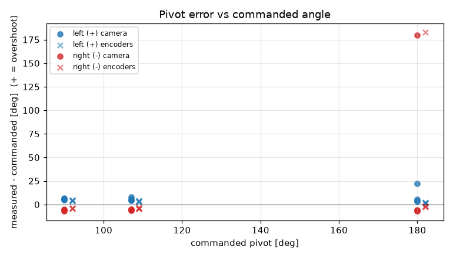
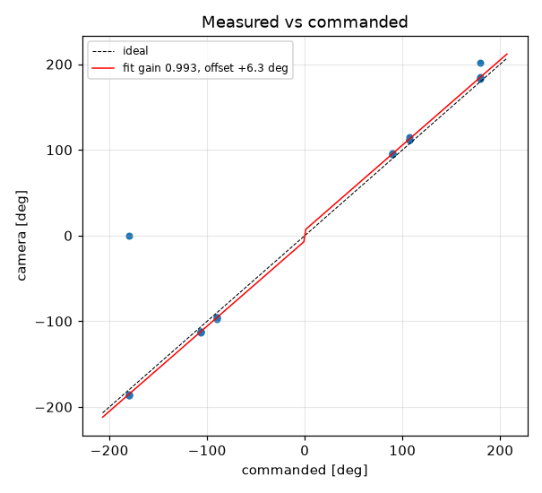
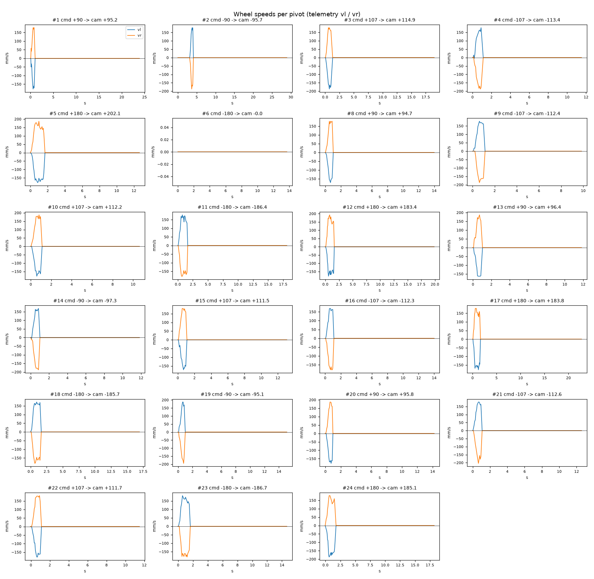

# Turn calibration -- vevov -- vevov-baked2

23 camera-scored pivots at cruise 0 mm/s, rotational_slip 0.987, pivot_overrun 2.2 mm (b_eff 115.7 mm).

| commanded | n | mean error [deg] | min | max |
|---|---|---|---|---|
| +90.0 | 4 | +5.50 | +4.7 | +6.4 |
| +107.0 | 4 | +5.55 | +4.5 | +7.9 |
| -90.0 | 3 | -6.01 | -7.3 | -5.1 |
| -107.0 | 4 | -5.66 | -6.4 | -5.3 |

Fit: camera = **0.9934** x commanded **+6.31** deg; mean |error| 5.66 deg; left mean 5.52, right mean -5.81; mean centre drift 4.34 cm.

Suggested: `SET rotational_slip 0.9805`, `SET pivot_overrun 8.57` (camera = gain*cmd + offset; slip_new = slip*gain; overrun_new = overrun + offset_rad*b_eff/2).

| # | cmd | camera | err | encoder err | drift cm | peak vl | peak vr | dur s | reason |
|---|---|---|---|---|---|---|---|---|---|
| 1 | +90 | +95.2 | +5.2 | +4.8 | 4.0 | 178 | 178 | 0.7 | stop |
| 2 | -90 | -95.7 | -5.7 | -3.6 | 4.2 | 179 | 187 | 0.8 | stop |
| 3 | +107 | +114.9 | +7.9 | +3.3 | 4.7 | 187 | 178 | 0.9 | stop |
| 4 | -107 | -113.4 | -6.4 | -4.4 | 4.7 | 178 | 187 | 0.8 | stop |
| 5 (disturbed, excluded) | +180 | +202.1 | +22.1 | +1.2 | 3.2 | 178 | 187 | 1.4 | stop |
| 6 (disturbed, excluded) | -180 | -0.0 | +180.0 | +182.7 | 0.0 | 0 | 0 | 0.0 | stop |
| 8 | +90 | +94.7 | +4.7 | +3.8 | 3.9 | 172 | 178 | 0.7 | stop |
| 9 | -107 | -112.4 | -5.4 | -4.6 | 4.7 | 178 | 187 | 0.8 | stop |
| 10 | +107 | +112.2 | +5.2 | +4.0 | 4.3 | 178 | 188 | 0.9 | stop |
| 11 (disturbed, excluded) | -180 | -186.4 | -6.4 | -2.2 | 5.7 | 178 | 178 | 1.3 | stop |
| 12 (disturbed, excluded) | +180 | +183.4 | +3.4 | +2.1 | 5.7 | 178 | 193 | 1.4 | stop |
| 13 | +90 | +96.4 | +6.4 | +4.0 | 4.2 | 163 | 187 | 0.7 | stop |
| 14 | -90 | -97.3 | -7.3 | -4.7 | 4.4 | 169 | 187 | 0.8 | stop |
| 15 | +107 | +111.5 | +4.5 | +3.0 | 4.8 | 172 | 180 | 0.8 | stop |
| 16 | -107 | -112.3 | -5.3 | -3.5 | 4.8 | 169 | 178 | 0.8 | stop |
| 17 (disturbed, excluded) | +180 | +183.8 | +3.8 | +1.5 | 5.7 | 178 | 178 | 1.4 | stop |
| 18 (disturbed, excluded) | -180 | -185.7 | -5.7 | -2.6 | 5.2 | 172 | 181 | 1.4 | stop |
| 19 | -90 | -95.1 | -5.1 | -3.6 | 4.0 | 187 | 195 | 0.7 | stop |
| 20 | +90 | +95.8 | +5.8 | +4.4 | 3.7 | 178 | 187 | 0.8 | stop |
| 21 | -107 | -112.6 | -5.6 | -3.6 | 4.4 | 178 | 204 | 0.9 | stop |
| 22 | +107 | +111.7 | +4.7 | +2.9 | 4.3 | 178 | 181 | 0.8 | stop |
| 23 (disturbed, excluded) | -180 | -186.7 | -6.7 | -1.5 | 5.6 | 181 | 181 | 1.4 | stop |
| 24 (disturbed, excluded) | +180 | +185.1 | +5.1 | +1.4 | 5.5 | 187 | 178 | 1.4 | stop |
