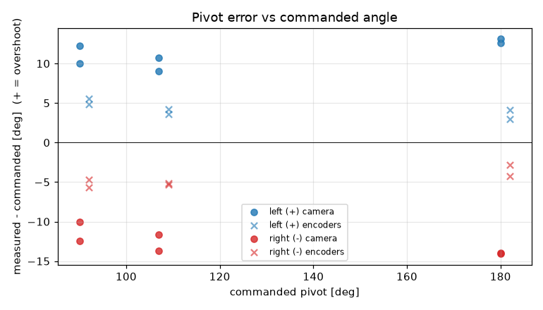
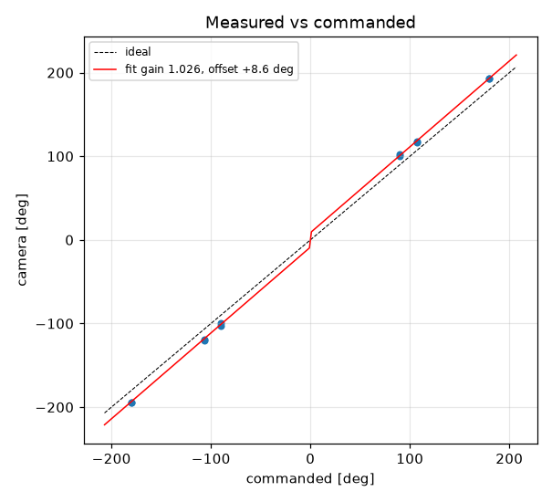
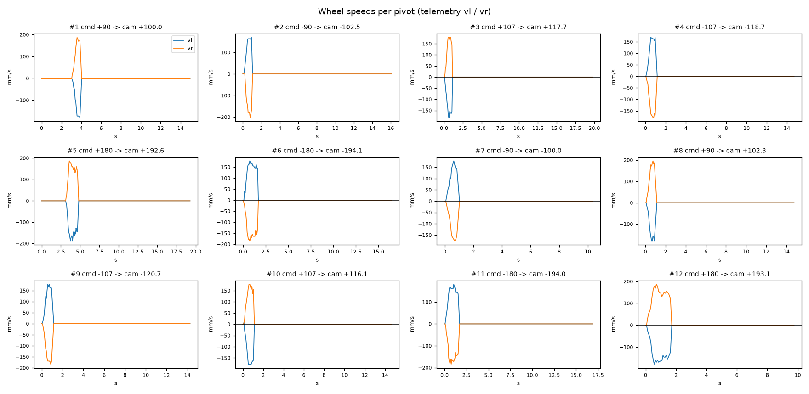

# Turn calibration -- vevov -- vevov-raw

12 camera-scored pivots at cruise 0 mm/s, rotational_slip 0.952, pivot_overrun 0.0 mm (b_eff 119.96 mm).

| commanded | n | mean error [deg] | min | max |
|---|---|---|---|---|
| +90 | 2 | +11.13 | +10.0 | +12.3 |
| +107 | 2 | +9.88 | +9.1 | +10.7 |
| +180 | 2 | +12.86 | +12.6 | +13.1 |
| -90 | 2 | -11.23 | -12.5 | -10.0 |
| -107 | 2 | -12.67 | -13.7 | -11.7 |
| -180 | 2 | -14.03 | -14.1 | -14.0 |

Fit: camera = **1.0265** x commanded **+8.64** deg; mean |error| 11.97 deg; left mean 11.29, right mean -12.65; mean centre drift 4.81 cm.

Suggested: `SET rotational_slip 0.9772`, `SET pivot_overrun 9.04` (camera = gain*cmd + offset; slip_new = slip*gain; overrun_new = overrun + offset_rad*b_eff/2).

| # | cmd | camera | err | encoder err | drift cm | peak vl | peak vr | dur s | reason |
|---|---|---|---|---|---|---|---|---|---|
| 1 | +90 | +100.0 | +10.0 | +4.8 | 4.4 | 178 | 187 | 0.8 | stop |
| 2 | -90 | -102.5 | -12.5 | -5.6 | 4.6 | 169 | 201 | 0.8 | stop |
| 3 | +107 | +117.7 | +10.7 | +4.2 | 4.8 | 181 | 178 | 0.9 | stop |
| 4 | -107 | -118.7 | -11.7 | -5.3 | 5.0 | 169 | 178 | 0.8 | stop |
| 5 | +180 | +192.6 | +12.6 | +3.0 | 5.6 | 187 | 187 | 1.5 | stop |
| 6 | -180 | -194.1 | -14.1 | -2.8 | 5.4 | 178 | 184 | 1.5 | stop |
| 7 | -90 | -100.0 | -10.0 | -4.7 | 4.2 | 178 | 175 | 0.6 | stop |
| 8 | +90 | +102.3 | +12.3 | +5.5 | 4.0 | 178 | 196 | 0.7 | stop |
| 9 | -107 | -120.7 | -13.7 | -5.1 | 4.6 | 178 | 183 | 0.8 | stop |
| 10 | +107 | +116.1 | +9.1 | +3.6 | 4.5 | 178 | 178 | 0.9 | stop |
| 11 | -180 | -194.0 | -14.0 | -4.2 | 5.1 | 181 | 184 | 1.4 | stop |
| 12 | +180 | +193.1 | +13.1 | +4.1 | 5.3 | 178 | 187 | 1.5 | stop |
