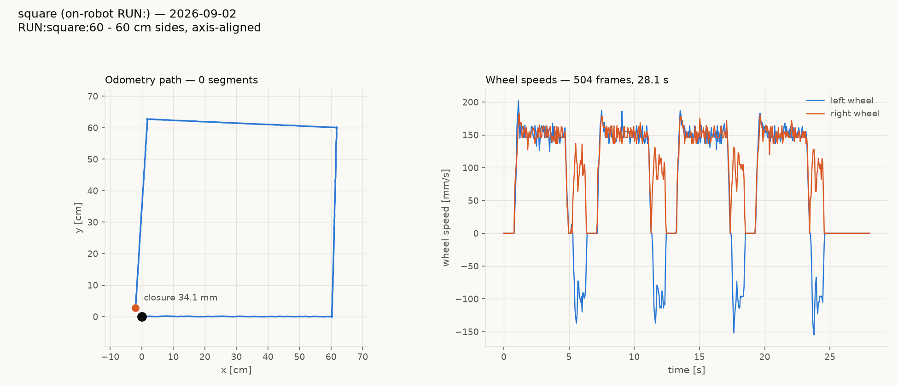
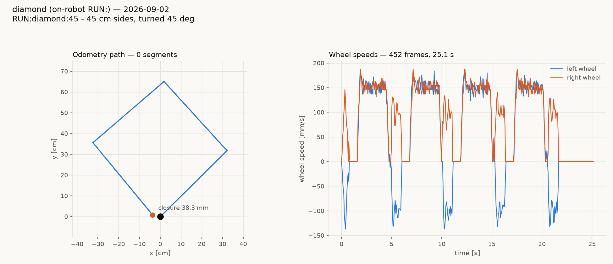
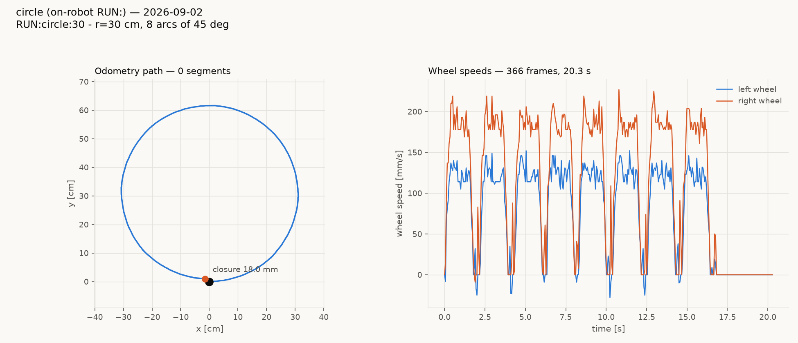
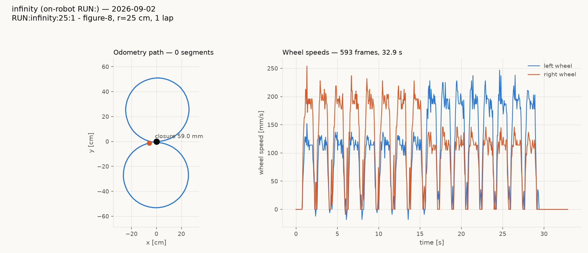
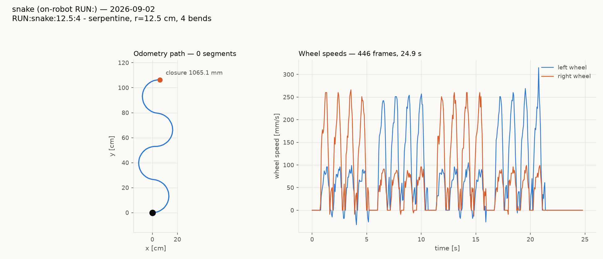

# Shaping on: what it fixed, and what it did not — vevov, 2026-09-02

Same robot, same session, three repeats per figure, constant-a shaping
switched ON against the legacy taper as the control arm.

## The bug that was found and fixed

**The yaw axis never got the kinematic braking gate.** Sprint 025 gave
the *distance* axis a `v²/(2a)` braking window; the yaw axis kept gating
on the fixed `yawTaper_` count window even in shaped mode. The code said
so out loud:

> *"unlike that axis's kinematics-derived gate this one still uses the
> fixed `yawTaper_` counts window unconditionally"*

At the tuned 800 counts that is ~70% of a 90° pivot's ~1141 counts of
differential, so one tuning constant — not the physics — decided when a
pivot started slowing.

MEASURED vevov 2026-09-02, four 90° pivots per setting, shaping on,
**before** the fix:

| `yaw_taper` | crawl per pivot | excess | sd |
|---|---|---|---|
| 800 | 375 ms | +0.36° | 0.16 |
| 400 | 235 ms | +1.83° | 0.31 |
| 200 | 244 ms | +11.75° | 2.67 |
| 100 | 146 ms | +4.97° | 1.14 |

A forced choice between a long crawl and large scatter — an artifact of
the fixed window, since the kinematic one is short at low twist *and*
still reaches zero at the target.

**After the fix**, six 90° pivots each, same robot, same session:

| | crawl/pivot | excess | **sd** |
|---|---|---|---|
| legacy | 308 ms | +0.05° | **1.14** |
| shaped + kinematic gate | 385 ms | +0.04° | **0.18** |

**Pivot scatter improved 6×** at unchanged bias. That is the real result
of this work. It is pinned by
`tests/host/test_motion_engine_acceleration_profile.py`, including a
negative control that the legacy path still honours `yawTaper_`, and
verified to fail if the fix is reverted.

## What it did NOT fix

**The crawling is still there**, and I want to be plain about that
rather than bury it. Across the whole tour suite, closure is a wash:

| tour | legacy mean ± sd | shaped mean ± sd |
|---|---|---|
| square | 52.3 ± 15.3 mm | 42.2 ± 11.2 mm |
| diamond | 28.6 ± 7.2 mm | 31.4 ± 4.9 mm |
| circle | 25.6 ± 15.9 mm | 28.7 ± 11.9 mm |
| infinity | 85.6 ± 4.9 mm | 74.6 ± 17.7 mm |
| snake | advance 1066.3 ± 2.1 mm | 1065.7 ± 0.8 mm |

Total spread across the suite: **45.4 mm legacy → 46.5 mm shaped.**
Four of five figures tightened; the infinity got 3.6× looser. Call it
even.

An earlier draft of this claimed a dramatic improvement. That was a
**confounded comparison** — legacy numbers from gopiv against shaped
numbers from vevov, two robots with different drivetrains. The table
above is the same robot in one session, and it says something much more
modest.

## Where the crawl actually is

Ruled out by measurement, each with shaping on:

- **not `accel`/`decel`** — 4 pivots took 1.48 s of crawl shaped vs
  1.52 s legacy
- **not `yaw_taper`** — after the fix, pivot duration no longer tracks it
- **not `turn_floor`** — 0.12 → 0.01 moved crawl only 381 → 358 ms

A full pivot trace shows why. This is not a taper running out; the
commanded speed **rises again** after it has already slowed:

```
0.50s  vl -200  vr  238   duty -2400/ 2100
0.58s  vl -146  vr  146   duty  -600/  400   slowing
0.65s  vl  -41  vr   32   duty  -300/  300   nearly stopped
0.72s  vl  -32  vr   41   duty  -900/  500   driving again
0.79s  vl  -79  vr   82   duty -1300/  900   harder
0.86s  vl  -91  vr   82   duty  -500/  300
0.94s  vl    0  vr    0   duty     0/    0
```

That is a hunt against the completion condition, not a deceleration
profile. The pure-turn completion margin is **4 counts** — about 0.16°
— so the move cannot end until it lands inside that, and it keeps
re-driving until it does. The straight axis has the same shape with a
10-count margin.

The likely fix is to let a move end on **profile completion** — glide to
zero and accept the residual — rather than on the position error
closing. That is what the stakeholder asked for, and the current design
does not offer it. Tracked in
`clasi/issues/moves-crawl-and-correct-instead-of-gliding-to-a-stop.md`.

## Charts







## Configuration used

```
SET accel 400        SET decel 400        SET dist_floor 0.25
SET twist_hold_gain 8  SET speed_floor 512  SET turn_floor 0.06
SET yaw_taper 800    SET pivot_overrun 2.0
```

`accel`/`decel` default to 0, which selects legacy mode, so a robot does
nothing different until a host sets them. Picking shipped defaults
should wait until the crawl is understood — baking numbers that only
half-work is worse than leaving the switch off.
