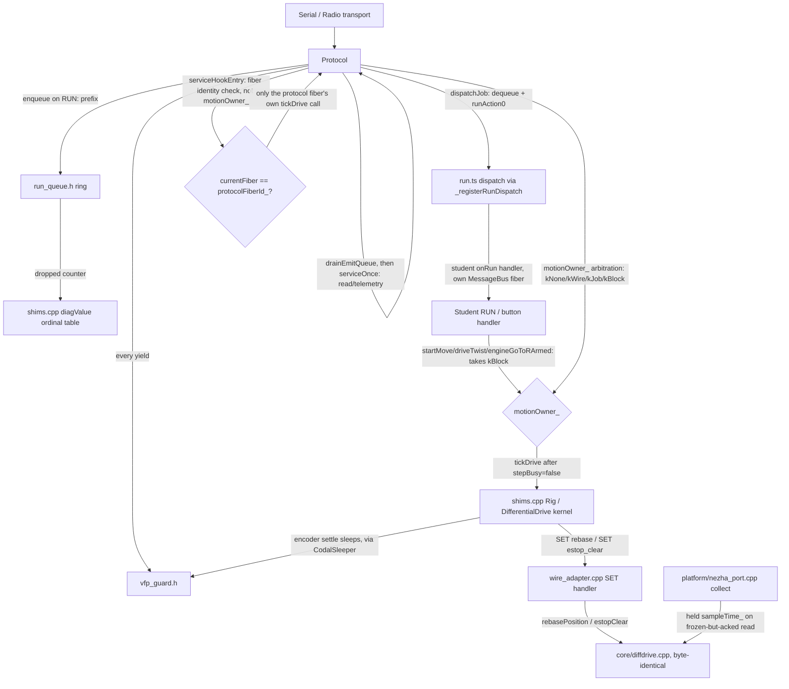

# src — the DiffDrive extension

**Owner:** Eric Busboom · **Last reviewed:** 2026-08-26 · **Status:** in-flux (as-built through sprint 016 — sprints 004-016 all closed and merged. Wire hardening and tests that can fail (sprint 008): timeout reject/clamp unified across all six motion verbs, `kVersion`/line-cap/`RUN_EVENT_SOURCE`/`kDiag*` single-sourced or drift-tested, the `WaHandle` test doubles re-synced to production, the post-move settle loop extracted into a host-testable `MotionEngine` helper, `TLM AUTO`/`BUFFER` given defined semantics, and a triage-aware `make_deploy.py` plus a standing per-sprint build-checkpoint-ticket convention closing the target-viability gap. The wire's motion-completion channel resolved, §5 (sprint 005). `main.ts` split into six cohesion-sized modules under `blocks/` (sprint 012), then `src/` regrouped into five dependency-layer subdirectories (sprint 013) — see §1.)

`src/` is grouped into five subdirectories by dependency layer —
`core/`, `motion/`, `platform/`, `comms/`, `blocks/` — plus `shims.cpp`
and this document at the top level (sprint 013; see §1's table for the
exact mapping). The directory split is coarse (five buckets for eleven
layers), so each subdirectory carries only a thin `DESIGN.md` pointing
back into the matching section below — `src/core/DESIGN.md`,
`src/motion/DESIGN.md`, `src/platform/DESIGN.md`,
`src/comms/DESIGN.md`, `src/blocks/DESIGN.md` — while this document
still carries the logical subsystem breakdown, and the fine-grained
per-file behavioral and design detail, as sections. Global conventions
(units
ladder, CCW sign, mirroring, the ×1000 config convention, protocol
versioning, the tick model) live in
[`docs/design/design.md`](../docs/design/design.md) and are assumed
throughout.

## 1. Layer map and layering rules

From the bottom up, with each layer's *verified* include discipline —
these are enforced by nothing but convention plus the host test
harness (which fails to link if a "host-portable" file grows a CODAL
dependency), so treat them as invariants:

| Layer | Files | May include |
|---|---|---|
| Kernel | `core/diffdrive.h/.cpp` | `<cstdint>`/`<cmath>`/`<algorithm>` only — **no I2C, no CODAL, no MakeCode, no geometry** |
| Motion engine | `motion/motion_engine.h/.cpp` | `diffdrive.h` + libc only — host-portable |
| Heading wrap (sprint 006) | `core/heading_wrap.h` | libc only — host-portable, no project includes at all |
| Encoder glitch armor (sprint 006) | `core/encoder_glitch_armor.h` | libc only — host-portable, no project includes at all |
| Encoder pose source (sprint 006) | `platform/encoder_pose_source.h` | `motion_engine.h` + libc only — host-portable |
| Wire grammar | `comms/wire_handler.h/.cpp` | libc only — host-portable, no project includes at all |
| Wire adapter | `comms/wire_adapter.h/.cpp` | `wire_handler.h` + libc — host-portable; reaches hardware only through forward-declared `shims.cpp` free functions |
| Transports | `comms/serial_transport.*`, `comms/radio_transport.*` | CODAL (`pxt.h` in the .cpp) — know bytes and framing, **nothing** about verbs, grammar, or motion |
| Hardware ports | `platform/nezha_port.*`, `platform/otos_port.*`, `platform/platform_ports.h` | `pxt.h` + the port interfaces they implement — know I2C/CODAL, nothing about blocks or the wire; `nezha_port.cpp` additionally calls into `encoder_glitch_armor.h` and `otos_port.cpp` into `heading_wrap.h`, both above (a dependency on a lower, host-portable layer, not membership in this one) |
| Protocol composition | `comms/protocol.h/.cpp` | everything above — the CODAL fiber that plumbs transports into the wire stack |
| Shim + blocks | `shims.cpp`, `blocks/sim.ts`, `blocks/run.ts`, `blocks/pose.ts`, `blocks/stop.ts`, `blocks/world.ts`, `blocks/motion.ts` (sprint 012: split from a single `main.ts` — see §9; sprint 013: `.ts` files grouped into `blocks/`) | everything — the composition root and the student-facing API |

Cross-cutting convention: `shims.cpp` has **no header**. Its C++
callers (`protocol.cpp`, `wire_adapter.cpp`) reach it via same-package
forward declarations that must stay signature-compatible with the real
definitions; the host harness supplies its own test-double definitions
of the same signatures. This is what keeps `wire_adapter.cpp` and
`shims.cpp` decoupled while sharing one `MotionEngine` singleton.

**Include-path rule (sprint 013).** Every `#include "X"` naming a file
under one of these subdirectories is qualified relative to `src/`'s
root (e.g. `motion_engine.h` including the kernel needs
`#include "../core/diffdrive.h"`, not a bare `#include "diffdrive.h"`)
— the project's builds (`-I src` in both the PXT cloud build and
`tests/host/`'s syntax-gate/shared-lib helpers) resolve
`#include "..."` relative to the including file's own directory, not
the project root.

## 2. Kernel — `core/diffdrive.h/.cpp` (`DiffDrive::DifferentialDrive`)

**Responsibility.** The closed-loop wheel-speed control law: per-cycle
PID + accel feedforward, per-wheel accel/decel correction curves,
slow adaptive bias, twist-hold trim, lambda authority scaling, speed
floor, crawl-pulse sub-breakaway dithering, stall/deficit latches,
lease-based command expiry, e-stop, and lock-free publication of a
diagnostics `Output` snapshot. Counts-native: 1 count = 0.1° shaft.

**Key data structures.** `Config` (staged/active pair, sequence-count
handoff), `Command` (mode neutral/velocity/raw-duty + lease
`validUntil`), `WheelSample`, `PositionRef`/`TwistRef` (integrated
command references the position-error and twist-hold terms compare
against), `Output` (published via an even/odd `outSeq_` counter so
readers never block the stepper).

**Public interface.** Fluent `setXxx()` config setters / `setConfig`;
`begin()`; `drive(velocity, twist, lease)` / `driveDuty()` /
`neutral()` / `estop()` / `estopClear()` / `emergencyStopMotors()` /
`clearStallLatch()` / `rebasePosition()` / `rearmReferences()`
(sprint 029 ticket 001, K4 — a deferred request shaped exactly like
`rebasePosition()` that disarms the position and twist references at
the start of the next `step()`, letting a segment boundary re-anchor
without sacrificing a neutral tick); `output()`; `step()` — and
`start()`, which launches the kernel's own paced fiber but is
**deliberately not called anywhere in this package** (see §9, tick
model). Refusals surface as a `Status` return plus a latched
`lastError()`. Three read-only diagnostic accessors
(`twistReferenceCounts()`, `twistReferenceArmed()`,
`positionReferenceCounts()`) exist for host-test coverage of the
reference integrators below; no production caller writes through them.

**Ports it defines** (the complete surface a platform implements):
`Motor` (staged duty writes, split-phase encoder sampling, immediate
emergency stop), `Clock`, `Sleeper`, `FiberLauncher` (optional — a
host that owns its loop drives `step()` directly).

**Dependencies.** None. This is the bottom of the stack.

**Invariants.**
- *Vendored, synced copy, paired-PR regime*: vendored from
  `radio-robot-elite/src/firm/diffdrive/differential_drive.{h,cpp}`.
  The "byte-identical to upstream" invariant is no longer literally
  true — `cycleGapCount`/`cycleGapCount_` was already a local
  divergence not yet ported back, and this repo has not yet dropped
  byte-identity in favor of a local fork with its own fidelity test
  (that decision is still open — see
  `clasi/sprints/029-motion-profile-unification-one-shaper-one-floor-predictive-arrival/issues/decide-the-kernel-fork.md`).
  Until it resolves one way or the other, the regime in effect is:
  **fix kernel bugs in both trees, via a paired PR** (see
  `.claude/rules/fiber-yield-safety.md`'s own "do not edit" carve-out).
  Sprint 029 ticket 001 landed the first change under that regime, four
  patches (design `docs/design/motion-profile-unification.md` §4.5),
  each independently justified by a MEASURED defect
  (`docs/code-review/2026-09-02/raw/motion-and-kernel.md` MK-02/MK-03)
  and each implemented here with a diff staged for upstream at
  `docs/code-review/2026-09-02/raw/kernel-patches-k1-k4.upstream.patch`
  (not yet opened as an upstream PR as of this ticket's own close):
  - **K1** — the twist-hold reference (`twistRef_.reference`,
    `controlStep()`) integrates the FLOORED COMMANDED twist —
    `scaledTwist · floorScale`, computed from `scaledLeft`/`scaledRight`
    BEFORE `trim` is folded in, where `floorScale` is the scale
    `applySpeedFloor()` reports it applied (1.0 when the floor does not
    bind) — never the post-floor TRIMMED targets, and its headroom
    clamp is still sourced from the previous cycle's floored speeds.
    Ticket 001's own first landing integrated
    `0.5·(speedRight − speedLeft)` of the floored *targets* instead —
    which already have `∓trim` folded in — so the servo's own output
    fed back into the reference it is judged against next tick, a
    positive-feedback loop ideal (matched) wheels never excite but a
    real wheel mismatch does: MEASURED on tovez
    (`captures/bench-acceptance-029-20260904c/`), `WHEELS_V 200 200`
    drove one wheel negative and the other to 492 mm/s under that
    landing. **Corrected sprint 029 ticket 010** (design §4.5's K1 row);
    ticket 001's own defect (speed-floor binding making the OLD
    pre-patch line under-track the real differential, MEASURED −11%
    reverse duty on a cruise-100 pivot) stays fixed because `floorScale`
    still rescales the reference exactly as before — only the trim
    contribution is now excluded. With `vMin = 0` (this design's own
    fleet bake, K5) `floorScale` is always 1.0 and the corrected form
    reduces to the original pre-K1-patch line.
  - **K2** — `positionError()` takes a per-wheel `advanced` bool (did
    the PREVIOUS `step()`'s own collect actually move that wheel's
    cached sample) and skips `ref.reference += speed·dt` when false,
    returning the prior (unchanged) error instead. Previously a stale
    collect let the reference advance a full tick against a
    wheel.position that had not moved, injecting a duty kick the
    instant the sample caught up (MEASURED +6 duty points off one
    frozen tick).
  - **K3** — `positionError()` now also clamps the STORED
    `ref.reference` itself to `(position − origin) ± posErrMax` after
    each update, not just the value it returns. Previously the
    reference could accumulate an unbounded backlog that discharged
    all at once once the wheel caught up (the taper "end bump").
  - **K4** — `rearmReferences()` (above).
  Everything else in the kernel — the FF+I law, lambda, bias, stall/
  deficit latches, lease, e-stop, output publication — is untouched by
  this ticket.
- Each `step()` runs split-phase encoder sampling:
  `requestSample()` → 4 ms settle sleep → `tick()` per wheel. Anything
  that lands other I2C traffic inside that settle window destroys the
  sample (see §7, bus discipline).
- Commands carry a lease; an expired lease means neutral on every
  subsequent step. `kLeaseMax` = 1 h.

## 3. Motion engine — `motion/motion_engine.h/.cpp` (`diffDrive::MotionEngine`)

**Responsibility.** The two-primitive reduction the whole motion
surface is built on (canonical spec: `radio-robot-lib`
`motion-api.md` §2): everything is a constant-ratio wheel segment.
Owns chassis geometry (`travelCalib`, `trackWidth`, `rotationalSlip`)
and the move engine — end-of-move taper, acceleration ramp,
wrong-way abort, pivot-then-straight splitting, deadline backstop.

**Public interface.**
- Primitives: `wheelsV(left, right, duration)` — velocity hold whose
  `duration` **is** the kernel lease, shaped through `VelocityShaper`
  every tick like everything else (design `motion-profile-
  unification.md` §5's continuous-hold branch: `remain = -1`, `floor =
  0` — a hold has no completion to brake toward, and no floor to fall
  back on either, so it ramps from 0 at `accel` rather than stepping to
  `v_floor` the way a bounded `Segment` does); `wheelsX(left, right,
  cruise, timeout)` — per-wheel distances, ratio-locked so both wheels
  finish together. **Motion profile unification (sprint 029)**:
  `wheelsX` is now closed-loop on encoders, built as a `Segment` exactly
  like `moveX`, instead of the old one-shot dead-reckoned `drive()` —
  the two primitives no longer differ in kind, only in how their
  targets are expressed (design §12's recorded decision).
- Reductions: `moveX(distance, rotation, cruise, timeout)` (a
  |rotation| ≥ 50° with nonzero distance splits into pivot-then-
  straight, one caller-visible call, one shared deadline);
  `moveV(vx, omega, duration)`; `goToR(x, y, speed, arrive, timeout)`
  (single-shot, no supervisory re-solve). **Sprint 006**: `goToR` now
  owns its own split decision instead of inheriting `moveX`'s generic
  one — `moveX`'s pivot-then-straight split reissues the arc's own
  `(s, theta)` as pivot-then-straight, which reaches a different
  endpoint than the blended arc whenever the split threshold fires
  (the arc-length `s` is not the chord length except in the limit);
  `goToR` above the threshold instead issues pivot = `atan2(y, x)`
  (the line-of-sight bearing) then chord = `hypot(x, y)` straight,
  which reaches `(x, y)` exactly by construction. `theta` is
  normalized to the short arc (±180°) before the split decision, so a
  behind-the-robot target pivots at most ~180° instead of the long way
  around. `arrive` is now honored as a radial no-op gate
  (`hypot(x, y) <= arrive` returns without issuing a segment) — still
  single-shot, no supervisory re-solve; a caller wanting repeat-until-
  arrival re-issues `goToR()` itself, unchanged from before.
  `goToW(pose, …)` (reads a caller-supplied `PoseSource` **once**,
  rotates world delta into the body frame, delegates to `goToR`) is
  unaffected by this change other than inheriting `goToR`'s corrected
  geometry.
- Move servicing: `service()` (renamed from `serviceMove()`, motion
  profile unification, sprint 029) — one ~40-line tick (design §5) that
  dispatches whichever of `seg_`/`hold_` is active through the ONE
  `VelocityShaper shaper_` instance, no mode forks: reads this tick's
  already-published `Output`, computes `dt` from the `Clock`, advances
  the shaper toward `min(cruise, axis cap, limits_.vMax)` against the
  dominant axis's own remaining distance, re-issues `kernel_.drive()`
  **every tick** with a rolling 500 ms lease, checks wrong-way/stall/
  e-stop/deadline, and ends the move when the shaper's own predictive
  `arriving` flag fires (§6.3: "the tick I am about to command will
  carry me to the target" — computed ahead of time, not discovered
  after the fact by a position margin). Every constant-acceleration/
  deceleration profile, floor, and arrival window lives in
  `VelocityShaper`/`MotionLimits` (`motion/velocity_shaper.h/.cpp`,
  `motion/motion_limits.h`) — `MotionEngine` owns one settable
  `MotionLimits&` via `limits()`, which replaces every per-tour shaping
  setter (`setDistTaper`/`setYawTaper`/`setDistFloor`/`setTurnFloor`/
  `setRampMs`/`setBrakeFrac`/`setProfileExitMmS`/`setPivotOverrunMm`,
  all deleted) with `limits().setAccel()`/`setDecel()`/`setJerk()`/
  `setVMax()`/`setOmegaMax()`/`setVFloor()`/`setOmegaFloor()`/`setLag()`/
  `setStopDistance()`/`setArriveDist()`/`setArriveYaw()`. There is no
  legacy/shaped mode split any more — the shaper runs unconditionally,
  and design §7/`captures/motion-profile-probe-20260901/measured.txt`'s
  own "before" numbers (a v²-growing deceleration, servo-fighting
  pivots, a 10%-over-cruise straight peak) describe code this rewrite
  deletes, not a reachable path. `endMove()`, `isMoveActive()`,
  `isDriving()` (`seg_.active || hold_.active` — `isMoveActive()` alone
  answers "is a `Segment` running", which is not the same question for
  a `wheelsV()` hold), `progress()` (0..1000), `wrongWayCount()`.
- Geometry: `countsPerMm() = 10 / travelCalib`;
  `effectiveTrackWidth() = trackWidth / rotationalSlip`, a method,
  deliberately never cached. **Sprint 007**: `rotationalSlip` gains
  `setRotationalSlip(float)`, validated `>0` exactly like
  `setTrackWidth()`/`setTravelCalib()` (invalid values silently
  ignored, prior value retained) — closing the one geometry field that
  had a getter but no setter (API-06: the doctrine already named
  `rotationalSlip` as the only correct turn-calibration knob, but no
  caller anywhere could reach it). Reachable from `shims.cpp` through
  the existing generic `ConfigField`/`kFields` mechanism (§5, §9), not
  a new dedicated `setGeometry()`-style shim — this field is a
  one-time chassis-calibration constant for a non-reference kit, not a
  value tuned as routinely as `trackWidth`/`travelCalib`.
- `PoseSource` — the three-read world-pose port (`x()/y()/heading()`),
  implemented by `OtosPort` on hardware, `EncoderPoseSource` on
  hardware without an OTOS (sprint 006, §7/§9), and `FakePoseSource`
  in tests. `MotionEngine` holds no `PoseSource` of its own; it is
  passed per `goToW()` call, which is what makes the class
  host-testable with no OTOS in the link. **Sprint 006**: the
  interface's `heading()` contract can no longer state a single wrap
  convention now that two hardware implementations disagree by
  construction — `OtosPort` reports heading wrapped to (−π, π] (the
  chip's own int16 register), `EncoderPoseSource` reports the same
  unwrapped heading `shims.cpp`'s odometry already carries. Both are
  contractually valid because `goToR()`/`goToW()` consume `heading()`
  only through `cos()`/`sin()` (wrap-invariant); the header comment now
  says so explicitly instead of asserting one universal convention —
  a caller that ever *differences* two `heading()` reads (rather than
  taking their cos/sin) must not assume a shared wrap convention across
  implementations.

**Key state.** `Segment seg_` (`motion/segment.h`, replaces `MoveState`
— motion profile unification, sprint 029): targets in counts, `cruise`,
`dominantAxis` (`kDistance`/`kYaw`, decided once at construction from
`pureTurn()`), a **lazily-captured** origin, pending second phase, one
`deadline` spanning both phases. `Hold hold_` (target v/twist, one
`deadline`) for a continuous `wheelsV()`. One `VelocityShaper shaper_`
and one `MotionLimits limits_`. **Lazy origin capture** (design §6.5):
`beginSegment()` issues no `kernel_.drive()` of its own — a fresh
`Segment` is built with `originPending = true`, and `posLeft0`/
`posRight0` are captured on the segment's own FIRST `service()` call,
from that tick's already-published `Output` (which has, by
construction, already applied any `rebasePosition()` requested before
it). This retires the old `MoveState`'s `positionEpochLeft0`/`Right0`
pair entirely — there is no rebase race left to guard against, because
the origin is never read before the rebase it needs to reflect has
landed. Cost: the first real command lands one `service()` tick later
than the old synchronous `startSegment()` did (24 ms), paid back by not
needing the epoch guard or a synchronous `drive()` call inside a
primitive. Geometry defaults are the vevov bake: `travelCalib` 0.7878
mm/deg, `trackWidth` 114.2 mm, `rotationalSlip` 0.952 — each with the
measurement history in the field comments. `MotionLimits::lag` [s]
(design §4.1/§6.1) defaults to 0.0 — "unmeasured" — until a robot's own
`WHEELS_V` step-response bench sweep (design §10.2, the *first* of that
section's three measurements) fits it; `VelocityShaper::advance()`
credits `vAct*lag` on top of the pre-existing `vPrev*dt`/`vNext*dt`
terms in its braking plan and arrival test (an additive amendment, not
a literal replacement of design §6.1's own pseudocode — see
`velocity_shaper.cpp`'s own step 1/step 5 comments for the measured
reason), so a robot with `lag` left at 0 sees no behavior change at
all.

**MEASURED tovez 2026-09-04c** (sprint 029 ticket 007 bench acceptance,
`captures/bench-acceptance-029-20260904c/`, firmware `1.20260903.1`,
no `geometry.firmware_bake` for tovez — compiled defaults above apply
unbaked): a `WHEELS_V 200 200 1500` step from rest with `TLM FULL`
(`lag-capture-frames.json`) fits the RIGHT wheel cleanly to a
first-order lag of the commanded `accel`-ramped target,
**τ ≈ 126 ms** (grid-search least-squares over the ODE
`dv/dt=(v_cmd(t)-v)/τ`, `v_cmd(t)=min(200, 400·t)`) — inside this
design's own 50–150 ms expected order (§6.3). The LEFT wheel does
**not** fit a first-order model at all (visible overshoot to 210 mm/s
at t≈0.5 s before settling to a *different* steady value, 134 mm/s,
than the right wheel's 240 mm/s, against an identical 200/200 mm/s
command) — a first-order lag is monotonic and cannot produce that
overshoot, so this session set `lag = 0.126` (the right wheel's clean
fit) and flags the left-wheel asymmetry as a separate, unexplained
defect rather than folding it into `lag`. `stop_distance` and
`omega_floor` were both attempted per §10.2 the same session
(`stop-distance-summary.txt`, `omega-floor-summary.txt`) but neither
produced a trustworthy number: the same session's G1 pivot gate
(12× alternating ±90°) measured a systematic, direction-dependent bias
(+90° pivots undershoot 4–12°, −90° pivots overshoot 4–14°, mean
|error| 8.13°, sd 8.83° — this design's ±0.5°/0.4° gate bar, badly
missed) that a pure `stop_distance`/`omega_floor` measurement cannot
separate from a real geometry mismatch (`trackWidth`/`rotationalSlip`
tuned for vevov, unbaked for tovez). The `omega_floor` sweep (`WHEELS_V
±v ∓v 1500`, v: 70→10 mm/s) never found a speed with no sustained
rotation — even v=10 mm/s produced −75.5° in 1.5 s (−50.4°/s), and the
rotation rate was **not monotonic in v** (v=50 rotated faster than
v=70), inconsistent with a clean floor measurement and left
unresolved. The same session's G5 attempt (`WHEELS_V 200 200 2000`,
`g5-frames.json`) is the most serious finding: the left wheel's
commanded +200 mm/s settled at a **negative** measured velocity
(−76 mm/s, with negative `dutl`) while the right wheel overshot to
**492 mm/s** against a 210 mm/s gate ceiling and a 200 mm/s command —
a live, non-frozen, camera-corroborated closed-loop control defect
(the robot drove to within 1.4 cm of the field safety margin before an
`ESTOP`), not a telemetry artifact. G2–G4/G6 were not attempted this
session as a result — see the ticket's own session notes and
`reports/bench-acceptance-029-20260904c.md` for the full writeup. This
is now the second and better-evidenced hardware session (2026-09-04
first suspected a kernel wedge; this session's live, updating,
camera-corroborated telemetry during active moves rules that out and
points at a real per-wheel control/geometry defect instead) — a
`STATUS`/`TLM` staleness bug was ALSO independently confirmed this
session (the `active` STATUS bit and `TLM FULL`'s per-tick pose/duty
fields both stuck at their last real value for 100+ seconds after the
robot was camera-confirmed at rest, while `cyc`/`seq`/`now` kept
advancing normally) — this is a separate defect from the control-loop
one above, and is the same failure mode the 2026-09-04b diagnostic
session's Hypothesis 1 predicted from `evidence-pivot90-full-frames.json`
alone; today's session supplies the first live confirmation of it.

**MEASURED tovez 2026-09-04d** (sprint 029 ticket 007 bench acceptance,
`captures/bench-acceptance-029-20260904d/`, firmware unchanged at
`1.20260903.1` — this session flashed nothing, only re-ran the same
build after ticket 010 landed K1's fix: the twist-hold reference now
integrates the floored *commanded* twist rather than the trimmed
targets, the defect the 2026-09-04c G5 sign-reversal/492 mm/s overshoot
traced to). Carrier also changed: this session drove tovez over its
on-robot `zilch` Pi's lossless TCP serial daemon
(`tools/fieldlink.TcpFieldLink`, new this session) rather than the
lossy torture radio relay every prior tovez session in this ticket
used — ruling out relay loss as a confound for what follows.
`field_dance.py` (`field-dance.log`) **still FAILED, but the shape
changed again, and mostly for the better**: the three pivots are now
close to clean (+90→+91.5° err +1.5°, PASS; +180→−170.4° err +9.6°,
FAIL; +90→+90.0° err −0.0°, PASS; net drift over the three only
+14.2°/+4.7° per pivot, versus 2026-09-04's +47.6…+57.6° per pivot and
2026-09-04c's 2-of-3 pass/14° miss) — consistent with K1 being at least
part of the pivot-accuracy story. The **drives are the new finding**:
all three (+20, −40, +20 cm) failed with a strikingly consistent
bearing error of **+87°, +91°, +86°** off the expected heading — a
~90° systematic direction defect on straight-line moves specifically,
distinct from anything characterized in the 2026-09-04c session (whose
drives failed with large, inconsistent bearings and no such pattern).
Magnitudes tracked commanded distance reasonably (16.9/35.5/17.7 cm
vs 20/40/20 commanded) — this is a directional defect, not a
runaway — and the dance still **returned home** (3.1 cm off, PASS),
confirming the net excursion stayed safe throughout (camera-confirmed
final position (41.7, 9.8) cm, well inside the field margin). `i2cf`
climbed 2→53 across the run (same steadily-climbing-during-motion
pattern as every prior session), `STATUS` stayed healthy and
non-frozen afterward (`ready=1 active=0 cyc=2103`, `cyc` had advanced
normally the whole time) — no repeat of the telemetry-staleness bug in
this simple post-dance check. Per this ticket's own mandatory ordering
(`field_dance.py` must PASS before any other commanded motion), this
session stopped here: no lag/G1/G5/stop_distance/omega_floor/G2-G4/G6
work was attempted. The ~90° drive-bearing defect is the priority for
the next session/firmware engineering to chase — it is now
characterized cleanly enough (consistent magnitude, consistent ~90°
angle, three-for-three) to be a real lead rather than noise.

**The ~90° drive-bearing defect above was tooling, not firmware —
ROOT-CAUSED AND FIXED same-day (2026-09-04d continuation session,
sprint 029 ticket 007).** `tools/field_dance.py`'s `pose()` was running
a REGISTERED tag's `yaw_rad` (already the robot's heading —
`tools/camlink.py`'s `mount_yaw_rad = -pi/2 + residual` registration
bakes the +90° convention in at the daemon) through
`field.robot_heading_from_tag_yaw()`, adding the convention a SECOND
time. A pivot's PASS/FAIL survives this (heading deltas cancel a
constant offset); every drive's absolute bearing came out rotated by
the extra +90° — exactly this section's finding. Separately, MEASURED
2026-09-04, `captures/bench-acceptance-029-20260904d/heading-probe.log`:
tovez APPEARED to have its tag plate mounted ~180° from the fleet convention — CORRECTED the same afternoon: the plate is fine, the firmware was driving tovez backwards (vevov's motor mapping compiled in; tovez is wired left = port 2 (−1) / right = port 1 (+1)); fixed by `make_deploy.py::_inject_motors()` baking `firmware_bake.motors`, report §9. As first read
(a 5 cm probe displaced the tag at bearing +11.4° while the
0°-residual-registered daemon reported yaw −165.8° for the same pose).
Fixed via a new pure function, `field.pose_from_registered_samples()`
(reads a registered sample's `yaw_rad` unchanged), and
`field_calibration.json`'s tovez entry now carries
`mount_yaw_residual_deg: 180.0` plus a matching `mount_x_cm` sign flip.
Verified on real hardware: two `field_dance.py --tcp` re-runs from a
repositioned, margin-safe start
(`field-dance-refit-run1.log`/`run2.log`) show every bearing error now
≤4° (was 86–91°) — the directional defect is gone. What remains, seen
identically in both re-runs, is a real, repeatable MAGNITUDE
undershoot on the LONGER move of each pair (180° pivot lands ~9–9.6°
short; 40 cm reverse drive lands ~4.6–4.7 cm short) while the paired
90° pivots and 20 cm drives in the same runs pass comfortably (≤3.1° /
≤2.4 cm) — an ACCURACY finding, not a CONVENTION one, and squarely
what this ticket's `stop_distance`/`omega_floor` measurements and G1-G6
exist to characterize. Full account:
`captures/bench-acceptance-029-20260904d/notes.md` §5,
`reports/bench-acceptance-029-20260904d.md` §5-6.

**MEASURED tovez 2026-09-04 (afternoon, team-lead OOP session,
`captures/bench-acceptance-029-20260904d/`, report §7).** The
"magnitude" findings above were two more tooling faults, not motion
ones: the dance divided by `parallax_k` on a tag whose registered
`mount_z` the daemon already corrects (`heading-probe.log`: 4.87 cm raw
for a 5 cm move), and it had left `twist_hold_gain 8` on the board —
at that gain, with the measured 0.13 s drivetrain lag, every cruise-100
pivot hunted until its deadline (`pivot-gates.log`: peak wheel 164-190
mm/s on a 100 mm/s command); at the compiled 2.0 the same pivots
complete in 1.3-1.5 s (`pivot-timing.log`). With those removed:
`lag` MEASURED per wheel from four `WHEELS_V ±200 ±200 1500` step
responses (`lag-measure.log`): left 0.115 s, right 0.146 s
(0.095-0.165 across trials), both wheels holding 199-206 mm/s — the K1
fix on hardware. `stopDistance` MEASURED as 0: ten floor-cruise (70
mm/s) pivots with `lag 0.13` UNDER-shoot by 5.9 mm/wheel (sd 2.2,
`pivot-gates-gain2.log`), i.e. the lag term alone over-predicts coast
at the floor, while cruise-100 pivots are centred (mean signed +0.05°,
`g1-run.log`); coast is not `v·lag` across speeds (§8 of the report).
G1 at cruise 100: mean|err| 2.07°, sd 2.29°, of which the camera's own
rest noise is sd 1.03°/sample (0.65° on a difference of 5-sample
means) and the camera/odometry rotation ratio is 1.061 ± 0.010 with
vevov's geometry running on tovez (`rotational_slip 1.01` restores
agreement; radio-robot-lib's tovez.json says `rotation_gain_pos 1.061`
independently). Straights: six `MOVE_X ±600 0 200` legs 597-598 mm by
camera, monotone deceleration tails, no end bump (`g3-run*.log`); peak
wheel speed 226-237 and measured acceleration up to 938 mm/s² on a
400-limited command are kernel tracking overshoot, outside this design
(§2 non-goals). Square closure (host-driven `MOVE_X 200 0 150` /
`MOVE_X 0 1571 100` ×4, three laps): 12, 10, 10 mm (`g6-run.log`). One
engine defect found and fixed: `Segment::wrongWay()`'s fixed 12-count
margin aborted forward-left 45° arcs on their first tick (the wheels
start 30 ms apart, `g2-run.log`, `probe-arc.log`); the margin now
scales with the yaw target (this session's commit); on the reflashed board 6 of 6 arcs ran (`g2-run-b.log`, endpoint mean 10 mm). `omegaFloor`: no hard floor with `vMin = 0` -- full commanded rotation down to 30 mm/s per wheel, ~50 % at 10 (`omega-floor.log`); the compiled 20 deg/s stays.

**Dependencies.** Holds references to a caller-owned kernel and
`Clock` (the shaper's `dt` and the deadline backstop need wall time
independent of kernel stepping). Owns **no odometry** — pose stays a
`shims.cpp`/Rig concern; callers update it around `service()`.

**Invariants.**
- `wheels_*` and every reduction **clears the planner first** — at
  most one move-engine move is ever active (motion-api.md §6).
- Never adjust `trackWidth` to fix a turn; the correction lives in
  `rotationalSlip` (see the system doc's geometry doctrine).
- The CCW sign convention is not re-derived from cable order anywhere
  in this file; host tests pin it.
- Only a **pure turn** tapers on yaw — restated, motion profile
  unification (sprint 029): `Segment::remaining()` (`motion/segment.h`)
  reads `distTarget` OR `yawTarget` depending on `dominantAxis`, never
  both, so a second, independent yaw taper is not just avoided but
  architecturally unrepresentable — an arc's own remaining-distance
  computation never even looks at its yaw target's size (the old bug's
  exact mechanism: legs pinned at a 25% floor by a fixed yaw-count
  window regardless of how small the yaw target was, 2026-08-22, is not
  a reachable code path any more).

## 4. Wire grammar — `comms/wire_handler.h/.cpp` (`Wire::WireHandler`)

**Responsibility.** Protocol v6's ASCII line-grammar mechanics plus
the reliability layer. `feed()` reassembles arbitrary byte blocks into
lines (240-byte ceiling; overlong lines are discarded whole, never
truncated into a parseable prefix), tokenizes in place on spaces (no
allocation, no `std::string`), enforces case-as-direction (commands
UPPERCASE, replies lowercase), and dispatches an 18-entry verb table:
HELLO, PING, ID, VER, STATUS, HELP, GET, SET, TLM, WHEELS_X, WHEELS_V,
MOVE_X, MOVE_V, GO_TO_R, GO_TO_W, STOP, ESTOP, RUN. **Sprint 007**:
`kCommandTable`'s size is now derived (`static const VerbEntry
kCommandTable[];`, defined with a deduced size plus a `static_assert`
pinning the expected count) instead of the size being hand-written
twice (declaration and definition both said `[18]`) — closing WIRE-09:
removing a verb without updating both `[18]`s used to compile silently
and zero-fill the vacated slot, which `strcmp()`s a `nullptr` on the
first lookup that reaches it (a hard fault on the robot, for every
command). No verb is added, removed, or reordered by this change — the
18 names above are unchanged; only how the array's size is spelled
changes. **Sprint 008**: the six motion verbs' `timeout`/`duration`
fields (`WHEELS_X`/`WHEELS_V`/`MOVE_X`/`MOVE_V`/`GO_TO_R`/`GO_TO_W`) now
pass through one shared decode-time clamp before any verb-specific
decode logic runs: `0` is rejected (`kRange`), and any value above
2^31−1 is silently clamped to 2^31−1. This closes WIRE-02/KERN-06
(R-06 — `WHEELS_X`/`MOVE_X` disagreeing about what `0` means, and a
`WHEELS_X … timeout 0` leaving a stale kernel lease armed with no
motion obligation tracking it) and WIRE-10/KERN-10-adjacent (R-18 — a
timeout above 2^31 wrapping the deadline arithmetic negative and
re-triggering the ticket-011 starvation-kill pattern for an input class
no prior test reached). Enforcing this once, at decode, in
`wire_handler.cpp`, rather than six times in each `wire_adapter.cpp`
handler, is deliberate: every downstream consumer (`WireAdapter`'s own
obligation-window math, `MotionEngine::wheelsX()`'s lease-clamp
arithmetic, the kernel's `drive()` lease) now only ever sees an
in-range value, so none of them individually needs to reason about `0`
or overflow — reject (not clamp) was the deliberate choice for the `0`
case specifically (sprint 008).

**Reliability layer.** Every sequenced verb carries a mandatory
trailing `#<id>`, strictly incrementing from 1. Handler state is
exactly one field — `expectedNext_` (2026-08-26: `gapOutstanding_` is
deleted with the telemetry ack piggyback, below) — with **no
clock or timer anywhere** in the class. `dispatch()` resolves the id
first: in-order ids decode **before** any reply (decode failure nacks
the same id and does not advance — "decode failure is a NAK"); stale
retransmits re-ack without re-executing; gaps nack and stall the
stream until the missing id arrives. Merits rejections (verb decoded,
adapter refused) ack-and-advance plus `err <code> #<id>` — kept
sharply distinct from decode failures. `lastDone`/`lastDoneReason` are
polled fresh off the Adapter on every ack/nack, never cached.
HELLO/PING/ESTOP/HELP/ID/VER/STATUS are unsequenced, intercepted before
id resolution. The rule (agreed with radio-robot-lib, protocol.md's
owner, 2026-08-27): **a verb is sequenced iff its correctness depends on
its position in the stream** -- either executing it twice changes the
robot, or answering it out of order yields a wrong answer. ID/VER/HELP
answer session constants; STATUS is the out-of-band diagnostic a
DESYNCED host must be able to send. GET stays sequenced despite being
read-only, because SET mutates what it reads. All unsequenced verbs take
the PING posture (forgiving of any trailing content), never HELLO's
strict zero-arity -- strict would make `ID #1` wrong-arity, and an
unsequenced verb has no ack to anchor an err against, so the reply would
be silence.

Note HELLO is a session RESET, not a liveness probe: it sets
expectedNext_ = 1, so firing it at a live session desyncs it. PING says
"alive"; STATUS says "alive, and here is where the sequence stands"
(next=/done=/reason=); HELLO says "start over".
(HELP joined this set 2026-08-27: it is the verb a human types first,
so answering it must not depend on knowing the grammar being asked
about; it is forgiving of any trailing content, like PING, and its
listing is emitted as several short lines so a marginal radio hop can
deliver it);
HELLO resets the sequence state (a reconnecting host's resync) but
never touches Adapter state. **There is no unsolicited ack/nack of any
kind (2026-08-26, stakeholder direction: "an ack or a nack is only a
response to a message, not a beacon").** The `emitReliability()`
keepalive — sprint 004 ticket 003's split, still riding as
`emitTelemetry()`'s third write after sprint 024 ticket 001 removed
its free-running form — is deleted outright: `emitTelemetry(const
Snapshot&)` emits a fresh `thdr <col>...` when one is due plus
`t <v>...` for the given frame, and nothing else. A subscriber that
wants to know whether its last command landed sends a command (e.g.
`STATUS`) and reads that command's own ack; a lost ack/nack heals via
the host's own retransmit or poll. The **application** still supplies
the frame cadence (protocol.cpp, 50 ms) for a TLM-subscribed host
(see §8's Fiber loop).

**`Adapter` seam.** The pure-virtual contract behind every verb:
identity/now/status, the six motion verbs (angles arrive as float
milliradians), estop/stop, GET/SET field delegation, TLM mode,
lastDone channel, and RUN's raw-token pass-through. Satisfied by
`WireAdapter` in production and `WireMockAdapter` in tests.

**`Column`/`Snapshot` value types (sprint 004 ticket 004; ticket 007's
correction).** `Column` (one telemetry value: `name`, `value`, `hex`)
and `Snapshot` (a borrowed array of `Column` plus a count) carry
default member initializers, which makes `Column` a non-aggregate
under C++11 — even though `tests/host/` compiles at C++20, where the
same rule does not disqualify it. `Column` therefore keeps an explicit
`Column() = default;` plus a 3-argument converting constructor so the
~20 `columns_[i++] = {"name", value, hex};` call sites in
`WireAdapter::buildSnapshot()` (§5) compile identically on both
standards, without dropping the NSDMIs (needed so a default-constructed
`Column columns_[kMaxSnapshotColumns]` never holds indeterminate
values) or touching any already-correct call site. `Snapshot` shares
the exact same defect under C++11 but is deliberately left unfixed: no
call site anywhere brace-initializes one (every site
default-constructs, then assigns `.columns`/`.count`), so it is a
latent structural twin, not a live one. This constructor pair is not a
style choice — see §11 for why silently removing it breaks the robot
build while every host test stays green.

**Invariants.**
- Decode functions are pure (no adapter call, no sink write); execute
  functions run only after the ack is already on the wire.
- Known, pinned characterization: an embedded NUL truncates the line
  at C-string comparisons (e.g. `PING\0extra` == `PING`); the one
  guarded case is a NUL as the first non-space byte (memory-safety,
  counted malformed).
- Duplicate-id handling has no error code by design — strict
  sequencing makes a duplicate structurally unreachable.

**Dependencies.** `Sink` (one `write()` per reply line, `\n`
included) and `Adapter`. Nothing else — host-portable by construction.

## 5. Wire adapter — `comms/wire_adapter.h/.cpp` (`diffDrive::WireAdapter`)

**Responsibility.** The concrete `Wire::Adapter` for this robot. All
six motion verbs have real effect: WHEELS_V → `setWheelsTimed()`
(duration ceiling 5000 ms, shared by MOVE_V — "a dead host cannot mean
a runaway"); WHEELS_X/MOVE_X/MOVE_V/GO_TO_R/GO_TO_W → the
`engineXxx()` forwards onto the `MotionEngine` singleton. `cruise`/
`speed` handling is uniform: negative → `kRange`; zero → the
configured default via `engineDefaultCruise()`, refused `kRange` if
that too is unconfigured. **Sprint 007**: `engineDefaultCruise()`
no longer derives from `fullDutyVelocity` (the kernel's ~875 mm/s
100%-duty rail) — it now reads a new, independently configured
`defaultCruise_` field (`shims.cpp` Rig state, seeded 150 mm/s to
match the block layer's own `defaultSpeed`), closing R-11/BLK-03/API-03:
the wire's "0 = configured default" convenience sentinel and the
kernel's unrelated "0 = uncalibrated, refuse" sentinel on
`fullDutyVelocity` were two different meanings of zero collapsed onto
one field — a spec-following host sending `cruise 0` got the fastest,
least-controlled move the robot can make instead of a sane default.
The four verb handlers' refusal-on-`<=0` logic above is **unchanged**;
only the value it reads changed. **Sprint 006**:
GO_TO_W no longer answers `kUnimplemented` for "no OTOS connected" —
`engineGoToW()` now falls back to `EncoderPoseSource` on any robot
without a live OTOS (§7/§9), so this handler always dispatches to
`MotionEngine::goToW()`. `mradToRad()`
here is the **single** place wire milliradians become radians.
GET/SET map snake_case wire names 1:1 onto the `ConfigField` ordinals
(`kFields` table) — 15 through sprint 006, 18 as of sprint 007, 19 as
of 2026-08-29, and **34, as of sprint 029 ticket 004** (design
`motion-profile-unification.md` §4.7): the ten shaping-related fields
(`v_floor`, `stop_distance`, `accel`, `decel`, `v_max`, `jerk`,
`omega_max`, `omega_floor`, `arrive_dist`, `arrive_yaw`) are no longer
individually switched in `shims.cpp` — one small descriptor table
(`kLimitsFields`, `{ordinal, setter, field}` rows over
`MotionLimits`' own "positive, else keep" setters and public members,
`motion_limits.h`) is consulted by `setKernelValue()`/`getConfigValue()`
BEFORE either function's own per-field switch runs, replacing what used
to be up to thirteen independently-maintained `MotionEngine` shaping
setters with one small, additive table (review CO-05, scoped to this
design). `v_floor` keeps ordinal 8 (previously `speed_floor`, the
kernel's own `vMin`) but now writes `MotionLimits::vFloor` instead —
the kernel's `vMin` stays pinned at 0 forever (K5, `ensure()`'s own
`Config` seed comment). `stop_distance` keeps ordinal 18 (previously
`pivot_overrun`, `MotionEngine::pivotOverrunMm_`, now deleted) and now
writes `MotionLimits::stopDistance`, consumed by the shaper's own
predictive-arrival math every tick (§6.3 of that design) rather than
subtracted from the segment's target at start time. `omega_max` keeps
ordinal 30 (previously `max_yaw_rate`). `omega_floor` (34),
`arrive_dist` (35) and `arrive_yaw` (36) are new ordinals with no prior
name. Eight OLD ordinals (22, 23, 24, 25, 26, 27, 29, 31 —
`brake_frac`, `dist_taper`, `yaw_taper`, `dist_floor`, `turn_floor`,
`ramp_ms`, `plateau_min_s`, `profile_exit`) are **removed** outright:
no row exists for them in `kFields` any more, so both GET and SET
answer `err 1` (`Wire::Result::kUnknown`, the same reply any
unrecognized wire name gets) for one release — a stale bench script
fails loudly instead of silently setting nothing. The
`setTaperWindows`/`setTaperFloors`/`setRampMs` block-facing shims that
used to set the now-deleted fields are retired to harmless no-ops for
the same one-release window (a saved MakeCode/TS program that still
calls them compiles and runs; it just does nothing).
`default_cruise` (ordinal 15, backed by the new `shims.cpp` Rig field
above, not `kernel.config()`), `rotational_slip` (ordinal 16, backed
by `MotionEngine::setRotationalSlip()`/`rotationalSlip()`, §3), and
`stall_clear` (ordinal 17, a write-triggered action wearing a
config-field's clothes: `SET stall_clear <nonzero>` calls
`DifferentialDrive::clearStallLatch()`, already existed, previously
had no caller anywhere in the package outside a test shim; its GET
side is a convenience readback of `stallHalted`, not a stored value —
alongside the pre-existing STATUS `flags` bit 2 and `probe(2)`, now
documented, this is the third independent way to read the stall
latch's state). `stall_clear` is deliberately **not** a new top-level
wire verb and is **not** folded into `clearEmergencyStop()`/`ESTOP`
(§9) — the stall latch and the e-stop latch are semantically distinct
fault classes, same principle sprint 006 established for
`deliverStopNow()` deliberately not touching `estopLatch_`. **Sprint
028**: `kFields` gains `rebase` (ordinal 32, backed by
`kernel.rebasePosition()` plus, on an OTOS-equipped chassis, the
platform-layer pose-seed path `seedPose()` already uses so both pose
sources stay agreed at the zero point) and, riding in the same ticket,
`estop_clear` (ordinal 33, backed by `kernel.estopClear()`) — both
write-triggered actions wearing a config-field's clothes, the exact
shape `stall_clear` established rather than a second new mechanism.
Reaching `rebasePosition()` over the wire closes the gap where a
radio-driven tour could not zero its own pose/heading frame at leg 1
and had to carry a host-side rotation to read every chart; reaching
`estopClear()` over the wire closes the parallel gap where clearing an
e-stop had no sequenced path (`RUN:clearestop` is cleartext-only,
unsequenced, and coexists unchanged). Both are refused (not silently
ignored) while a motion obligation or RUN job is live, the same
commandable-state gate other state-changing SET actions already check
— zeroing the frame or clearing e-stop out from under an active move
would corrupt in-flight position-error math. STATUS
packs diag booleans into a local
`flags` word and, since sprint 004 ticket 004, an honest `otos=`
(`otosGet(7) != 0`, replacing a hardcoded `false` that predated any
wire-reachable OTOS check — R-22/WIRE-06) plus a decimal `i2cf=` fault
count sourced from the same `diagValue(8)` call the telemetry `i2cf`
column reads (see the Telemetry projection paragraph below), so the
two can never disagree. `onRun()` is an honest `kUnknown` — the real
by-name test trigger is protocol.cpp's MessageBus RUN bridge, a CODAL
mechanism this host-portable class must never touch.

**Motion-obligation tracking.** This class sees every accepted motion
verb, so it records `now + duration/timeout` as a deadline and exposes
`hasLiveMotionObligation()` for protocol.cpp's fiber to poll — that
fiber owns the actual `tickDrive()` call. Armed by **all six** motion
handlers (ticket 012 fixed a real ticket-011 bug where only WHEELS_V
armed it and every other verb's move starved and was watchdog-stopped
almost immediately). The clock arrives as a plain C function pointer
(`NowMsFn`), nullptr on hosts with no clock (obligation then always
false — honest). **Sprint 008**: the `duration`/`timeout` value every
handler reads here is now guaranteed already in-range (nonzero, ≤
2^31−1) by `wire_handler.cpp`'s shared decode-time clamp (§4) — no
handler here changed its own logic; the values arriving at
`motionObligationDeadline_ = now_() + timeout` simply can no longer
be `0` or large enough to matter for wraparound. **Sprint 016 ticket
003**: this flag used to clear in exactly two places, `onEstop()` and
`onStop()` — a goal-directed move (MOVE_X/GO_TO_R/GO_TO_W) that reached
its own goal long before its declared `timeout` left it armed anyway,
so protocol.cpp's fiber kept ticking the kernel for the rest of that
window regardless. `resolvePendingIfDue()` and `forceResolvePending()`
(the motion-completion machinery immediately below) now clear it too,
the moment either one commits a resolution — the natural-completion
path that was the actual gap.

**Telemetry projection (sprint 004 ticket 004).** `buildSnapshot()`
returns a `const Wire::Snapshot&` into a member (mirroring
radio-robot-lib's own `DiffDriveAdapter::buildSnapshot()`), built from
five more forward-declared `shims.cpp` reads: `poseX`/`poseY`/
`poseHeading` (each **mutates** odometry as a side effect — load-
bearing, not an accident to optimize away, since nothing else advances
odometry between moves and the 50 ms telemetry tick is what keeps pose
current); `otosGet` (a **cache-only** read — the protocol fiber must
never trigger a fresh OTOS sample, since an I2C transaction interposed
in the Nezha encoder's select→read settle window destroys the encoder
sample; `otosGet(0)`/`otosGet(1)` are 0.1 mm, `otosGet(2)` is already
centidegrees — do not also divide it); and `wheelSpeed`. POSE's 12
columns (`seq now flags x y h ox oy oh vl vr i2cf`) are always
present; FULL adds 8 more (`cyc posl posr dutl dutr lexc wrng cycovr`)
only in `TlmMode::kFull`. **Sprint 008**: `TlmMode::kAuto` and
`TlmMode::kBuffer`'s previously-undocumented fall-through to POSE's
column set is now a stated decision, not an accident:
`TlmMode::kAuto` is a documented alias for `TlmMode::kPose` (same 12
columns, same cadence — matches the pre-existing de facto behavior
exactly, so no wire-visible change), while `TlmMode::kBuffer` refuses
at the `TLM` verb itself (`kUnimplemented`) rather than silently
emitting POSE's columns — no buffering mechanism exists anywhere in
this codebase to give "buffer" real, narrower semantics yet, and
refusing is more honest than emitting a column set no one specified.
`telemetryEnabled()` (`mode_ !=
TlmMode::kOff`) lets protocol.cpp skip building a Snapshot at all for
a session with no subscriber (see §8's Fiber loop). `computeFlags()`
(wire_adapter.cpp, anonymous namespace) is now the single source both
`status()` and `buildSnapshot()` read, so STATUS's `flags=`/`i2cf=`
and the telemetry `flags`/`i2cf` columns can never drift apart.

**Motion-completion resolution (sprint 005 ticket 004).**
`lastDone()`/`lastDoneReason()` are the wire's completion channel, not
an inert surface: `armPendingMotion(id, goalDirected)` arms on every
accepted motion verb; `resolvePendingReason()` is the pure decision
(an estop/stall diag flag wins outright regardless of verb kind;
otherwise a goal-directed verb — MOVE_X/GO_TO_R/GO_TO_W — resolves
once `engineMoveActive()` goes false, `kStop` if the wire-side lease
was still live at that point or `kTimeout` if it had already elapsed;
a non-goal-directed verb resolves purely from that same lease);
`resolvePendingIfDue()` commits the result into `lastDoneId_`/
`lastDoneReason_` lazily, the moment either accessor is next polled;
`forceResolvePending()` handles the two edges a fresh command's own
arming can't wait for (an explicit STOP, or a later command
superseding a still-pending earlier one — `kAborted`). Both accessors
call `resolvePendingIfDue()` before returning, so polling either one
alone is enough to notice a completion.

**Dependencies.** `wire_handler.h`; `shims.cpp` free functions by
forward declaration only (`stopAll`, `estopAll`, `setWheelsTimed`,
`setKernelValue`, `getConfigValue`, `diagValue`, `engineWheelsX`,
`engineMoveX`, `engineDefaultCruise`, `engineMoveV`, `engineGoToR`,
`engineGoToW`, and — sprint 004 ticket 004 — `poseX`, `poseY`,
`poseHeading`, `otosGet`, `wheelSpeed`). Holds no kernel/engine/Rig
reference of its own.

## 6. Transports — `comms/serial_transport.*`, `comms/radio_transport.*`

**SerialTransport.** Owns the raw USB-serial byte stream and 0x0A
line delimiting; explicit `(buffer, length)` pairs, never
`ManagedString`. `begin()` grows CODAL's default ~20-byte serial rings
to `kRingBytes` (sprint 004 tickets 006/007). That number is a real
ceiling, not a tuning choice: codal-core's `setRxBufferSize()`/
`setTxBufferSize()` (`inc/driver-models/Serial.h`) take a `uint8_t`
size, capping at 255. `kRingBytes{255}` leaves only ~15 bytes of
headroom above one full 240-byte line — enough for one maximal line
plus a little slack, **not** enough to hold two full lines
concurrently. Ticket 006's original intent (`2 * kMaxLineBytes` = 480)
silently truncated to 224 on assignment — *below* `kMaxLineBytes`
itself, defeating the resize with nothing but an easy-to-miss
`-Woverflow` warning as the signal — which is why the constant changed
under ticket 007 and is now brace-initialized so a future edit that
overflows it again is a compile error, not a repeat of the same silent
truncation. `tryReadLine()` (the one Protocol uses) never sleeps:
drains buffered bytes into a 240-byte partial-line accumulator across
calls. `kMaxLineBytes` = 240 is deliberately kept equal to
`WireHandler::kMaxLineBytes` so this transport is never the tighter
cap (a 201–239-byte line would otherwise be truncated one layer below
the tested discard-whole-line guarantee). `writeLine()`'s two-writer
guard (sprint 004 ticket 006) is a **bounded retry inside the call
itself**: a second caller finding the guard held sleeps `fiber_sleep(2)`
and checks again, up to `kMaxSendAttempts = 5`, before giving up and
counting a drop — deliberately a *different* policy from
`RadioTransport::sendLine()`'s drop-and-retry-once below (the sprint's
architecture review explicitly approved keeping the two distinct:
serial has no caller whose loss is "fine" the way telemetry's
self-healing `seq` gap makes radio's drop acceptable). The drop
counter is exposed at diag ordinal 26 (`probe(26)`/`diagValue(26)`,
`shims.cpp`).

**RadioTransport.** Frames wire lines for the fleet's RADIOBRIDGE
relay: `[SEQ][FLAGS][LEN][payload]` fragments (START/MORE/END flags),
a TX-only port of the fleet's robot-side radio driver. Radio enable is
lazy (group 10 by default, channel 4 — vevov's fleet assignment —
power 7). Group is the one field a student program can change, via
`setGroup()`/the blocks layer's "set radio group" block (sprint 021
ticket 005). The supported path is calling it from `on start`, before
the radio has come up: `setGroup()` just stores the value, and
`ensureRadioReady()` reads it during lazy bring-up. Calling it after
the radio is already armed re-applies immediately via
`uBit.radio.setGroup()` so the call is not a silent no-op, but whether
that re-apply actually changes what an already-armed radio receives on
is UNVERIFIED on this hardware — no test of that path has been run.
Channel and power stay fixed constexpr values with no settable
surface. RX is
a single-fragment command plane: `tryReceiveLine()` consumes a flag
set by the MICROBIT_RADIO_EVT_DATAGRAM handler — `datagram.recv()` is
**only** called inside that handler because polling an empty queue
kills the program within two polls (measured; CODAL EmptyPacket
refcounting). Multi-fragment inbound reassembly is deliberately out of
scope. Send-path scratch buffers are members, not stack locals — the
protocol fiber's 2 KB stack overflowed and hard-faulted with them on
the stack (measured). Those buffers are no longer single-fiber-only
(sprint 004 ticket 002): the protocol fiber (via `RadioSink::write()`)
and the TS fiber (via `Protocol::emitLine()`) both call `sendLine()`
now, guarded by a `sending_` bool — the second caller in returns
`false` untouched. `emitLine()` retries once after `fiber_sleep(2)`;
`RadioSink::write()` ignores the drop by design (a lost `t` frame
self-heals via the next `seq` gap). Not host-testable (this file
includes `pxt.h`); verified by code review, first exercised live at
the bench. **Sprint 008**: `kMaxPayloadBytes`'s own doc comment
previously claimed it was "sized the same as SerialTransport's bound"
— false since ticket 005 (sprint 004) raised `SerialTransport`'s
`kMaxLineBytes` to 240 while this constant stayed 200; the comment now
states the true relationship: `kMaxPayloadBytes` is deliberately the
**tighter** of the two transports' caps, and `protocol.cpp`'s
`emitLine()` (§8) now names this constant directly instead of
re-declaring its own bare `200` literal, so the two can never drift
apart silently again the way they already had (WIRE-05/R-21). The
*value* is unchanged — still 200, still radio's real capacity ceiling
— this sprint single-sources the constant, it does not raise radio's
capacity: that is `radio-rx-capacity-fragmentation.md`'s scope (sprint
010), which also already tracks the adjacent, still-open finding that a
legal `FULL`-mode telemetry frame can itself reach up to 239 bytes,
above this same cap (§10's Open Questions).

**Layering.** Both know bytes and framing only — no verbs, no COBS,
no semantics. Siblings under Protocol, deliberately uncoupled from
each other.

**WiFi transport (2026-09-02) — `comms/wifi_link.*`,
`comms/wifi_uart.*`.** A third transport, peer to the two above: the
ELECFREAKS Planet X WiFi module (Ai-Thinker Ai-WB2-12F, ESP-AT
dialect) on RJ11 jack J1, driven over `NRF_UARTE1` (TX P8 / RX P1).
Split the same way the kernel is split from its ports: `WifiLink` is
the host-portable AT state machine (no `pxt.h`; tested under
`tests/host/test_wifi_link.py` against a scripted fake module), and
`WifiUartCodal` is the CODAL byte pipe behind a four-method `WifiUart`
seam. The design ported is radio-robot-lib's wifi-link design note
(the AT-mode, `CIPMUX=1` link proven on tovez in nezha-upy), not the
earlier transparent-passthrough exploration: bring-up is `AT+RST` →
configure → `AT+CWJAP?` poll → `CWJAP` → `CWDHCP`/`CIPSTA?` → UDP
socket on link 4 (`:7654`, mode 2), after which one inbound datagram
is one wire line, the host is learned from the `+IPD` header
(`CIPDINFO=1`) and forgotten after 60 s of silence, and every outbound
line is exactly one `AT+CIPSEND`. Every method is non-blocking and
runs on the protocol fiber (no yield, so no VFP-guard concern).
Protocol owns a third `WireHandler` over the shared adapter
(`wireHandlerWifi_`, own `expectedNext_`), mirrors `emitLine()` output
to it, gates its telemetry frames through `WifiLink::telemetryAllowed()`
(≥ 50 ms floor plus queue room — the reference implementation's
measured heap-wedge), and emits one `DBG:wifi ...` line per state
change. Opt-in via `diffDrive.enableWifiLink()`, and inert unless
`tools/make_deploy.py` baked credentials from the gitignored
`config/wifi_secrets.json` (the checked-in SSID literal is empty, which
is the link's "disabled" sentinel). The same module also runs a **TCP
server** on the same port (`AT+CIPSERVER`): a client is a line stream
like USB, assembled per client, with the newest/last-speaking client
as the reply target and a fallback to the UDP host when it closes. The
send engine queues telemetry frames only when idle and lets a reply
purge queued frames, so a host that delays its TCP acks can slow
frames but never a reply. The robot also multicasts its own DNS-SD
announcement on link 3 every 60 s — `<name>.local` plus
`<name> robot link` under both `_robotlink._tcp` and `_robotlink._udp`
with a TXT record naming the robot — because the module has no mDNS
of its own. With this carrier in place the **v6 radio link is off by
default** in `test/test.ts` (`BOOT_RADIO_LINK`, flipped by
`make_deploy.py --radio-link`), leaving the radio to MakeCode's own
blocks. Verified on tovez 2026-09-02: `captures/tovez-wifi-20260902/`
(every v6 verb over TCP and UDP with wheels turning, identical results
to USB on the same boot; a wheels tour captured over the net; the radio
silent with the switch off), and
`docs/knowledge/2026-09-02-wifi-transport-tovez.md`.

## 7. Hardware ports — `platform/nezha_port.*`, `platform/otos_port.*`, `core/heading_wrap.h`, `core/encoder_glitch_armor.h`, `platform/platform_ports.h`

**NezhaMotorPort** (`DiffDrive::Motor` over I2C 0x10). The
write-shaping pipeline is not styling — each stage guards a measured
hardware failure: exact-zero short-circuit (the brick latches its last
commanded speed across MCU resets, so stop is never shaped, throttled,
or slewed); stopNotTaken re-write; reversal dwell through zero (an
instant H-bridge flip latches the 0x46 encoder readback — the
"encoder wedge"); sigma-delta integer-percent quantizer whose carry is
discarded on zero so a stopped wheel cannot creep; min-write throttle
+ slew, both bypassed for stops. Encoder sampling is split-phase
(select 0x46 → 4 ms settle → read), counts never device-reset —
rebaseline is a software offset (`rebaseline()`, offset-only, no bus
traffic).

**Sprint 028: frozen-read hold, not a fabricated zero velocity.**
`collect()`'s existing I2C-failure branch already withholds a fresh
`sampleTime_` stamp when `readEncoderRaw()` returns `false`, which
already makes the kernel's `refreshSample()` (§2) correctly hold the
previous `sample.velocity` for that tick — that path was never the
defect. The defect is the adjacent, previously-unflagged case: a
*successful* read (`readEncoderRaw()` returns `true`) whose raw counts
are byte-identical to the previous sample while the wheel is under
active drive (`appliedDuty()` nonzero) — one documented cause is the
"encoder wedge" two paragraphs below (an instant H-bridge flip latching
the 0x46 readback), though the fix does not depend on diagnosing the
cause. Before this sprint, that case fell into `collect()`'s success
branch unconditionally, advancing `sampleTime_` and letting
`refreshSample()` compute `(pos - lastPos) / dt = 0` — a real
zero, honestly derived from stale-but-successfully-acked data, that the
velocity PID then chased as a genuine ~300 mm/s error (MEASURED gopiv
2026-09-01, `captures/gopiv-profile-sweep-20260901/tour_tight.json`
frames 185-191: `posr` frozen, `i2cf` unmoved on that specific tick,
`vr` reported 0, duty stepped 3300→4500, wheel overshot to 420 mm/s).
The fix adds one more condition to `collect()`'s success branch,
reusing the wedge detector's existing "driven" signal
(`appliedDuty()`) at a single-tick threshold rather than the
multi-tick `kWedgeThreshold` the latched/suspect flags use: when raw
counts are unchanged AND the wheel is driven, withhold the fresh
`sampleTime_` stamp exactly as the failure branch already does. This
requires no change to `core/diffdrive.{h,cpp}` (the vendored kernel
stays byte-identical, no cross-repo fidelity-suite resync needed) —
`refreshSample()`'s existing `sampleTime != sample.sampleTime` gate
does the holding for free once the port stops advancing the stamp on
this specific case. A useful side effect: because `i2cFaultCount_`
(§2) increments on precisely the same "`sampleTime` failed to advance"
condition, the frozen-but-acked tick now counts toward `i2cf` too,
where before it did not — the failure stays visible, per the issue's
own explicit requirement, rather than being smoothed into
indistinguishable "the wheel stopped" data. A wheel legitimately at
rest is unaffected: rest is "undriven and unchanged," never "driven and
unchanged," so a real stop still advances `sampleTime_` every tick
and correctly reads velocity 0, and does not newly tick `i2cf` on an
idle bus (`i2c-fault-count-climbs-on-idle-bus` is a separate,
already-tracked issue this fix does not touch either direction).

**`EncoderGlitchArmor` (`encoder_glitch_armor.h`, sprint 006 — new
host-portable module).** The raw-counts plausibility decision that used
to live entirely inside `NezhaMotorPort::collect()` — implausible-jump
rejection, two-strike accept — extracted into a small header with no
`pxt.h`/I2C dependency, alongside `motion_engine.h` in spirit: a pure
function of `(rawCounts, lastGoodRaw, rejectPending)` returning one of
three decisions (`kAccept` — plausible, integrate as motion;
`kAcceptAsRebaseline` — a second consecutive self-consistent reading
after an implausible jump, but now treated as *the counter restarted*,
not *the wheel teleported*; `kRejectPending` — first implausible
reading, hold and wait for a second). This changes KERN-07/R-07's
existing two-strike behavior: previously the second consistent reading
was accepted as a real ~4 m position jump; now that same trigger is
routed to `kAcceptAsRebaseline`, which `NezhaMotorPort::collect()` (the
thin, hardware-only caller) turns into an offset re-anchor
(`encOffset_ = raw`, matching the existing manual `rebaseline()`'s own
software-offset technique) instead of an integrated jump — position
stays continuous, velocity reads as the (small) real motion during the
gap rather than a multi-m/s spike. `NezhaMotorPort` is the only
caller; the class is otherwise unaware of I2C, CODAL, or the kernel.
Host-tested directly (no fakes needed — it has no hardware dependency
to fake); see §11 for this module's C++11 syntax-gate coverage.

**OtosPort** (SparkFun OTOS, I2C 0x17; implements `PoseSource`).
Ported verbatim from the reference firmware: register map, distinct
velocity LSB scales (decoding velocity with the position constants
reads 2× high / 11.1× low — measured), boot-time zeroing of the
chip's offset **and** scalar registers (the chip survives nRF resets
and silently inherits a previous session's values — measured 42.7 mm
pivot circle from a stale arm). The lever arm is applied in
**software** on every read/seed; the chip's own offset register is
held at zero — applying both double-corrects. **Sprint 006**:
`setPose()` now wraps the heading channel into (−π, π] before handing
it to `writePoseMm()`'s quantizer — the chip's heading register is a
wrap-mandatory quantity (full scale ±π) that `writePoseMm()` was
clamping like a length (x/y keep the clamp; only the heading channel
gains a wrap). A seed heading of 350° (a 0–360° convention source, or
the deliberately-unwrapped odometry heading echoed back through
`seedPose()`) now lands at the equivalent −10° instead of clamping to
+179.89°, keeping the OTOS and encoder pose sources agreed at seed
time — the disagreement `seedPose()`'s own drift-measurement contract
depends on not existing yet. **Host-testability note**: `otos_port.h`
includes `pxt.h` unconditionally (§1), so `OtosPort` itself cannot be
compiled into any host test — there is no existing seam that exercises
its I2C-bound methods host-side. The wrap math therefore needs the same
treatment as `EncoderGlitchArmor` below: a tiny host-portable helper
(`heading_wrap.h` — one pure function, no dependencies at all, smaller
in scope than `encoder_glitch_armor.h`) that `setPose()` calls and that
a host test exercises directly, proving the same LSB round-trip
(350° → −10°) the real register write would produce without needing
I2C in the link.

**`EncoderPoseSource` (`encoder_pose_source.h`, sprint 006 — new
host-portable module).** A second `PoseSource` implementation over
`shims.cpp`'s existing dead-reckoned odometry (`Rig::x/y/heading`), for
robots with no OTOS fitted — most of the fleet (the OTOS is on vevov
only). Three-method port, same shape as `OtosPort`: holds const
references to the Rig's already-computed `x`/`y`/`heading` floats and
returns them verbatim — it does not compute odometry itself. It is
constructed as a `Rig` member (or otherwise lifetime-tied to `Rig`'s
own lazy-singleton, process-lifetime instance) so the references it
holds never outlive their target — the same lifetime relationship
`MotionEngine`'s own `kernel_`/`clock_` references already have to
their `Rig`-owned targets; this is not a dangling-reference risk so
long as no `EncoderPoseSource` is ever constructed with a shorter
lifetime than `Rig` itself. It does not need its own epoch-tracking for the "epoch-guarded rebaseline"
motion-api.md §3.6 calls for, because it reads the same Rig-local state
`odomUpdate()` already produces, and `EncoderGlitchArmor` above already
makes that state continuous across a detected brick-reset — the
guarantee is inherited, not re-implemented. Heading is reported
unwrapped, matching `shims.cpp`'s existing odometry contract (§3's
`PoseSource` note on the two implementations' differing wrap
conventions). Host-portable and host-tested the same way
`FakePoseSource` already is.

**Bus discipline (system invariant).** The Nezha brick and the OTOS
share one I2C bus. Every OTOS transaction must run on the same fiber
that ticks the kernel; an OTOS read interposed in the encoder's
select→read settle window destroys the encoder sample.

**Yield discipline (system invariant).** The build enables the hardware
FPU (`-mfpu=fpv4-sp-d16 -mfloat-abi=softfp`) and **CODAL's context
switch does not save the FPU registers** — `swap_context` stores
R0-R12/SP/LR and contains no VFP instructions. GCC allocates the
callee-saved bank s16-s31 (= d8-d15) as ordinary spill space, *for
pointers as well as floats*, so a fiber parked at a yield can have its
locals replaced by another fiber's arithmetic. MEASURED gopiv
2026-09-01: `Protocol::run()` parked `&radioTransport_` in s17, a tour
fiber's PID overwrote it, and the protocol fiber dereferenced float
-25.0f as `this` — precise bus error, board reset.

Therefore **no code in this extension calls `fiber_sleep()` or
`schedule()` directly**; every yield goes through the guarded wrappers,
whose inline-asm clobber of d8-d15 forces the bank to be saved to the
calling fiber's own stack around the switch. Because CODAL is
non-preemptive, the set of yield points is finite and enumerable, which
is what makes the guard sufficient rather than merely a mitigation — and
because the save is per-frame it is also per-fiber, so a guarded fiber
is safe regardless of what unguarded code does.

The trap that a grep will not catch: a yield can hide inside a call that
looks synchronous. `uBit.serial.send(..., SYNC_SLEEP)` blocks on
`fiber_wait_for_event()` when the TX ring fills and is wrapped for that
reason. `uBit.i2c`, `radio.datagram.send`, async serial read and
`MessageBus::send` are audited and do not yield.

**platform_ports.h.** One-line CODAL implementations of
`Clock`/`Sleeper`/`FiberLauncher`
(`system_timer_current_time_us`/`fiber_sleep`/`schedule`/
`create_fiber`). `Sleeper` is the single choke point through which the
vendored kernel's encoder settle sleeps yield, which is why guarding it
covers `core/diffdrive.cpp` without editing it.

## 8. Protocol composition — `comms/protocol.h/.cpp` (`diffDrive::Protocol`)

**Responsibility.** The CODAL fiber that plumbs bytes between the
transports and the v6 wire stack — it knows nothing of the grammar
itself. Composition by NSDMI in declaration order: `SerialSink`/
`RadioSink` (each strips the trailing `\n` WireHandler supplies,
because its own transport appends its own), a single `WireAdapter`
(constructed with a placeholder identity; `run()` installs the real
one via `setIdentity()` once the fiber is executing — the proven-safe
time to call `microbit_friendly_name()`/`microbit_serial_number()`),
then **two** `Wire::WireHandler` instances — `wireHandler_` (serial)
and `wireHandlerRadio_` (radio, sprint 004 ticket 001) — composed over
that **same** `WireAdapter` instance, not two adapters. Each handler
still keeps its own `expectedNext_` (a plain instance
member) — the whole point: two independent hosts share one robot's
adapter state without one transport's sequence gap nacking the
other's next command.

**Fiber loop (`run()`).** Sends the boot banner unsolicited
(byte-identical to HELLO's reply), then forever: poll serial
`tryReadLine()` — lines with the literal `RUN:` prefix go to the
legacy MessageBus bridge, everything else is `feed()`'d to
`wireHandler_`; poll radio RX the same way (sprint 004 ticket 001,
closing sprint 003's own Open Question 4) — lines with the literal
`RUN:` prefix go to the same legacy bridge, preserved unchanged as a
fallback, everything else — the full v6 grammar — is `feed()`'d to
`wireHandlerRadio_` instead; every 50 ms, if
`wireAdapter_.telemetryEnabled()`, call `wireAdapter_.buildSnapshot()`
**once** and hand that same `Snapshot` reference to both handlers'
`emitTelemetry(snapshot)` (sprint 004 tickets 003/004) — building it
twice would double-advance `seq_` and mutate odometry twice, and would
report different `seq`/`now` to serial vs radio for what should read
as the same instant; with telemetry off (the boot default, or on any
tick where no host has subscribed), the tick emits nothing at all —
2026-08-26: `emitReliability()` is deleted (no unsolicited ack/nack on
any path; §"Reliability layer" above); and while
`wireAdapter_.hasLiveMotionObligation()`, call `tickDrive()` itself
(the fiber is the tick source for wire-issued motion), else
`fiber_sleep(5)`.

**Sprint 028: one execution model, not three.** Before this sprint,
wire motion ticked on this fiber (above) while `RUN:` motion ticked on
a second, MessageBus-forked fiber holding its own `while
(driveTick())` loop — the only place in the package where two fibers
could do float work concurrently, which is what the VFP yield-hazard
guard (sprint 026 ticket 001, `platform/vfp_guard.h`) exists to make
safe rather than eliminate. This sprint removes the second fiber's
motion role entirely, reusing sprint 026's own already-specified,
until-now-deferred design verbatim in shape: this fiber gains a
`motionOwner_` field (`kNone`/`kWire`/`kJob`) and, once a RUN command
is dequeued (below), invokes the TS action dispatcher directly —
`dispatchJob()` calls `runAction0()` on THIS fiber via a new
`_registerRunDispatch(cb)` seam (`run.ts`/`shims.cpp`) that replaces
the old `control.onEvent()` registration — rather than raising a
MessageBus event for a second fiber to pick up. A running job's own
tick loop still exists (its explicit `startMove()` + `driveTick()`
shape, which `test/test.ts` calls deliberately, is unchanged) — only
*which fiber* advances its iterations changes: a service hook fires
after `stepBusy = false` and before this loop's own pacing sleep,
letting the job's tick loop advance one iteration per pass of this
same fiber, the same "invert the pump, don't move the tick" decision
sprint 026's Design Rationale already reasoned through (arming the
motion obligation from TypeScript was explicitly rejected there: it
would put `tourWorld()`'s between-move OTOS reads inside the encoder
select-to-read settle window, trading the FPU hazard for an I2C one).
A wire motion request arriving while `motionOwner_ == kJob` is refused
with an error code rather than silently overwriting the job's move;
`RUN:abort`/`RUN:clearestop` bypass the queue and take effect
immediately regardless of `motionOwner_`, preserving the
already-working abort behavior (previously "by accident," per the
issue, because the second fiber ran concurrently) as a deliberate fast
path instead.

**Sprint 030: the service hook checks fiber identity, and the block
program's fiber becomes a third `motionOwner_` value.** Two gaps
survived sprint 028's collapse, both from the same root cause — a
CODAL `MessageBus` handler (a button press, in `test.ts`) runs on its
**own** fiber, a THIRD executor `motionOwner_`'s two-way `kWire`/`kJob`
split never accounted for:

1. `serviceHookEntry()` gated on `motionOwner_ == kJob` — a piece of
   STATE — not on which fiber was calling `tickDrive()`. A button-
   handler fiber calling `tickDrive()` while a job ran on the protocol
   fiber satisfied that state check and ran `serviceOnce()` a second
   time, concurrently, corrupting the wire dispatcher's shared line
   buffer mid-yield (the ack write yields; the other fiber's `feed()`
   overwrote the buffer during that yield). Fixed by capturing the
   protocol fiber's own identity (`protocolFiberId_`, set once in
   `run()`) and comparing it against an injectable "current fiber"
   reader (`currentFiberFn_`, defaulting to a real CODAL global read)
   through `shouldServiceHookRun()` — a pure, host-portable function
   (`core/fiber_identity.h`) so its decision logic gets a host test even
   though `protocol.cpp` itself cannot be host-compiled. No fiber but
   the protocol fiber's own `tickDrive()` call ever runs
   `serviceOnce()` now, regardless of what `motionOwner_` says.
2. `motionOwner_` had no value for "the block program's own fiber is
   driving" — `startMove()`/`driveTwist()`/`engineGoToRArmed()`
   (`shims.cpp`, reached from any TS fiber) called the engine
   unconditionally, so a button-handler tour could supersede a
   still-live wire move with no arbitration at all; the wire's own
   completion channel then resolved that superseded move as `kStop`,
   indistinguishable from a normal stop. **Decision:** `motionOwner_`
   (now `MotionOwner`, `core/motion_owner.h` — shared with
   `WireAdapter`'s own mirror, `externalOwner_`, closing their prior
   duplication as a bare bool that only ever meant "a job is in the
   way") gains `kBlock`, not a blanket refusal — `test.ts`'s existing
   button-triggered tours are a real, working, idle-time use of the
   robot and refusing them outright would regress that, so the
   block-motion entry points (`startMove`/`engineGoToRArmed`/
   `driveTwist` — the last also reached by `startDrive()`, which calls
   this same block-facing `driveTwist()` before starting its own tick
   loop) take `kBlock` ownership via `tryTakeBlockOwnership()`
   (refused, not silently superseding, unless `motionOwner_` is
   `kNone`), releasing it back to `kNone` via `releaseBlockOwnership()`
   once the drivetrain next looks idle (`tickDrive()`, the starvation
   watchdog for an abandoned call that was never ticked, and the three
   explicit stop paths `endMove()`/`stopAll()`/`estopAll()`). A wire
   motion verb arriving while `motionOwner_ == kBlock` is refused the
   same `kBusy` a `kJob`-held drivetrain already answers with — one
   arbitration rule, four owners, not two special cases plus a hole.
   `setWheelSpeeds()`'s own shim (`setWheels()`) is deliberately NOT
   one of these entry points (not named in the originating issue) and
   stays unarbitrated — a known, documented gap
   (`tests/host/test_kblock_ownership_source_pin.py`), not a fix this
   round.

Component diagram (target shape, reused from sprint 026's own
Architecture section, extended here for the third motion owner):

**RUN bridge.** `RUN:<name>[:<arg>…]` parks the payload in an 8-slot
ring (sprint 026 ticket 002's `run_queue.h`, superseding the original
4-slot MessageBus-events ring this paragraph used to describe — a real
queue with occupancy and a saturating drop counter, diag ordinal 30,
rather than a fixed cursor that could silently overwrite a still-live
slot). **Sprint 028**: dequeuing no longer raises a MessageBus event at
all — see the fiber-loop paragraph above for `dispatchJob()`'s direct
call into `run.ts`'s dispatcher via `_registerRunDispatch()`. 3 s same-
text dedupe (at arrival, not at handling, so it is immune to any
queueing) still absorbs hosts repeating commands to survive the
single-slot radio buffer (measured pre-028: one 3×-repeated RUN ran
three consecutive pivots) — unchanged by this sprint. **Sprint 008's
own note here is now historical**: the literal event source `0x2001`
this paragraph used to describe, and `run.ts`'s matching
`RUN_EVENT_SOURCE` constant, along with the drift test that pinned the
two against each other (`test_wire_constants_drift.py`), are all
deleted with the MessageBus event path itself — a meaningless pin is
removed with the code it pinned, not left vacuously passing.

**`emitLine()`** writes one caller-supplied line to **both**
transports — test results must come back over radio because USB only
reaches the bench stand, where the wheels are off the ground.
**Sprint 008**: its cap now names `RadioTransport::kMaxPayloadBytes`
directly instead of re-declaring its own bare `200` literal (WIRE-05/
R-21) — this constant is deliberately the **tighter** of the two
transports' caps (radio's, not serial's 240), chosen so a line this
call clips never depends on which transport happens to carry it; the
previous bare literal was numerically correct but disconnected from
that rationale, which is what let it read as merely stale once ticket
005 raised serial's own cap independently. `kMaxPayloadBytes` itself
moves from `private` to `public` on `RadioTransport` to make this
reference possible — a one-line access-specifier change with no
encapsulation cost (it stays a compile-time constant, still used
in-class to size `payloadBuf_`. Note that `RadioTransport`'s other
size/framing constants — `kFrameHeaderBytes`, `kGroup`, `kChannel`,
`kTransmitPower` — remain `private`, and only `kMaxPayloadBytes` was
moved: nothing outside the class needs to name the others, so widening
them would be access-loosening without a caller to justify it).
Single-sourcing the name, not the value, closes the drift risk without
touching radio's actual capacity (sprint 010's scope, §6). Since
sprint 004 ticket
002, the radio half checks `RadioTransport::sendLine()`'s bool return:
`false` means its re-entrancy guard fired against the protocol fiber's
own concurrent `RadioSink::write()`, and — because this is the one
caller whose loss is user-visible (a test's own recorded result) —
this retries once after `fiber_sleep(2)` before giving up silently,
not in a loop.

**Lifecycle.** Lazy singleton `protocol()`, started by a top-level
`_startProtocol()` call the moment the extension's compiled code loads
— never a global constructor (uBit.init ordering). **Sprint 012**: the
call site lives in `motion.ts` (formerly `main.ts`); the shim body it
calls lives in `sim.ts`. This is the one load-time file-order
constraint the sprint 012 split has to satisfy — `sim.ts` must be
listed before `motion.ts` in `pxt.json`'s `files` array, or this call
resolves to nothing the moment the namespace loads. Identity
constants: drivetrain "diffdrive", profile injected per-robot at deploy
time by `tools/make_deploy.py` (the checked-in literal is an un-baked
placeholder, never a real fleet robot name -- see `protocol.cpp`'s own
`kProfile` comment), version. **Sprint
008**: `kVersion` no longer hand-mirrors `pxt.json`'s version as a
literal that can silently drift (it had, by ten version bumps —
WIRE-01/MOD-01/BLK-09, R-17) — it is now single-sourced or drift-tested
against `pxt.json` (the specific mechanism is a build-time-feasibility
call made during ticket execution) so `ID`/`VER`'s wire reply can no longer misreport the build a
host is actually talking to, restoring the `mbdeploy` → `VER`
deploy-verification flow's own precondition.

**Telemetry gap (closed, sprint 004; consumer retrofit closed, sprint
005).** The old periodic cleartext `TLM:` line was retired with v5 and
had no v6 replacement through sprint 003. Sprint 004 built the
replacement: ticket 003 added the `thdr`/`t` frame mechanics (§4's
`emitTelemetry()`/`emitReliability()` split); ticket 004 wired the
real projection (§5's `WireAdapter::buildSnapshot()`) so a `t` frame
actually carries live pose/OTOS/wheel-speed/fault-count data once a
host subscribes via `TLM`. `tools/tlm.py` (sprint 005) now decodes
this frame directly — header tracking, seq-gap loss counting with
7-bit wraparound, orphan-frame accounting, CSV + meta sidecar output,
two fail-loud guards — with its own test suite
(`tests/tools/test_tlm.py`); this firmware never emits the old `TLM:`
prefix again, and nothing in `tools/` still depends on it.

## 9. Shim + blocks — `shims.cpp`, `blocks/sim.ts`, `blocks/run.ts`, `blocks/pose.ts`, `blocks/stop.ts`, `blocks/world.ts`, `blocks/motion.ts`

**shims.cpp** is the composition root and the MakeCode-facing C++
surface. The lazy-singleton `Rig` composes: two `NezhaMotorPort`s
(left M1 `-1`, right M2 `+1` — vevov wiring), the CODAL ports, the
kernel (tovez-bake defaults + `twistHoldGain` 2.0, cadence 24 ms),
and the `MotionEngine` (declared **after** the kernel — member init
follows declaration order). `ensure()` calls `kernel.begin()` but
**not** `kernel.start()` — the pure tick model — and launches the one
background fiber this file owns, the starvation watchdog.

Pieces the kernel deliberately does not contain:

- **Odometry** (`odomUpdate`): differential dead-reckoning from
  kernel `Output` positions using the engine's geometry
  (`countsPerMm`, `effectiveTrackWidth`), midpoint-heading
  integration into Rig-local `x/y/heading`. **Sprint 006**: `tickDrive()`
  now folds `odomUpdate()` into **every** tick unconditionally, not
  only while a move-engine move is (was) active — continuous-mode
  driving (`setWheels`/`driveTwist` under a `while (tickDrive())` loop)
  previously updated pose only on the next explicit pose read, which
  integrated the whole driven interval as one straight chord regardless
  of actual curvature (UC-009's "pose is always live-updated from
  odometry regardless of command mode" was aspirational, not true,
  before this fix). `updateMove()`'s own odometry gate (only while a
  move is active) is unchanged — that path is move-engine polling, not
  continuous-mode driving, and stays correct as-is.
- **Tick engine** (`tickDrive()`): one `kernel.step()` +
  `serviceMove()` on the caller's fiber, then absolute-deadline
  self-pacing to the kernel's configured 24 ms cadence (re-anchored
  after gaps). A cooperative-fiber `stepBusy` flag serializes
  concurrent tickers. **Sprint 008**: on the tick that ends a move,
  `tickDrive()` now calls a new `MotionEngine` settle helper instead of
  running its own inline loop — the helper steps the kernel up to 12
  times, breaking early once both wheels measure at rest, identical
  behavior to the loop it replaces (measured: without this step, the
  neutral never reached the motors before the `while (tickDrive())`
  caller exited, +9–13° per turn). `tickDrive()` still calls
  `odomUpdate(r)` once, itself, immediately after the helper returns —
  folding coast counts into Rig-local odometry stays a `shims.cpp`
  concern, unmoved by this extraction; only the settle/rest *decision*
  (how many steps, when to stop) crossed into `motion_engine`, which
  needed nothing more than the already-host-portable
  `kernel.step()`/`kernel.output()` surface to make that decision. This
  is a narrower cut than sprint 003 ticket 013's own note anticipated
  ("extracting cleanly would mean moving odometry ownership into
  motion_engine too") — that concern applies to extracting the whole
  settle-then-integrate behavior as one unit; it does not apply once the
  settle decision and the odometry fold are kept as two separate calls,
  which is what this sprint does. The extracted helper is now
  **host-tested directly** (exercised via `motion_engine_shim.cpp`
  extended with `meSettleToRest`/`meArmSettleProfile`, plus
  `fake_ports.h`'s `FakeSleeper::onSleep` hook sprint 006 added, reused
  here to script a decaying velocity profile across the helper's own
  internal step loop — `kernel_shim.cpp` has no `MotionEngine` instance
  to call the method on, so this ticket extended the existing
  `motion_engine_shim.cpp` instead, per its own header comment: "extend
  this file's function list, don't invent a second shim") — closing the
  gap sprint 003's own regression test could only argue for by proxy. No
  new fiber or ticker is introduced; the one-fiber-ticks-a-move
  constraint (§4/§8) is unaffected — `tickDrive()` is still the loop's
  only caller.
  **Sprint 007**: `tickDrive()`'s
  return value changes from raw post-`serviceMove()` move-engine state
  to `commandLooksActive(r)` (the same helper the starvation watchdog
  below already used and proved correct in production — move-engine
  active **or** nonzero applied duty), closing R-10/API-01: the
  documented `while (diffDrive.driveTick())` continuous-drive idiom
  (README, spec §4.2, UC-002) exited on its first iteration, because
  `wheelsV()`/`wheelsX()` clear the move planner before `tickDrive()`
  is ever called, so raw move-engine state read `false` immediately.
  `commandLooksActive()`'s existing "or nonzero applied duty" clause is
  exactly what a continuous-mode command needs; for a position-mode
  move's final tick, the settle loop just above already drives
  `appliedDutyLeft/Right` to zero before this function returns, so the
  documented "a move's final tick still returns false, ending the loop
  on the same call that finishes the move" behavior is preserved with
  no new logic. No doc site's prose changes meaning.
- **Stall latch clear + readback** (new, sprint 007): the kernel's
  `clearStallLatch()` and `Output.stallHalted` already existed and were
  already correct (R-01/API-02's finding was a **missing caller**, not
  missing kernel logic) — `clearStallLatch()`'s only caller anywhere in
  the package was a host-test shim, and the only readback was an
  undocumented `probe(2)`. Two thin new `shims.cpp` forwards close
  this: `clearStall()` (calls `kernel.clearStallLatch()`) and
  `isStalled()` (returns `kernel.output().stallHalted`), each reachable
  from a dedicated Drive-group block (`clearStallLatch()`,
  `isStalled()`) parked next to `emergencyStop()`/`clearEmergencyStop()`
  — and, on the wire, `stall_clear`'s new `kFields`/`ConfigField`
  ordinal (§5) reaches the same `clearStallLatch()` call via
  `setKernelValue()`'s ordinal 17. Deliberately **not** folded into
  `clearEmergencyStop()`/`ESTOP` — same principle sprint 006 established
  for `deliverStopNow()` deliberately not touching `estopLatch_`: the
  stall latch and the e-stop latch are semantically distinct fault
  classes, and blurring their clear paths would reintroduce the
  ambiguity that decision fixed for a different pair.
- **Stop delivery** (sprint 006, new): `stopAll()`/`endMove()`
  (`stop`/`stop move`) and `updateMove()`'s own move-completion branch
  (the `isMoving()`/`move progress` poller's path, which can end a move
  at its deadline without ever calling `tickDrive()`) now each also
  call a small shared helper that pushes an immediate, port-level
  zero write to both motors — the exact same primitive the starvation
  watchdog already uses (`Motor::emergencyStop()`, tick-independent,
  never touches the kernel's e-stop latch) — in addition to staging
  `kernel.neutral()` as before. This closes R-08/BLK-01: previously a
  stop/move-completion issued from a fiber other than the one currently
  inside `kernel.step()`'s ~8 ms settle window staged a neutral that
  was not delivered to the motors until that settle window's step()
  returned *and* another tick ran — which, if the tick loop had already
  exited (exactly the case when the completing/stopping call is what
  ended it), meant no further step() ran at all until the ~100–150 ms
  starvation watchdog fired. The fix adds no new fiber/ticker (the
  "one ticker per move" invariant, `settle-tick-loop-is-not-host-
  testable`, is unaffected) and does not touch the vendored kernel
  (`diffdrive.{h,cpp}` stay byte-unchanged, so no cross-repo resync is
  needed) — it is entirely a `shims.cpp`-level composition reusing an
  existing, already-proven primitive.
- **Starvation watchdog**: every ~50 ms, if something looks active
  (`isMoveActive()` or nonzero applied duty) and no tick has run for
  ~100 ms, it calls `kernel.neutral()`, `engine.endMove()`, and
  port-level `emergencyStop()` on both motors — a *resumable soft
  stop* that never touches the e-stop latch, so a fresh tick resumes
  motion with no clear step. Unchanged this sprint; the stop-delivery
  fix above reuses this same port-level primitive rather than adding a
  new mechanism.
- **Wire bridges**: `setWheelsTimed`/`driveTwistTimed` (duration =
  lease), the six `engineXxx()` forwards, `engineDefaultCruise()`,
  `diagValue()` (the DIAG/STATUS ordinal table),
  `getConfigValue`/`setKernelValue` (the ×1000 table, 34 ordinals as of
  sprint 029 ticket 004's descriptor-table rewrite — see §5), `probe()`,
  `setLimits()` (sprint 029 ticket 004: the one shim replacing the now-
  retired `setTaperWindows`/`setTaperFloors`/`setRampMs` no-op shims —
  see §5), `wheelSpeed()`.
  **Sprint 007**: `engineDefaultCruise()` no longer derives from
  `fullDutyVelocity`; it returns a new `defaultCruise_` Rig field
  (seeded 150 mm/s), settable/gettable through `setKernelValue`/
  `getConfigValue` ordinal 15 (§5). `diagValue(2)` (`stallHalted`,
  already existed) gains a name in `probe()`'s doc comment instead of
  staying an undocumented magic index. `diagValue()`'s own switch has
  its spliced `case 25` (between the "23/24" comment and cases 23/24)
  reordered — a reader trap, no behavior change.
- **OTOS surface**: a lazy singleton **separate from Rig** (usable
  without starting the drive), `otosBegin/otosRead/otosGet/otosZero/
  otosCalibrate/otosSetOffset`, `seedPose()` (writes **both** pose
  sources so their later divergence is the drift being measured — now
  correctly agreed at seed time for any heading, per §7's OTOS heading-
  wrap fix). **Sprint 006**: `engineGoToW()` no longer refuses when the
  OTOS is not connected — it now selects `OtosPort` when connected,
  `EncoderPoseSource` otherwise (§7), in this one place, and always
  dispatches to `MotionEngine::goToW()`. This closes
  `no-encoder-odometry-posesource-fallback`: GO_TO_W (and the block
  API's world-pose moves that route through it) is no longer a no-op
  on the fleet's OTOS-less robots (tovez, gopiv, zeguz) — it drives on
  dead-reckoned odometry instead, a materially weaker (drifting)
  promise than the OTOS gives, which the ticket's own documentation
  update states plainly rather than leaving the two verbs looking
  identical.

**The TypeScript side** owns the student units and the block API
(groups Drive, Move, Pose, World, Setup), the browser-simulator
fallback bodies (a kinematic stand-in that mirrors the tick engine's
24 ms pacing), and the RUN dispatcher. **Sprint 012** split this out of
a single `main.ts` into six cohesion-sized modules. Current structure:

- **`motion.ts`** — the `ConfigField` enum, the two movement-default
  `let`s (`defaultSpeed`/`defaultYawRate`) and their Setup-group
  setters (`setDefaultSpeed`, `setDefaultYawRate`, `setTrackWidth`,
  `setWheelCalibration`, `setConfigValue`), continuous-mode drive
  (`setWheelSpeeds`, `driveTwist`, `driveTick` — Drive/Move groups),
  position-mode move (`move`, `goTo`, `startMove`, `startGoTo`,
  `isMoving`, `moveProgress`, `stopMove`, `whileMoving`,
  `whileGoingTo` — Move group), and the namespace's one load-time
  side-effecting statement, the top-level `_startProtocol()` call.
- **`pose.ts`** — `poseX`, `poseY`, `heading`, `resetPose` (Pose
  group). Reads local (encoder-odometry) pose only; never touches the
  world/OTOS sensor.
- **`stop.ts`** — `stop`, `emergencyStop`, `clearEmergencyStop`,
  `isStalled`, `clearStallLatch` (Drive group). Owns the two
  independent fault latches (e-stop, stall) and nothing else.
- **`world.ts`** — OTOS world-pose tracking (`startWorldTracking`,
  `worldTrackingReady`, `seedPose`, `readWorld`, `worldX`/`Y`/
  `Heading`, `calibrateWorldSensor`, `setWorldSensorOffset`) and
  `goToWorld` with its own tuning state (`arriveTolCm`,
  `turnFirst`) and private `tickedMove()` runner (World group).
- **`run.ts`** — the RUN command dispatcher: the no-initialiser state
  block (`runParts`/`runNames`/`runHandlers`/`runAnyHandlers`/
  `runWired`), `ensureRunState()`, `wireRunDispatch()`, `onRun`/
  `onRunCommand` (Move group in the toolbox, despite being dispatch
  machinery — the block `group=` and the module boundary diverge
  here), and the block-hidden `runArg`/`runArgText`/`runArgCount`.
  Fully self-contained: nothing outside this file reads or writes its
  state. **Sprint 028**: `wireRunDispatch()` no longer registers via
  `control.onEvent(RUN_EVENT_SOURCE, ...)` — `RUN_EVENT_SOURCE` and the
  MessageBus event path it named are deleted (§8's RUN bridge
  paragraph). It instead calls a new `_registerRunDispatch(cb)` shim
  (`sim.ts`) once, at the same point it used to wire the MessageBus
  handler, so `Protocol::dispatchJob()` (C++) can invoke the dequeued
  command's matching handler directly, on the protocol fiber, via
  `runAction0()`. The by-name lookup and dispatch logic inside the
  registered callback (matching `runParts[0]` against
  `runNames`/`runHandlers`/`runAnyHandlers`) is otherwise unchanged —
  only *what triggers the callback* changes, from a MessageBus event
  to a direct C++ call.
- **`sim.ts`** — every `//% shim=`-annotated function's TypeScript
  body: the kinematic browser-simulator state (`simX`/`simY`/
  `simHeading`/`simVel`/`simYawRate`/…) and its per-tick integration
  (`simIntegrate()`), the shim bodies that give the browser real
  motion/pose/stop behaviour (`_setWheels`, `_driveTwist`,
  `_startMove`, `_updateMove`, `_tickDrive`, `_progress`, `_endMove`,
  `_stopAll`, `_estopAll`, `_estopClear`, `_poseX`/`Y`/`Heading`,
  `_resetPose`, `_seedPose`), and the no-op stand-ins for shim-only
  surface with no browser model at all (`_clearStallLatch`,
  `_isStalled`, `_setGeometry`, `_setKernelValue`, `_startProtocol`,
  `probe`, `setTaperWindows`/`Floors`/`RampMs` (retired no-ops, sprint
  029 ticket 004), `setLimits` (their replacement, same ticket),
  `otosBegin`/`Read`/
  `Get`/`Zero`/`Calibrate`/`SetOffset`, `emitLine`, `runCommandText`).
  The issue that proposed this split named a `sim.ts` row and a
  separate `shims.ts` row; verified against the real file, that
  boundary does not exist — nearly every `//% shim=` function's body
  *is* the simulator fallback, interleaved throughout, not two
  contiguous halves — so they are one module here.

Notable design points, all measured the hard way and unchanged by the
sprint 012 split (module attribution updated to the file each now
lives in):

- Continuous-mode commands (`setWheelSpeeds`/`driveTwist`, `motion.ts`)
  only move the robot while a `while (diffDrive.driveTick())` loop
  ticks; blocking moves tick internally. **Sprint 007**: this is now
  true in fact, not only in prose — `driveTick()`'s return contract fix
  above is what makes it true; the simulator's own `_tickDrive()`
  (`sim.ts`) gets the same fix (returns "does anything still look
  commanded" — sim move active, or nonzero `simVel`/`simYawRate` —
  instead of raw sim move-engine state) so the browser and hardware
  idioms match. `startMove`/`startGoTo` + polling does **not** advance
  a move by itself — a documented tick-model gap, unchanged this
  sprint.
- **Sprint 007, simulator/hardware parity** (`sim.ts`): `_setWheels`'
  sim body drops a stray `/10` in its yaw-rate term
  (`(right-left)/10/track` → `(right-left)/track`) that made simulator
  turns 10× slower than hardware for the same `set wheel speeds` call
  (R-12/BLK-06) — the formula now matches `_driveTwist`'s own,
  already-correct sim math. A `simEstopped` flag, set in `_estopAll()`
  and cleared in `_estopClear()`, gates `_setWheels`/`_driveTwist`/
  `_startMove` (checked, no-op while set) — mirroring hardware's
  intake-time refusal (`checkCommandable()`'s `estopLatch_` gate) so
  `emergency stop` now refuses further motion in the browser exactly
  as it does on hardware (R-13/BLK-07); previously the simulator
  refused nothing, so the UC-011 "forgot to clear" trap was invisible
  exactly where students develop.
- **Sprint 007**: `runArgCount()` (`run.ts`) gains the null guard its
  sibling `runArgText()` already had (`if (!runParts) return 0`) —
  closing R-15/BLK-02, a documented silent-boot-death (panic 980) class
  for any call before the first RUN event registers a handler.
- `goToWorld()` (`world.ts`) is this project's own TS-level closed-loop
  heuristic (one pass, pivot-first beyond 12°, curvature capped at
  25°, residual error inherited by the next hop) — deliberately a
  separate call path from the wire's GO_TO_W/`MotionEngine::goToR`
  plain reduction. The OTOS is read here, between moves only.
- The `run*` state arrays (`run.ts`) are declared **with no
  initialisers** — namespace initialisers run after a test file's
  top-level code, so an initialiser both crashes early registration
  (silent boot death, panic 980) and would wipe handlers already
  registered. **Sprint 012 preserves this verbatim** — it does not
  become the split's file-order problem (see below); it is a
  same-file, self-contained pattern regardless of which file `run.ts`'s
  content lives in.
- PXT traps pinned in comments: never write the word "radio" followed
  by a dot in prose (dependency scanner) — the one comment threading
  this today, `emitLine()`'s, moves to `sim.ts` unchanged; `//%` must
  sit immediately above the signature in every file, not just the
  original one; shims max out at two int args (TS9200 compiler
  assert).
- **New (sprint 012): the split's one load-time file-order
  constraint.** Splitting one file into six means functions in one
  module now call non-exported helpers declared in another — e.g.
  `pose.ts`'s `poseX()` calling `sim.ts`'s `_poseX()`. This relies on
  TypeScript's documented multi-file-namespace merging: files that
  reopen the same `namespace` and compile as one Program (which is how
  PXT's `files` list works) share one merged scope, exported or not.
  Every one of those references in this split is a function-**body**
  reference — resolved when the function is *called*, after every
  file has already loaded — so file order does not matter for it. The
  **one** exception is `motion.ts`'s top-level `_startProtocol()`
  call (§8's Lifecycle paragraph): that statement executes the moment
  `motion.ts` loads, so `sim.ts`'s `_startProtocol` definition must
  already exist — `sim.ts` must be listed before `motion.ts` in
  `pxt.json`'s `files` array. No other cross-file reference in this
  split has a load-time ordering requirement. Verified empirically
  during sprint 012 (ticket 001's own real `pxt build`), not merely
  argued for.

## 10. Open questions / known limitations

- **(Resolved, sprint 005)** ~~`tools/`'s bench scripts still parse the
  old cleartext `TLM:` prefix (see §8's Telemetry gap paragraph); the
  v6 `thdr`/`t` frames sprint 004 built are real but nothing in
  `tools/` consumes them yet.~~ `tools/tlm.py` is a 430-line `thdr`/`t`
  decoder with its own 522-line test suite (`tests/tools/test_tlm.py`)
  — see §8.
- **(Resolved, sprint 005)** ~~`WireAdapter::lastDone()`/
  `lastDoneReason()` permanently inert — hosts cannot observe motion
  completion via the reliability channel.~~ The resolution machine
  (`armPendingMotion`, `resolvePendingReason`, `resolvePendingIfDue`,
  `forceResolvePending`, `engineMoveActive`) is built; hosts observe
  motion completion via `lastDone()`/`lastDoneReason()` — see §5.
- Radio RX is a single 64-byte fragment slot with no multi-fragment
  reassembly (sprint 004 closed the *grammar* question, not the
  *capacity* one). **(Resolved, sprint 010)** ~~An inbound line longer
  than one fragment is clamped to a parseable prefix rather than
  reassembled or rejected, which can execute as a different, shorter,
  legal command, not merely drop one — and radio's own TX cap
  (`kMaxPayloadBytes` = 200) is already provably exceedable by a
  legal, if pathological, telemetry frame (up to 239 bytes
  measured).~~ An inbound line longer than one fragment is now
  REJECTED outright (`radioRxLineFits()`, `radio_transport.h`), never
  clamped to a shorter, silently-executable prefix; `kMaxPayloadBytes`
  was raised from 200 to 240 and is drift-tested against the wire's
  own line ceiling (`tests/host/test_wire_constants_drift.py`). The
  239-byte pathological worst case that used to exceed the old 200
  now fits under 240 — with exactly 1 byte of headroom, thin, not
  comfortable (`tests/host/test_wire_telemetry_frame.py`). Filed as
  `clasi/issues/radio-rx-capacity-fragmentation.md`, closed by sprint
  010.
- **(Resolved, sprint 008)** ~~The post-move settle loop is
  hardware-only-tested.~~ Its bounded-iteration/break-on-rest decision
  is now a `MotionEngine` helper, host-tested directly (§9). Remaining,
  narrower gap: `odomUpdate(r)` itself and the loop's actual
  `kernel.step()` calls against real hardware are still only ever
  exercised by flashing — this sprint host-tests the *decision logic*,
  not the physical settle behavior, which is the same boundary every
  other host-portable extraction in this document draws.
- **(Resolved, sprint 008)** ~~`protocol.cpp`'s `kVersion` is a manual
  mirror of `pxt.json` and can drift.~~ Single-sourced or drift-tested
  against `pxt.json` (§8) — ten version bumps had drifted at the time
  this was fixed (WIRE-01/R-17).
- **(New, sprint 008)** `TlmMode::kBuffer` now refuses
  (`kUnimplemented`) rather than falling through to POSE's columns
  (§5) — a real behavior change for any host that was unknowingly
  relying on the old fall-through, though none is known to exist. A
  future sprint that gives BUFFER real, narrower semantics changes this
  refusal into an implementation, not a widening of an existing
  contract.
- **(New, sprint 008)** The target-viability gap
  (`host-tests-compile-newer-standard-than-target.md`) is addressed by
  a standing per-sprint build-checkpoint-ticket *convention* (§11;
  `docs/design/design.md`'s matching update), not by a hard automated
  gate in `close_sprint` — that tool is CLASI-server code outside this
  project's own source tree, so no ticket here can wire a gate into it.
  This closes the gap procedurally (every future sprint's own planner
  is expected to include the ticket) rather than mechanically
  (nothing currently prevents a sprint from being planned without one);
  flagged for the team-lead/stakeholder as a process decision worth
  revisiting if a sprint ever ships without its checkpoint ticket.
- **(Resolved, sprint 006)** ~~The encoder-odometry `PoseSource`
  fallback for OTOS-less robots is explicitly not built; GO_TO_W
  refuses on such robots.~~ `EncoderPoseSource` (§7) now serves that
  role; GO_TO_W dispatches on every robot regardless of OTOS presence
  (§9). Remaining caveat: the fallback carries no drift/uncertainty
  signal back to the caller — a GO_TO_W served by encoders is silently
  a weaker promise than one served by the OTOS, distinguishable today
  only by reading STATUS's `otos=` flag before calling, not by
  anything GO_TO_W itself returns.
- `EncoderGlitchArmor`'s rebaseline-on-discontinuity path (§7) is
  built and host-tested against the *code path* KERN-07 identified,
  but the *hardware premise* — whether a Nezha brick MCU reset actually
  restarts the 0x46 counter near zero — remains unconfirmed absent a
  bench run; see `brick-reset-odometry-teleport.md` and sprint 006's
  bench-checklist ticket.
- **(New, sprint 007)** The review's Design assessment names a broader
  opportunity this sprint deliberately does not build: e-stop, the
  stall latch, the starvation watchdog's soft-stop, and lease expiry
  are four distinct "robot is off" states a student currently
  distinguishes only by reading separate readbacks; a single unified
  "why won't it move" surface could retire the whole class. Excluded
  this sprint because the watchdog's soft-stop is **deliberately
  non-latching** (§9) while the other three latch/expire — a unified
  reporter needs to represent that asymmetry correctly, which is a new
  design question (enum? bitmask? which ordinals feed it?) this
  sprint's research did not narrow down enough to ticket safely. Three
  of the four states are now independently readable after this sprint
  (e-stop: STATUS flags bit 1; stall: STATUS flags bit 2 / DIAG
  ordinal 2 / `stall_clear` GET, §5/§9; the settle loop's own
  stop-delivery fix, sprint 006) — a future sprint would design the
  aggregation, not invent readbacks from scratch. **(Update, sprint
  016)** §12 now documents all five underlying stop mechanisms
  (including the two this entry didn't originally name — the
  port-level immediate write and lease expiry) and which entry points
  deliver each. That is a documented enumeration, not the aggregation
  itself — the single unified readback surface this entry describes
  remains future work.
- **(New, sprint 007)** `default_cruise`'s seed value (150 mm/s,
  matching the block layer's `defaultSpeed`) is a planning-time choice,
  not a measured one — if a bench host's own idea of a sane default
  differs from the block layer's, this is the constant to revisit.
- **(New, sprint 007)** `pxt.json`'s `microphone` dependency's true
  purpose is genuinely unknown — two independent code-review passes
  found no reference to it anywhere in `src/`/`test/`, and disagreed
  with each other on whether that means it is dead. Documented, not
  deleted (`specification.md` §2); flagged here in case the stakeholder
  has out-of-band knowledge this review process cannot see from source
  alone.

## 11. Host-vs-target language standard (a standing build-gate constraint)

`tests/host/` compiles this package's portable C++ at `-std=c++20`
(`tests/host/test_kernel_harness.py`); both real embedded targets — the
legacy mbed-classic/yotta build and the codal-microbit-v2 build — compile
at `-std=c++11`, baked into the pxt-microbit target's own yotta/CMake
toolchain files and not overridable from this project's `pxt.json`. A
green host suite is therefore **not evidence of target viability**: any
C++14/17/20-only construct in `src/` compiles and passes on the host
side while silently failing to compile for the robot at all, with no
signal from the test suite. The confirmed instance is §4's
`Column`/`Snapshot` paragraph — a struct with default member
initializers is not a C++11 aggregate, and ~20 brace-initialization
call sites in `WireAdapter::buildSnapshot()` (§5) compiled and passed
253 host tests while failing every real target build
(`clasi/issues/host-tests-compile-newer-standard-than-target.md`,
sprint 008 — filed after sprint 004 ticket 005 could not produce a
flashable hex against that fully green suite).

Sprint 004 ticket 007 narrowed the gap for `src/` specifically: a
`-std=c++11 -fsyntax-only` compile gate
(`tests/host/test_cxx11_syntax_gate.py`) now runs, as part of the host
suite, over the four translation units that do not include `pxt.h` and
are therefore syntax-checkable this way — `diffdrive.cpp`,
`motion_engine.cpp`, `wire_handler.cpp`, `wire_adapter.cpp`. This
closes the specific defect class ticket 007 fixed for those four files
going forward, but it is a syntax-only check on a subset of files, not
a substitute for actually building the hex: the CODAL-facing files
(`protocol.*`, `*_transport.*`, the hardware ports, `shims.cpp`) still
need `pxt.h` and are not covered by this gate at all, and a *linkable*
target build — not merely syntax-valid C++11 — is only ever proven by
the sprint checkpoint that actually builds a flashable hex.

**Sprint 006** adds three new host-portable headers with no `pxt.h`
dependency of their own — `heading_wrap.h`, `encoder_glitch_armor.h`,
and `encoder_pose_source.h` (§7) — to this same gate, via a small
dedicated syntax-check translation unit each (none has a natural
`.cpp` of its own the way `motion_engine.h` rides along with
`motion_engine.cpp`). This is the gate's coverage growing by the three
files this sprint adds that are eligible for it; it does **not**
narrow the gap for the files this sprint actually changes that remain
ineligible — `shims.cpp` (stop delivery, continuous-mode odometry
fold, `EncoderPoseSource`/`OtosPort` selection wiring) and
`nezha_port.cpp`/`otos_port.cpp` (the hardware-port callers of the
three new headers) all still include `pxt.h` and stay outside this
gate, exactly as `src/DESIGN.md`'s pre-sprint-006 text already said.
`otos_port.cpp` is a sharper instance of this than the rest: with
`heading_wrap.h`'s wrap math extracted and gate-covered, the entirety
of `otos_port.cpp`'s OWN code (the I2C calls, the LSB quantization
call site) is still completely untested outside a real chip — there is
no host seam for `OtosPort` at all, extracted helper or not. A green
host suite for this sprint's `shims.cpp`/port changes is, as always,
not evidence they compile for the robot — only the sprint's own
flashable-hex checkpoint proves that.

**Sprint 008** closes the *centerpiece* gap this section documents —
not by widening the syntax gate further (the settle-loop extraction's
new logic lands as a method on the already-gate-covered `MotionEngine`
class, defined in `motion_engine.cpp`, so no new file and no new gate
registration are needed — a deliberately simpler choice than sprint
006's three new headers, since `motion_engine.cpp` already composes the
kernel reference the new method needs and was already portable, unlike
`otos_port.cpp`/`nezha_port.cpp`, which had no portable home to extract
into without building one) — but by formalizing what this section has
said all along in different words: "a *linkable* target build... is
only ever proven by the sprint checkpoint that actually builds a
flashable hex." Sprints 004 and 007 each proved that sentence true by
accident (their own last ticket happened to run `make_deploy.py`, and
each time that accident is what caught the sprint's own defect). This
sprint makes the accident a rule: every sprint that touches
build-eligible source now includes a mandatory, always-last
build-checkpoint ticket (see `docs/design/design.md`'s matching
update), and `tools/make_deploy.py` itself gains the triage
this section's own "known-benign, tolerate a retry" caveats needed —
distinguishing a real `.cpp` compile failure from the legacy V1
hex-merge failure and the nondeterministic `TS9283`/`TS9043`/`TS9200`
packaging abort, retrying only the latter automatically. This still
does not turn the syntax gate into something it isn't: the gate proves
syntax validity for four portable files plus their extracted-header
siblings; the checkpoint proves the whole package actually links for
both real targets. Both are needed; neither substitutes for the other.

## 12. Sprint 016 — stop taxonomy

Five "make it stop" mechanisms exist across three layers (kernel,
motion engine, shim/wire); each is individually defensible, but
nothing previously stated which one a given entry point delivers. That
gap is exactly why `shims.cpp::endMove()` shipped for several sprints
calling `deliverStopNow()` alone, unpaired with `kernel.neutral()` — a
defect this sprint fixed (see the entry-point table below). Two
properties distinguish the five: **(a)** does it write to the motor
ports immediately (tick-independent), or only *stage* a command that
needs a subsequent `kernel.step()` to reach the motors, and **(b)**
once delivered, does it persist on its own across further `step()`s,
or can a still-live earlier command (a long lease, a continuous-drive
velocity) re-assert itself unless something else also holds it down.

**Mechanisms:**

| Mechanism | Immediate or staged? | Entry point(s) | Persists across subsequent `step()`s? | Requires clearing to resume? |
|---|---|---|---|---|
| `kernel.neutral()` (`core/diffdrive.cpp:365-369`) | Staged — overwrites `command_`; the motors are zeroed only on the next `step()` | `MotionEngine::endMove()` (`motion/motion_engine.cpp:103-106`, conditional on `move_.active`); `MotionEngine::serviceMove()`'s move-completion branch (`motion/motion_engine.cpp:451`, unconditional — natural end, timeout, stall, wrong-way, or e-stop); `shims.cpp::stopAll()` (`shims.cpp:767`); `shims.cpp::endMove()` free function (`shims.cpp:755`, unconditional as of this sprint); starvation watchdog (`shims.cpp:726`) | Yes, once a `step()` delivers it — holds until a new `drive()`/`driveDuty()` overwrites `command_` | No (not a latch) |
| `NezhaMotorPort::emergencyStop()` (`platform/nezha_port.cpp:125-130`) | Immediate — writes zero duty straight to the port, tick-independent | `deliverStopNow()` (`shims.cpp:272-275`), called from `stopAll()` (`shims.cpp:771`), `endMove()` (`shims.cpp:758`), and `updateMove()`'s move-end path (`shims.cpp:505`); the starvation watchdog's direct calls (`shims.cpp:728-729`); `DifferentialDrive::emergencyStopMotors()`'s own internal calls (`core/diffdrive.cpp:381-382`) | **No — momentary.** `command_`/the lease are untouched; the very next `step()` re-commands from them unless paired with `kernel.neutral()` or an e-stop latch | N/A (not a latch) |
| `kernel.estop()` (`core/diffdrive.cpp:371-373`) | Staged — sets `estopLatch_ = true` only; no motor write | `DifferentialDrive::estop()`, called from `shims.cpp::estopAll()` (`shims.cpp:778`) — always paired there with `emergencyStopMotors()` | Yes — re-checked on every `step()` (`core/diffdrive.cpp:485`) regardless of `command_` | Yes — `kernel.estopClear()` (`core/diffdrive.cpp:375-377`), forwarded by `shims.cpp::estopClear()` (`shims.cpp:783`) |
| `kernel.emergencyStopMotors()` (`core/diffdrive.cpp:379-383`) | Both — an immediate port zero on both motors (same primitive as row 2) **and** `estopLatch_ = true` as a side effect, undocumented at the header (`core/diffdrive.h:200`) | `shims.cpp::estopAll()` (`shims.cpp:779`), reached from the `emergency stop` block (`blocks/stop.ts:21-25`) and the wire's ESTOP verb (`WireAdapter::onEstop()`, `comms/wire_adapter.cpp:494-499`) | Yes — same latch as row 3 | Yes — same `estopClear()` path |
| Lease expiry (`core/diffdrive.cpp:475-483`) | Staged — a passive per-`step()` check (`cmd.validUntil` vs. the kernel clock), not a caller-invoked action | Not an entry point a caller invokes. `MotionEngine::serviceMove()` reissues a rolling 500 ms lease every tick while a move is active (`motion/motion_engine.cpp:388`), so an abandoned move degrades within 500 ms of servicing stopping; the wire's `WHEELS_V`/`WHEELS_X`/`MOVE_V` verbs set the lease to the caller's full requested duration once, at command time (`kWheelsVDurationCeiling`, `comms/wire_adapter.h:59`) | Yes, once triggered — forces `effective = kModeNeutral` on every subsequent `step()` until a new `drive()`/`driveDuty()` call | No explicit clear — a fresh lease-bearing command resumes motion |

**Row 2 is the one that misleads, and it is this sprint's own
finding.** `deliverStopNow()` alone — an immediate, port-level zero
write — is momentary, not a stop: it does not touch `command_` or any
latch, so a still-live kernel command (a long continuous-drive lease,
in particular) re-asserts a nonzero duty on the very next `step()`.
Every production call site pairs it with `kernel.neutral()` (row 1) or
an e-stop latch (rows 3/4) for exactly this reason — `shims.cpp::
endMove()` calling `deliverStopNow()` unpaired was the gap; it now
also calls `kernel.neutral()` unconditionally (below).

**Entry points:**

| Entry point | Mechanism(s) delivered | Survives the next `step()`? |
|---|---|---|
| `stop` block / wire STOP → `stopAll()` (`shims.cpp:764-772`) | `engine.endMove()` + `kernel.neutral()` (staged) + `deliverStopNow()` (immediate) | Yes |
| `emergency stop` block / wire ESTOP → `estopAll()` (`shims.cpp:775-780`) | `engine.endMove()` + `kernel.estop()` + `kernel.emergencyStopMotors()` (latch + immediate) | Yes, robustly — latched until `estopClear()` |
| `stop move` block → `endMove()` free function (`shims.cpp:743-759`) | `engine.endMove()` (stages neutral only if a move-engine move was active) + an unconditional `kernel.neutral()` (this sprint's fix) + `deliverStopNow()` | Yes — the unconditional `kernel.neutral()` is what now also stops a continuous-drive command, not only a move-engine move |
| Starvation watchdog (`watchdogEntry()`, `shims.cpp:718-731`) | `kernel.neutral()` + `engine.endMove()` + an immediate port zero on both motors | Yes, but non-latching — a fresh `drive()`/`tickDrive()` call resumes motion immediately; re-fires every ~50 ms while abandonment persists |
| `updateMove()`'s move-end path (`shims.cpp:487-507`, via `MotionEngine::serviceMove()`) | `serviceMove()`'s own `kernel.neutral()` on move completion/timeout/stall/wrong-way/e-stop (`motion/motion_engine.cpp:451`) + `deliverStopNow()` when the move was active and just ended (`shims.cpp:505`) | Yes — same staged-plus-immediate pairing as `stopAll()`/`endMove()` |

No structural change — this section is documentation-only. Every
citation above was checked against this sprint's final source, not
carried over from planning notes.
